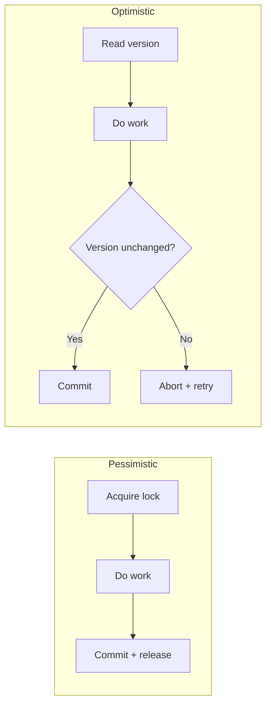
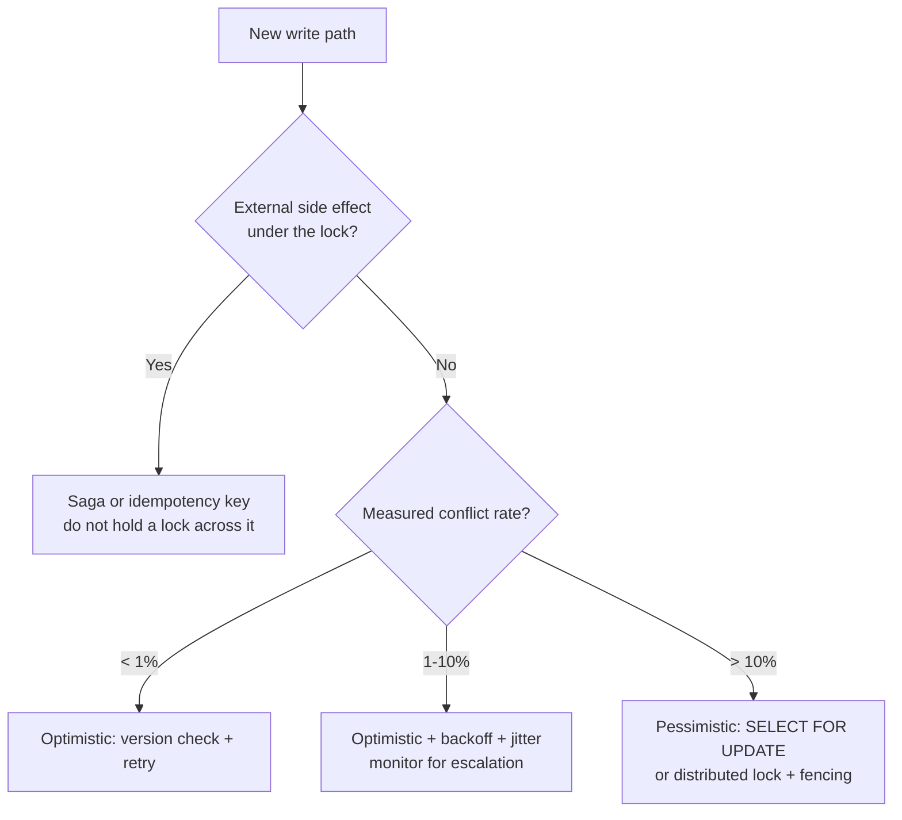
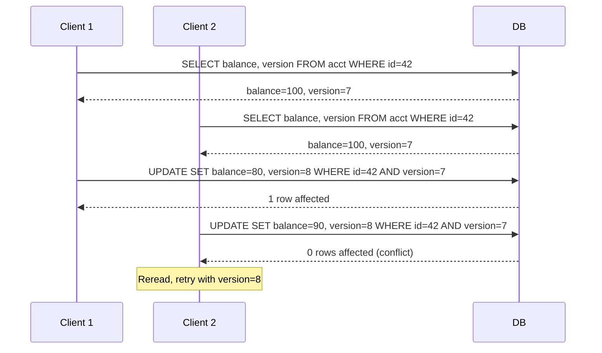

# Optimistic vs Pessimistic Concurrency Control

> **TL;DR.** Pessimistic locking acquires a lock before touching data and holds it until commit; optimistic concurrency does the work lock-free and validates at commit. The deciding variable is conflict rate. At low contention (< 1% aborts), optimistic wins because validation is cheaper than locking and readers never block writers[^1]. At high contention (> 10%), optimistic collapses into O(N^2) wasted work from retry storms[^2]. Default to optimistic (MVCC + version check) and escalate to `SELECT FOR UPDATE` on measured hot rows. For distributed locks, always attach a fencing token[^3].

## Learning Objectives

- Compare optimistic and pessimistic concurrency across throughput, tail latency, and failure modes at varying conflict rates.
- Identify the three variables (conflict rate, retry cost, side effects) that determine the correct choice.
- Justify a hybrid MVCC-plus-escalation approach as the production default.
- Evaluate Spanner's wound-wait, PostgreSQL's SSI, and Stripe's idempotency keys as real implementations of each strategy.

## The Core Trade-off

Two transactions want the same row at the same time. Pessimistic says: make one wait. Optimistic says: let both proceed, then abort the loser at commit. The fundamental tension is wasted work versus wasted waiting.

Pessimistic locking serializes access to hot data. Every waiter pays the lock-holder's full execution time as latency, but no work is thrown away. Optimistic concurrency lets all transactions run in parallel, but losers discard their work and retry. At low contention, almost nobody loses, so optimistic throughput dominates. At high contention, the abort-retry cycle compounds: with N contending clients, total work grows as O(N^2)[^2].

The crossover point is workload-specific. Google Spanner defaults to pessimistic concurrency control for serializable transactions; the docs note that "in highly contentious workloads, it helps transactions make progress"[^4]. DynamoDB's conditional writes make OCC a natural fit because most NoSQL access patterns hit distinct keys[^2].

A second variable flips the choice regardless of conflict rate: the cost of retrying. A 5 ms row update retries for free. A 30-second analytical job or a non-idempotent payment API call cannot be retried safely. Side-effect-bearing operations push toward pessimistic locking even at low contention.

*Pessimistic pays upfront coordination cost; optimistic defers it to commit and pays only on conflict.*

## Side-by-Side Comparison

| Dimension | Optimistic (version check, CAS) | Pessimistic (SELECT FOR UPDATE, 2PL) |
|---|---|---|
| Throughput at low contention | High: no lock overhead, readers never block writers[^1] | Lower: lock acquire/release on every operation |
| Throughput at high contention | Collapses: O(N^2) wasted work[^2] | Degrades gracefully: serialized but predictable |
| Tail latency | Low p99 on happy path; spikes on retry storms | Bounded by lock-holder duration; GC pauses amplify[^3] |
| Deadlock risk | None (no locks held) | Must detect and resolve cycles[^5] |
| Starvation risk | Slow transactions repeatedly aborted by faster ones[^4] | Wound-wait guarantees older transactions progress[^5] |
| External side effects | Unsafe: retried side effects may double-fire | Safe: lock held across critical section (with fencing) |
| Implementation complexity | Application manages retry loops and backoff | Database manages lock graph; distributed locks need consensus |
| Server-side state | None between read and write | Lock table entries for every active lock[^5] |

The table misleads on "deadlock risk." Optimistic avoids deadlocks but introduces livelock: under sustained contention, transactions can starve indefinitely. Spanner documents this as "transaction starvation" and recommends switching to pessimistic mode[^4].

The "tail latency" row hides the real danger of pessimistic locking: any GC pause, slow query, or network blip during the critical section blocks every waiter for the full duration of the stall[^3].

## When to Pick Optimistic

**Low-contention wide keyspaces.** User profile edits, configuration updates, most CRUD on sharded data. DynamoDB conditional writes handle millions of keys with near-zero conflict because each user touches their own partition[^2].

**Short, idempotent transactions.** The retry cost is negligible when the transaction is a single-row update under 5 ms. The canonical pattern: `UPDATE ... SET version = version + 1 WHERE id = ? AND version = ?`[^1].

**HTTP APIs with ETags.** RFC 7232 `If-Match` headers make writes conditional on the resource version. The client retries on 412 Precondition Failed. Stripe's idempotency keys extend this to payment APIs with a 24-hour minimum TTL[^6].

**Read-heavy workloads on MVCC databases.** PostgreSQL, InnoDB, and Spanner all serve snapshot reads without blocking writers. SSI (PostgreSQL 9.1+) gives full serializability without 2PL blocking[^7].

## When to Pick Pessimistic

**Hot rows with measured high contention.** Inventory counts, seat reservations, auction bid counters, account balances updated by many concurrent writers. Serializing with `SELECT FOR UPDATE` avoids the retry storm entirely.

**Long-running transactions where retry is expensive.** Batch imports, multi-step workflows, or transactions that take seconds. Aborting and redoing 10 seconds of work is worse than waiting 50 ms for a lock.

**Operations with non-idempotent external side effects.** Calling a payment provider, sending an SMS, or triggering a webhook inside the transaction. You cannot safely retry these, so you must hold the lock across the critical section[^3].

**Distributed coordination requiring correctness.** Leader election, distributed mutex, exactly-once resource allocation. Use a consensus-backed lock (ZooKeeper zxid, etcd lease) with a fencing token, never a bare TTL-based lock[^3][^8].

## The Hybrid Path

Most production databases already run hybrid: MVCC for the happy path, explicit locks for hot paths. PostgreSQL uses snapshot isolation for reads and exposes `SELECT FOR UPDATE` for application-level escalation[^9]. Spanner lets you set `ReadLockMode` per transaction: pessimistic for hot paths, optimistic for long-running multi-region reads[^4].

The practical pattern: default to optimistic everywhere, instrument your conflict rate (PostgreSQL `pg_stat_database.xact_rollback` and `deadlocks`, plus application-level logging of SQLSTATE 40001 for SSI serialization failures; Spanner Lock Statistics[^10]), and escalate to pessimistic on paths where the abort rate exceeds 5-10%. This gives most operations lock-free throughput while giving known-hot paths deterministic progress.

*Decision flowchart: conflict rate and side-effect profile determine the strategy. Most OLTP paths land on optimistic with escalation for measured hot rows.*

## Real-World Examples

**Google Spanner** uses pessimistic locking by default for serializable read-write transactions. Locks are acquired at cell granularity (row x column), so two transactions can modify different columns of the same row simultaneously[^5]. Conflict resolution uses wound-wait: older transactions abort younger ones, guaranteeing forward progress without deadlocks[^5]. Four lock modes (ReaderShared, WriterShared, Exclusive, WriterSharedTimestamp) provide fine-grained concurrency[^5].

**PostgreSQL SSI** is the first production implementation of Serializable Snapshot Isolation (Ports and Grittner, VLDB 2012)[^7]. Reads acquire non-blocking SIRead predicate locks; the engine watches for dangerous read-write dependency cycles and aborts one transaction with SQLSTATE 40001[^9]. First-committer-wins: the transaction that reaches commit first succeeds[^11]. Applications must retry on 40001, making this optimistic at the application layer.

**Stripe's idempotency keys** implement application-layer OCC for payment APIs. Clients generate a UUID per logical operation; Stripe deduplicates server-side with a 24-hour minimum TTL[^6]. Retries reuse the same key. If a second request modifies the payload, Stripe rejects it. This is OCC where the "version" is the idempotency key claim.

*OCC version-check pattern: the second writer detects the conflict at commit time and retries with the current version.*

## Common Mistakes

> [!WARNING]
> **Holding locks across network calls.** A payment API call inside a `SELECT FOR UPDATE` transaction blocks every waiter for the RPC's full latency. Move external calls outside the transaction; use a saga or record-then-call pattern.

> [!WARNING]
> **Missing fencing tokens on distributed locks.** A GC-paused client waking after TTL expiry can overwrite a valid lock holder's data. Always attach a monotonic token and enforce it at the storage layer[^3]. Redlock without fencing is unsafe for correctness[^12].

> [!WARNING]
> **Naive retry loops without backoff.** At N contending clients, synchronized retries produce O(N^2) wasted work[^2]. Use exponential backoff with full jitter. AWS shows this reduces total calls by ~50% at N=100[^2].

> [!WARNING]
> **Using optimistic on known-hot rows.** If your abort rate exceeds 10%, you are burning more CPU on retries than a lock would cost. Measure conflict rate in production and escalate explicitly[^9].

## Decision Checklist

- [ ] What is the measured conflict rate on this path? (Check `pg_stat_database.xact_rollback` and `deadlocks`, plus application logs for SQLSTATE 40001, or Spanner Lock Statistics[^10].)
- [ ] How expensive is redoing the work on retry? (Seconds of compute? External API call?)
- [ ] Does the transaction contain a non-idempotent side effect?
- [ ] Is your database MVCC-based? (If yes, optimistic is the default happy path.)
- [ ] For distributed locks: does your lock service produce a fencing token?
- [ ] Have you implemented exponential backoff with jitter on retry paths?

## Key Takeaways

- The deciding variable is conflict rate. Below 1%, optimistic wins. Above 10%, pessimistic wins. Between 1-10%, optimistic with backoff and monitoring.
- Default to MVCC + version check for most operations. Escalate to `SELECT FOR UPDATE` on measured hot rows.
- Never hold a database lock across a network call. Use sagas or idempotency keys for operations with external side effects.
- Distributed locks without fencing tokens are unsafe for correctness. Use ZooKeeper zxid, etcd lease ID, or a database sequence as the token[^3].
- Retry storms are the silent killer of optimistic systems. Exponential backoff with full jitter is non-negotiable[^2].

## Further Reading

- [How to do distributed locking](https://martin.kleppmann.com/2016/02/08/how-to-do-distributed-locking.html): Kleppmann's canonical critique of Redlock and the fencing-token argument; start here for correctness reasoning about distributed locks.
- [Exponential Backoff And Jitter](https://aws.amazon.com/blogs/architecture/exponential-backoff-and-jitter/): Marc Brooker's simulation showing why naive OCC retries collapse at scale and how jitter fixes it.
- [Serializable Snapshot Isolation in PostgreSQL](https://arxiv.org/abs/1208.4179): Ports and Grittner, VLDB 2012. The paper behind PostgreSQL's SSI; shows how optimistic validation achieves serializability without 2PL.
- [Transaction locking in Cloud Spanner](https://cloud.google.com/blog/products/databases/transaction-locking-in-cloud-spanner): wound-wait, cell-level locks, and the four lock modes explained with production examples.
- [Designing robust and predictable APIs with idempotency](https://stripe.com/blog/idempotency): Stripe's engineering blog on application-layer OCC for payment APIs; the definitive idempotency-key pattern.
- [Is Redlock safe?](http://antirez.com/news/101): Sanfilippo's rebuttal to Kleppmann. Read both sides before choosing a distributed lock implementation.

## Flashcards

<strong>Q: What is the O-notation for total wasted work under OCC with N contending clients?</strong>

A: O(N^2). Each round, N-1 clients abort and retry. Over N rounds needed for all to complete, total work is quadratic in the number of contenders[^2].

<strong>Q: What is the canonical SQL pattern for application-level optimistic concurrency?</strong>

A: `UPDATE table SET col = ?, version = version + 1 WHERE id = ? AND version = ?`. If zero rows affected, a concurrent writer bumped the version; reread and retry.

<strong>Q: Why does Spanner use wound-wait instead of wait-die?</strong>

A: Wound-wait preserves older transactions (those that started earlier) by aborting younger ones. This guarantees forward progress without deadlocks[^5].

<strong>Q: What is a fencing token and why is it necessary for distributed locks?</strong>

A: A monotonically increasing number attached to each lock grant. The storage layer rejects writes with stale tokens. Without it, a GC-paused client waking after TTL expiry can overwrite a valid lock holder's data[^3].

<strong>Q: At what conflict rate should you escalate from optimistic to pessimistic?</strong>

A: When the measured abort rate exceeds 5-10%. Below 1%, optimistic is better. Above 10%, retry storms waste more CPU than locks would cost. Between 1-10%, use optimistic with backoff and monitor.

<strong>Q: What PostgreSQL error code indicates a serialization failure under SSI?</strong>

A: SQLSTATE 40001. The application must catch this and retry the entire transaction from the beginning[^9].

<strong>Q: Why is Redlock unsafe for correctness-critical distributed locks?</strong>

A: It produces no fencing token, so a paused client cannot be distinguished from a valid one. Its safety also depends on bounded clock skew across Redis nodes, which NTP jumps can violate[^3][^12].

## References

[^1]: H.T. Kung and John T. Robinson, "On Optimistic Methods for Concurrency Control", ACM Transactions on Database Systems, 1981. https://dl.acm.org/doi/10.1145/319566.319567
[^2]: Marc Brooker, "Exponential Backoff And Jitter", AWS Architecture Blog, 2015-03-04. https://aws.amazon.com/blogs/architecture/exponential-backoff-and-jitter/
[^3]: Martin Kleppmann, "How to do distributed locking", 2016-02-08. https://martin.kleppmann.com/2016/02/08/how-to-do-distributed-locking.html
[^4]: Google Cloud, "Concurrency control" (Spanner documentation), last updated 2026-05-01. https://cloud.google.com/spanner/docs/concurrency-control
[^5]: Manit Gupta, "Understanding transactional locking in Cloud Spanner", Google Cloud Blog, 2022-11-16. https://cloud.google.com/blog/products/databases/transaction-locking-in-cloud-spanner
[^6]: Brandur Leach, "Designing robust and predictable APIs with idempotency", Stripe Engineering Blog, 2017-02-22. https://stripe.com/blog/idempotency
[^7]: Dan R.K. Ports and Kevin Grittner, "Serializable Snapshot Isolation in PostgreSQL", VLDB 2012 (arXiv 1208.4179). https://arxiv.org/abs/1208.4179
[^8]: etcd project, "contrib/lock/README.md" (distributed locking with fencing token example). https://github.com/etcd-io/etcd/blob/main/contrib/lock/README.md
[^9]: PostgreSQL wiki, "SSI: Serializable Snapshot Isolation in PostgreSQL". https://wiki.postgresql.org/wiki/SSI
[^10]: Hans Huang, "Lock Statistics: Diagnose performance issues in Cloud Spanner", Google Cloud Blog. https://cloud.google.com/blog/topics/developers-practitioners/lock-statistics-diagnose-performance-issues-in-cloud-spanner
[^11]: PostgreSQL wiki SSI examples section, "first-committer-wins" rule. https://wiki.postgresql.org/wiki/SSI#Overview
[^12]: Salvatore Sanfilippo, "Distributed Locks with Redis" (Redlock specification). https://redis.io/docs/latest/develop/clients/patterns/distributed-locks/
