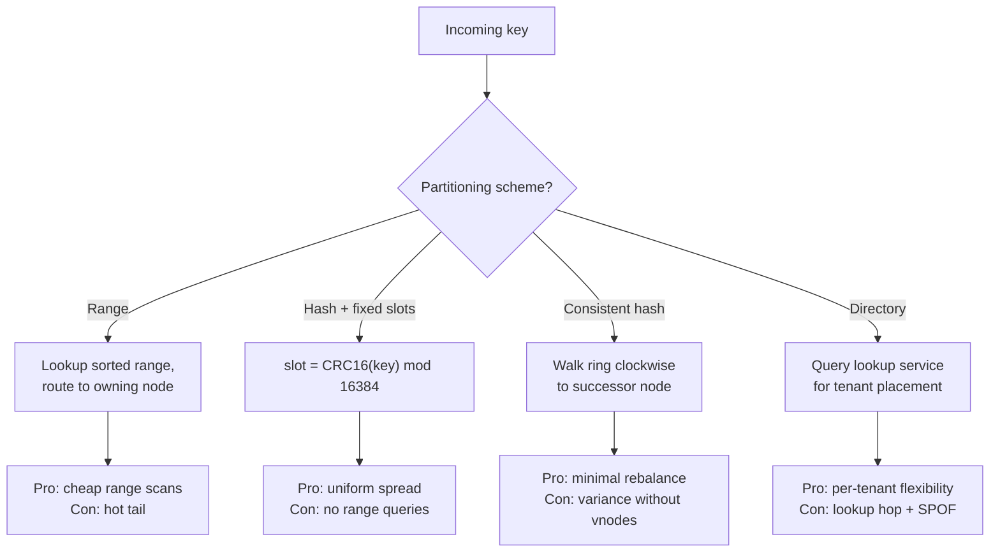
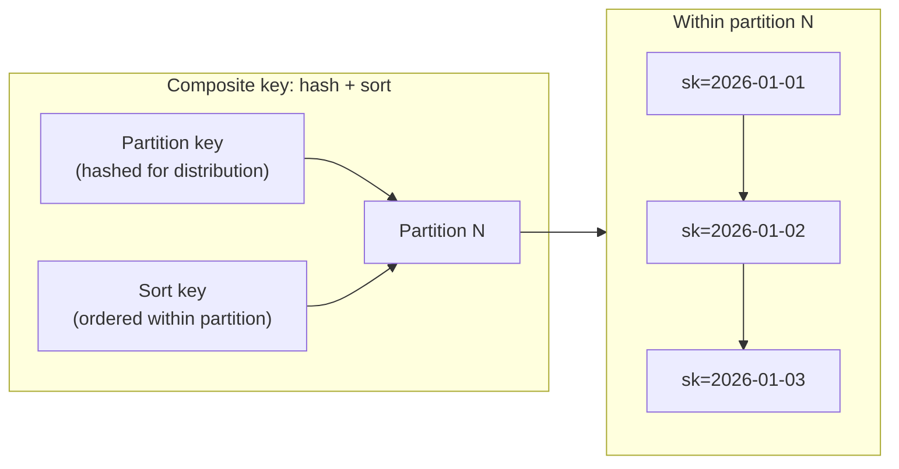
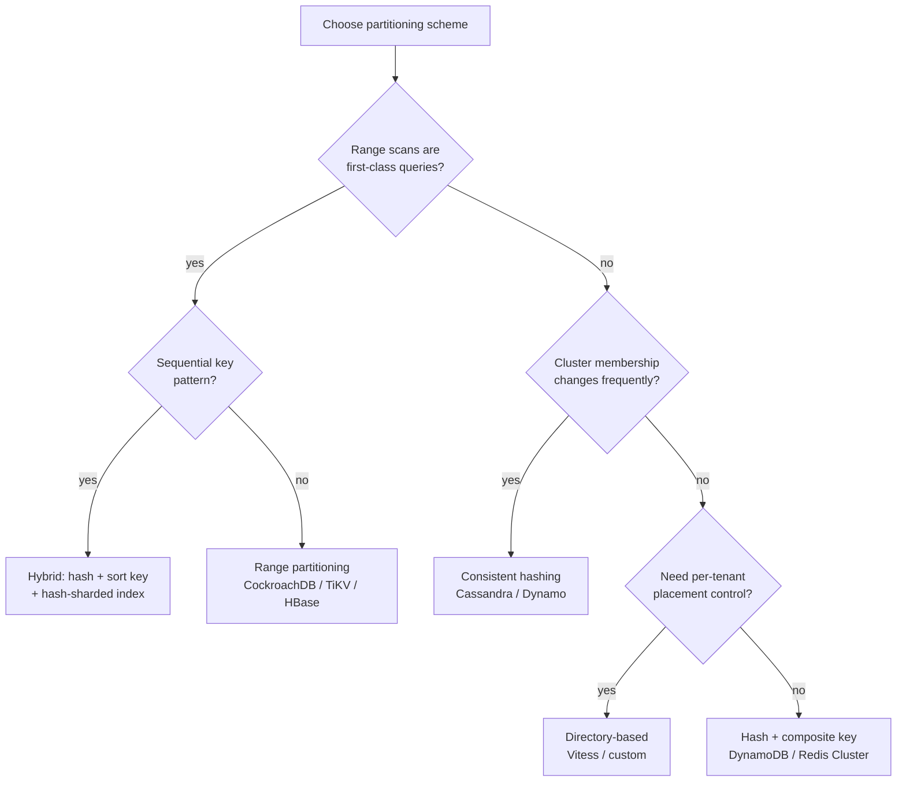

# Partitioning Schemes: Range, Hash, Consistent Hash, Directory

> **TL;DR.** Every horizontal-scale database partitions data, and the scheme it picks determines which queries are cheap, which are expensive, and how painful rebalancing is. Hash partitioning (DynamoDB, Redis Cluster) spreads load uniformly but kills range scans. Range partitioning (CockroachDB, HBase, TiKV) makes range scans cheap but creates hot tails on sequential writes. Consistent hashing (Cassandra, Dynamo) minimizes data movement when nodes join or leave. Directory-based (Vitess) gives per-tenant placement flexibility at the cost of a lookup hop. Default to hash with a composite key (partition key + sort key) for most workloads; escalate to range only when range scans dominate, and add a directory layer when whale tenants need isolation.

## Learning Objectives

- Compare range, hash, consistent hash, and directory partitioning across query support, rebalance cost, and hot-spot risk.
- Identify the workload characteristics that favor each scheme.
- Justify a composite-key hybrid that combines hash distribution with in-partition range locality.
- Evaluate real systems (DynamoDB, CockroachDB, Redis Cluster, Vitess) and explain why each chose its scheme.

## The Core Trade-off

The fundamental tension is **even distribution versus locality**. Hash partitioning destroys key ordering to spread load uniformly, so range scans like "all events in the last hour" must fan out to every partition[^1]. Range partitioning preserves order and makes those scans cheap, but sequential writes (timestamps, autoincrement IDs) pile onto the newest range, creating a hot tail[^2][^3].

A secondary tension is **rebalance cost**. Naive `hash(key) % N` remaps nearly every key when N changes. Consistent hashing moves only K/N keys when one node joins or leaves[^4]. Directory-based schemes move nothing until you explicitly reassign a tenant, but add a lookup hop and a critical-path dependency on the directory service[^5].

No scheme wins on all axes. The decision depends on whether your dominant access pattern is point lookups, range scans, or dynamic membership changes.

*Each scheme trades one axis for another; no single approach dominates across all workloads.*

## Side-by-Side Comparison

| Dimension | Range | Hash (fixed-slot) | Consistent Hash | Directory |
|---|---|---|---|---|
| Range scan cost | One or two partitions[^2] | Fan-out to all partitions[^1] | Fan-out to all partitions | Depends on vindex design[^6] |
| Point lookup cost | Log(ranges) metadata hop | O(1) slot computation[^7] | O(1) ring walk | One directory lookup + data fetch |
| Write distribution | Hot tail on sequential keys[^3] | Uniform | Uniform with vnodes[^8] | Operator-controlled |
| Rebalance movement | Split in place (metadata-only)[^9] | Most keys move if N changes | Only K/N keys move[^4] | Zero until explicit reassignment |
| Operational complexity | Auto-split, auto-merge | Simple, static slot count | Virtual nodes, token management | Directory HA, cache coherence |
| Hot-spot mitigation | Hash-sharded indexes (opt-in)[^10] | Write sharding with suffixes[^11] | Bounded-load algorithms[^12] | Move tenant to dedicated shard |
| Scale ceiling | Billions of ranges (Spanner-class) | 16,384 slots (Redis Cluster)[^7] | Proportional to vnodes | Limited by directory throughput |
| Best-known system | CockroachDB, HBase, TiKV | Redis Cluster, DynamoDB | Cassandra, Amazon Dynamo | Vitess, multi-tenant SaaS |

The table understates one thing: rebalance cost is never zero. Even CockroachDB's metadata-only split is followed by replica rebalancing that streams Pebble data to new nodes during Raft reconfiguration[^13]. And consistent hashing's K/N guarantee means that adding one node to a 10-node cluster still moves 10% of all data, which at petabyte scale is terabytes of network transfer.

The "scale ceiling" row matters more than it appears. Redis Cluster's specification recommends a maximum of roughly 1,000 nodes, though the 16,384 slots set a theoretical upper bound of 16,384 masters[^7]. If you need more, you need a different scheme or a tiered architecture.

## When to Pick Hash Partitioning

**Point lookups dominate and range queries are rare or report-only.** User profiles by ID, session stores, key-value caches. DynamoDB's partition key hash gives uniform distribution across millions of operations per second[^1].

**You need predictable write distribution.** Hash destroys ordering, which means sequential timestamps do not pile onto one partition. Redis Cluster's CRC16 mod 16,384 spreads keys evenly regardless of input pattern[^7].

**The cluster size is stable.** Fixed-slot schemes (Redis Cluster's 16,384 slots, Cassandra's vnodes) handle membership changes gracefully because slots, not keys, are reassigned[^8]. But if you are using naive modulo without pre-sharding, adding a node remaps almost everything[^14].

**Composite keys give you the best of both.** DynamoDB's partition key + sort key hashes the first to pick a partition, then keeps the second in sorted order within it. Point lookups and in-partition range scans are both cheap[^15].

## When to Pick Range Partitioning

**Range scans are first-class queries.** Time-series data ("all events between 09:00 and 10:00"), lexicographic prefix scans ("all users whose name starts with 'Sm'"), and ordered pagination. CockroachDB and TiKV serve these from one or two ranges without fan-out[^2][^3].

**Automatic splitting adapts to growth.** CockroachDB splits ranges at 512 MiB[^16]; TiKV at 96 MB[^3]; HBase at 10 GB[^17]. No operator intervention needed as data grows.

**You can mitigate the hot tail.** Prefix the timestamp with a tenant ID or bucket number so writes spread across ranges. CockroachDB offers hash-sharded indexes as an opt-in escape hatch for sequential workloads[^10].

**Caution:** If your primary key is a monotonic timestamp with no prefix, every write lands on the last range. This is the single most common partitioning mistake in production.

## When to Pick Consistent Hashing

**Dynamic membership is the norm.** Cache clusters where nodes join and leave hourly. CDN edge servers. Dynamo-style storage where nodes churn. Consistent hashing moves only K/N keys per membership change[^4][^18].

**You need minimal disruption during scale-out.** Adding a node to a 100-node Cassandra cluster moves roughly 1% of data, not 99%[^14].

**Virtual nodes smooth the variance.** Without vnodes, some nodes get roughly 2x the average load[^19]. Cassandra 3.x defaulted to 256 vnodes per node; Cassandra 4.0+ defaults to 16[^8]. Jump consistent hash (Lamping and Veach, 2014) achieves perfect balance in O(ln N) time with zero memory[^20]. Bounded-load consistent hashing caps any node at (1 + epsilon) times the mean[^12].

## When to Pick Directory-Based Partitioning

**Per-tenant placement flexibility is non-negotiable.** Multi-tenant SaaS where a whale customer needs a dedicated shard, or where compliance requires data residency in a specific region. The directory maps `tenant_id` to a shard with full freedom[^5].

**Heterogeneous shards are acceptable.** Some shards are larger, some have more replicas, some run on beefier hardware. The directory encodes all of this without constraining the hash function.

**You can tolerate the operational weight.** The directory is itself a critical service. It must be highly available, cached aggressively, and consistent. Vitess's `vtgate` consults the VSchema on every query[^6]. If the directory is down, routing is down.

## The Hybrid Path

Most production systems combine two or more schemes. The dominant pattern is **pre-sharded virtual partitions mapped by consistent hashing, with a directory for known heavy tenants**.

DynamoDB hashes the partition key to pick one of many internal partitions, uses adaptive capacity to redistribute headroom, and splits hot partitions automatically[^1]. Cassandra assigns vnodes per physical node on a consistent-hash ring (256 in 3.x, 16 in 4.0+)[^8]. Vitess uses a directory (VSchema) to map rows to shards via a configurable vindex, with keyrange-based routing[^6].

The composite-key pattern (hash the partition key, sort within it) is the most broadly applicable hybrid. It gives you hash-level load spreading for writes and range-level locality for reads within a logical group[^15].

*Composite keys hash the partition key for even distribution, then keep sort keys ordered within each partition for cheap range scans.*

## Real-World Examples

**DynamoDB** hashes partition keys to spread millions of ops/sec across internal partitions, each capped at 3,000 RCUs and 1,000 WCUs[^15]. When a partition overheats, split-for-heat divides it, but only if the sort key has enough cardinality to benefit. An ever-increasing sort key with a low-cardinality partition key caps throughput at 1,000 WCUs regardless of adaptive behavior[^1]. The documented mitigation is write sharding: append a random suffix (1 to 200) to the partition key[^11].

**CockroachDB** range-partitions the entire keyspace into 512 MiB ranges, each a Raft group with three replicas[^16][^9]. Splits are metadata operations on the Pebble store. For sequential workloads, hash-sharded indexes scatter writes across many ranges at the cost of range-scan locality[^10]. A February 2026 advisory documented a race between MVCC garbage collection and range splits that could delete live data under specific conditions[^21].

**Redis Cluster** fixes 16,384 hash slots at install time. Nodes own subsets of slots; resharding moves slots one at a time via `MIGRATE`[^7]. Hash tags (`{user1000}.followers`) force related keys to the same slot for multi-key operations. The 16,384 limit exists because the gossip heartbeat carries the full slot bitmap; doubling slots would double gossip bandwidth[^7].

## Common Mistakes

> [!WARNING]
> **Timestamp as the sole partition key.** All writes land on the newest partition; 99% of capacity idles. Prefix with tenant ID or bucket number, or use hash-sharded indexes[^10][^11].

> [!WARNING]
> **Naive modulo without pre-sharding.** `hash(key) % N` remaps nearly every key when N changes by one. Use fixed-slot pre-sharding (Redis: 16,384 slots) or consistent hashing to guarantee only K/N keys move[^14][^4].

> [!WARNING]
> **Confusing partition key with sort key.** Queries that filter only on the sort key must fan out to every partition. Model your queries before your schema; the partition key determines routing, the sort key determines order within[^15].

> [!WARNING]
> **Too few partitions at launch.** A single-partition MVP hits a ceiling when traffic grows. Pre-shard to 256 to 1,024 virtual partitions so you can redistribute without resharding for 3 to 5 years[^8].

## Decision Checklist

- [ ] Are range scans first-class queries, or report-only (can tolerate fan-out)?
- [ ] Is the partition key monotonic (timestamps, autoincrement)? If yes, hash it or prefix it.
- [ ] Will cluster membership change frequently (weekly scale-out, node churn)?
- [ ] Is any tenant large enough to warrant a dedicated shard?
- [ ] Have you pre-sharded into enough virtual partitions to grow for 3 to 5 years?
- [ ] Can you state the per-partition throughput ceiling (DynamoDB: 1,000 WCUs)?
- [ ] Does your composite key have enough partition-key cardinality to avoid hot partitions?

*Decision flowchart: start with your dominant query pattern, then factor in membership dynamics and tenant isolation needs.*

## Key Takeaways

- Hash partitioning is the safe default for point-lookup workloads. Add a sort key for in-partition range locality.
- Range partitioning is correct when range scans dominate, but you must mitigate the hot tail on sequential keys.
- Consistent hashing solves rebalance cost (K/N movement), not query routing. Use it when nodes churn.
- Directory-based partitioning is for whale-tenant isolation and heterogeneous placement, not general-purpose routing.
- The decision is per-table, not per-database. One system can use hash for user lookups and range for time-series.

## Further Reading

- [Scaling DynamoDB: partitions, hot keys, and split for heat](https://aws.amazon.com/blogs/database/part-3-scaling-dynamodb-how-partitions-hot-keys-and-split-for-heat-impact-performance/): definitive tour of DynamoDB's internal partitioning, adaptive capacity, and the split-for-heat mechanism.
- [Karger et al., "Consistent Hashing and Random Trees", STOC 1997](https://dl.acm.org/doi/10.1145/258533.258660): the original paper; still the clearest explanation of the ring idea and the K/N movement guarantee.
- [Lamping and Veach, "A Fast, Minimal Memory, Consistent Hash Algorithm", 2014](https://arxiv.org/abs/1406.2294): jump consistent hash in five lines of code; fundamental reading for anyone implementing partitioning.
- [How CockroachDB Automates Operations](https://www.cockroachlabs.com/blog/automated-rebalance-and-repair/): automatic rebalance and repair mechanics with concrete range-size and dead-node-timeout numbers.
- [Redis Cluster specification](https://redis.io/docs/latest/operate/oss_and_stack/reference/cluster-spec/): the 16,384-slot design, MOVED/ASK redirects, gossip protocol, and hash tags.
- [How Discord Stores Trillions of Messages](https://discord.com/blog/how-discord-stores-trillions-of-messages): Cassandra hot-partition pain at scale and the migration to ScyllaDB with request coalescing.

## Flashcards

<strong>Q: What is the core tension between hash and range partitioning?</strong>

A: Hash partitioning spreads load uniformly but destroys key ordering, making range scans expensive (fan-out to all partitions). Range partitioning preserves order for cheap range scans but creates hot tails on sequential writes.

<strong>Q: How much data moves when you add one node to a consistent-hash ring?</strong>

A: Approximately K/N keys, where K is total keys and N is the new node count. Only the keys between the new node and its predecessor are reassigned. Without virtual nodes, variance is high (some nodes get 2x average load).

<strong>Q: What are DynamoDB's per-partition throughput ceilings?</strong>

A: 3,000 read capacity units per second, 1,000 write capacity units per second, and approximately 10 GB of storage per partition.

<strong>Q: Why does Redis Cluster use exactly 16,384 hash slots?</strong>

A: The gossip heartbeat carries the full slot bitmap. 16,384 slots (14 bits of CRC16) balances slot granularity against gossip bandwidth. Going to 65,536 slots (4x the count) would quadruple the bitmap size from 2KB to 8KB in every heartbeat message.

<strong>Q: What is the "timestamp as partition key" anti-pattern?</strong>

A: All writes land on the newest partition because timestamps are monotonic. 99% of partitions idle while one saturates. Mitigate by prefixing with tenant ID, bucketing, or using hash-sharded indexes.

<strong>Q: How does a composite key (partition key + sort key) combine hash and range benefits?</strong>

A: The partition key is hashed for even distribution across partitions. The sort key maintains order within each partition. Point lookups hit one partition; range scans within a partition key are cheap. Cross-partition range scans still require fan-out.

<strong>Q: When should you choose directory-based partitioning over consistent hashing?</strong>

A: When you need per-tenant placement flexibility (whale isolation, compliance-driven data residency, heterogeneous shard sizes). Directory adds a lookup hop and a critical-path dependency but gives full control over which data lives where.

## References

[^1]: Jason Hunter and Vivek Natarajan. "Scaling DynamoDB (Part 3): Summary and best practices." AWS Database Blog, January 2023. https://aws.amazon.com/blogs/database/part-3-scaling-dynamodb-how-partitions-hot-keys-and-split-for-heat-impact-performance/
[^2]: Cockroach Labs. "Range / Shard glossary entry." https://www.cockroachlabs.com/glossary/distributed-db/range-shard/
[^3]: "Coprocessor Config: region-split-size 96MB default." TiKV docs. https://tikv.org/docs/4.0/tasks/configure/coprocessor/
[^4]: David Karger et al. "Consistent Hashing and Random Trees." STOC 1997. https://dl.acm.org/doi/10.1145/258533.258660
[^5]: Vitess. "VSchema and Query Serving." https://vitess.io/docs/24.0/user-guides/vschema-guide/
[^6]: Vitess. "Sharded Keyspace." https://vitess.io/docs/user-guides/vschema-guide/sharded/
[^7]: "Redis cluster specification." Redis Docs. https://redis.io/docs/latest/operate/oss_and_stack/reference/cluster-spec/
[^8]: "cassandra.yaml file configuration (num_tokens)." Apache Cassandra docs. 3.11 default: 256; 4.0+ default: 16. https://cassandra.apache.org/doc/4.0/cassandra/configuration/cass_yaml_file.html
[^9]: Bram Gruneir. "How CockroachDB Automates Operations." Cockroach Labs blog, 2017. https://www.cockroachlabs.com/blog/automated-rebalance-and-repair/
[^10]: Cockroach Labs. "Hash-Sharded Indexes." CockroachDB docs. https://www.cockroachlabs.com/docs/stable/hash-sharded-indexes.html
[^11]: "Using write sharding to distribute workloads evenly in your DynamoDB table." AWS docs. https://docs.aws.amazon.com/amazondynamodb/latest/developerguide/bp-partition-key-sharding.html
[^12]: Vahab Mirrokni, Mikkel Thorup, Morteza Zadimoghaddam. "Consistent Hashing with Bounded Loads." arXiv:1608.01350, 2016. https://arxiv.org/abs/1608.01350
[^13]: Jack Vanlightly. "Serverless CockroachDB ASDS Chapter 4 part 3: heat management." 2023. https://jack-vanlightly.com/analyses/2023/11/21/serverless-cockroachdb-asds-chapter-4-part-3
[^14]: David Karger et al. "Web Caching with Consistent Hashing." 1999. https://web.archive.org/web/20240625143825/https://www.cs.cmu.edu/~srini/15-744/F04/readings/K+99.html
[^15]: "Partitions and data distribution in DynamoDB." AWS docs. https://docs.aws.amazon.com/amazondynamodb/latest/developerguide/HowItWorks.Partitions.html
[^16]: Cockroach Labs. "Replication Controls." https://www.cockroachlabs.com/docs/configure-replication-zones.html
[^17]: HBase region split basics. hbase.hregion.max.filesize default 10 GB. https://knowledge.broadcom.com/external/article/294551/hbase-basics.html
[^18]: Giuseppe DeCandia et al. "Dynamo: Amazon's Highly Available Key-value Store." SOSP 2007. https://www.amazon.science/publications/dynamo-amazons-highly-available-key-value-store
[^19]: Consistent hashing load variance with virtual nodes. Karger et al., 1997. https://people.csail.mit.edu/karger/Talks/Hash/index.htm
[^20]: John Lamping and Eric Veach. "A Fast, Minimal Memory, Consistent Hash Algorithm." arXiv:1406.2294, 2014. https://arxiv.org/abs/1406.2294v1
[^21]: Cockroach Labs. "Technical Advisory 162085: MVCC garbage collection and range split race." https://www.cockroachlabs.com/docs/advisories/a162085
