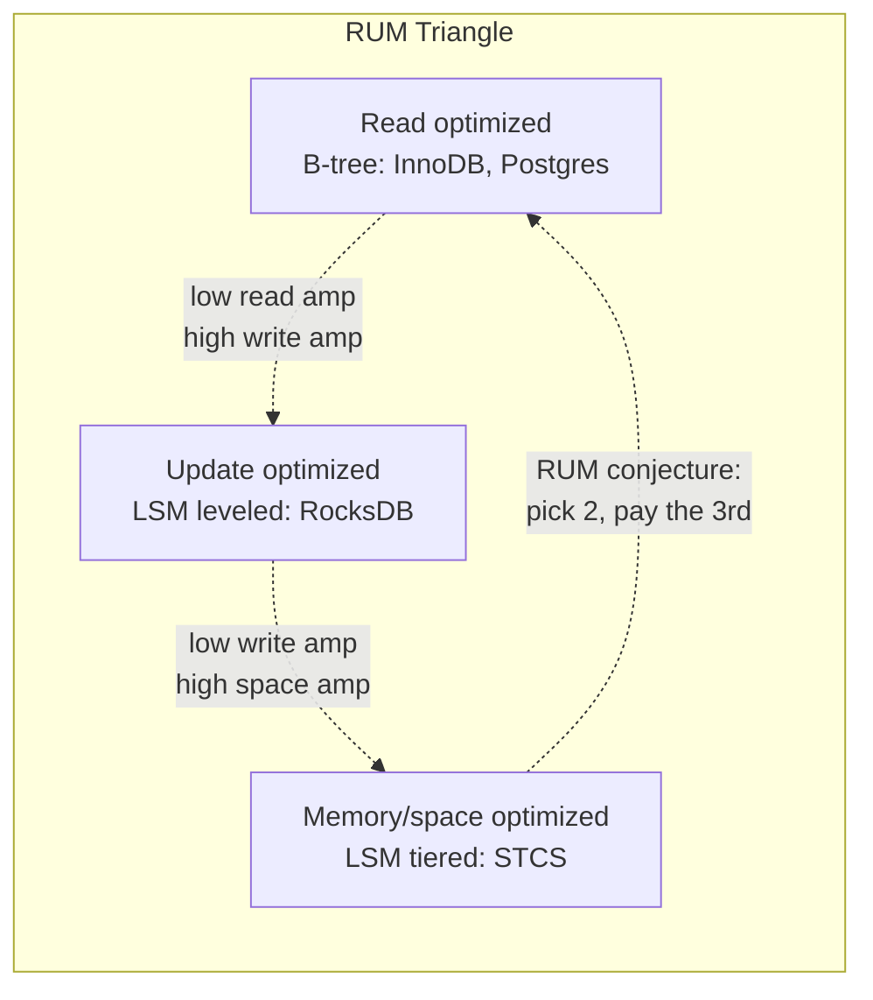
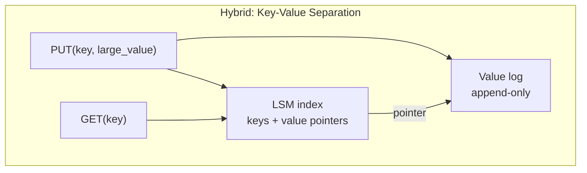
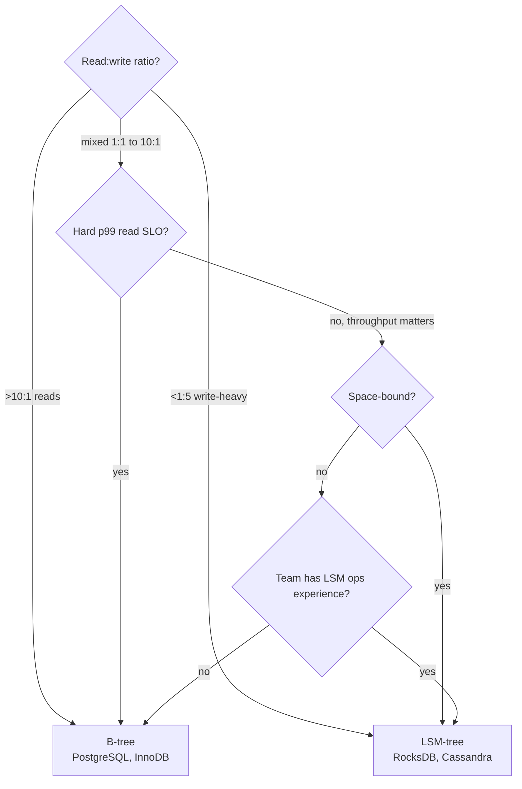

# B-tree vs LSM-tree Storage

> **TL;DR.** B-trees optimize reads with predictable 3-5 page I/O lookups and pay with 5-10x write amplification from whole-page rewrites[^1]. LSM-trees optimize writes with sequential batched flushes and pay with 10-30x write amplification from compaction plus read-path overhead across multiple sorted levels[^2]. Pick B-tree when your read:write ratio exceeds 10:1 and p99 read latency is a hard SLO. Pick LSM when writes dominate and you can tolerate compaction-driven latency variance. The deciding dimension is read:write ratio.

## Learning Objectives

- Compare B-tree and LSM-tree across read amplification, write amplification, space amplification, and tail latency.
- Identify workload characteristics (read:write ratio, value size, delete frequency) that favor one engine over the other.
- Justify a hybrid approach (key-value separation, per-collection engine choice) for mixed workloads.
- Evaluate Facebook MyRocks, CockroachDB Pebble, and Cassandra compaction strategies as production decision examples.

## The Core Trade-off

The RUM conjecture (Athanassoulis et al., EDBT 2016) frames the tension precisely: for any access method, optimizing two of Read overhead, Update overhead, and Memory/space overhead forces the third to be large[^3]. B-trees sit near the Read corner: a point lookup walks 3-4 levels of an 8 KB page tree regardless of dataset size[^4], but every 50-byte update rewrites an entire page plus WAL. LSM-trees sit near the Update corner: writes are sequential and batched into memtable flushes, but reads must probe multiple sorted levels and compaction rewrites data 10-30x[^2][^5].

The metric that moves in opposite directions is I/O pattern. B-trees issue random writes (dirty pages flushed to arbitrary disk locations) but random reads are fast (one tree walk). LSM-trees issue sequential writes (append-only flushes) but reads fan out across levels. On flash storage, sequential writes extend SSD lifespan; random page rewrites burn write cycles on unchanged bytes.

*The RUM conjecture positions B-tree near the Read corner and LSM variants along the Update-Memory edge; no engine escapes the triangle.*

## Side-by-Side Comparison

| Dimension | B-tree (InnoDB, PostgreSQL) | LSM-tree (RocksDB, Cassandra) |
|---|---|---|
| Point-read latency | 3-5 page I/Os, stable p99[^4] | Memtable + bloom-filtered level probes, variable p99 |
| Write throughput | Limited by random page I/O | Up to 10x or more higher sustained writes on same hardware[^1] |
| Write amplification | 5-10x (page rewrite + double-write buffer)[^1] | 10-30x leveled, approximately 2-3x tiered[^2][^5] |
| Space amplification | ~33% slack from page fill factor | ~10% leveled, up to 2x tiered during compaction[^6] |
| Range scan | Sequential leaf traversal, fast | Must merge across levels, slower |
| Tail latency under load | Stable (no background rewrites) | Spikes during compaction stalls[^7] |
| Operational complexity | Decades of tooling (vacuum, repack) | Compaction tuning, L0 stall monitoring |
| Delete handling | In-place mark + vacuum | Tombstones accumulate until compaction purges[^8] |

The table understates one dimension: operational surprise. B-tree databases have predictable behavior under load because updates happen in place. LSM databases have a background process (compaction) that competes with foreground reads for I/O and CPU. When compaction falls behind, writes stall[^7]. This is the single biggest operational difference in practice.

Range scans are the other hidden gap. In PostgreSQL and InnoDB, B-tree leaf pages are doubly linked; a range scan is a sequential walk. LSM range scans must merge iterators across every level because bloom filters only help point lookups[^9].

## When to Pick B-tree

**Read-dominated OLTP with hard p99 SLOs.** Web applications where the read:write ratio exceeds 10:1. User lookups, order history, session retrieval. PostgreSQL and InnoDB handle these with 3-4 page I/Os regardless of table size[^4][^10].

**Workloads with frequent range scans.** Reporting queries, pagination, time-range filters over indexed columns. B-tree leaf traversal is sequential; LSM must merge across levels.

**Teams without compaction expertise.** B-tree operational tooling is mature: `VACUUM`, `pg_repack`, InnoDB buffer pool tuning, online index rebuilds. The failure modes are well-documented and recoverable.

**Small-to-medium datasets (under 1 TB) on provisioned IOPS.** When storage is not the bottleneck, B-tree's simpler architecture wins on debuggability and predictability.

**Named systems:** PostgreSQL, MySQL/InnoDB, SQLite, Oracle, SQL Server.

## When to Pick LSM-tree

**Write-heavy ingestion where throughput ceiling matters.** Time-series, event sourcing, log aggregation, IoT telemetry. LSM sustains up to 10x or more the write rate of B-tree on the same flash[^1][^11].

**Space-constrained environments where compression efficiency matters.** MyRocks achieved 2x smaller on-disk size than compressed InnoDB because SSTables are not page-aligned: a block that compresses to 5 KB uses exactly 5 KB[^1]. Facebook cut UDB instance sizes by 62.3% migrating from InnoDB to MyRocks[^12].

**Append-mostly workloads with few updates or deletes.** Chat messages, social-feed events, blockchain state. Tombstone accumulation is minimal when deletes are rare.

**SSD-lifetime-sensitive deployments.** Sequential writes reduce flash wear even when write amplification is numerically higher, because the SSD controller handles sequential patterns more efficiently than random page rewrites[^1].

**Named systems:** RocksDB, LevelDB, Cassandra, ScyllaDB, CockroachDB (Pebble), TiKV, BadgerDB.

## The Hybrid Path

Most production systems do not pick one engine for everything. The practical hybrid strategies:

**Key-value separation (WiscKey).** Store keys in the LSM but large values in a separate append-only value log. Compaction rewrites only keys (small), cutting compaction cost 2.5-111x versus LevelDB for large-value workloads[^13]. BadgerDB and TitanDB implement this in production.

**Per-collection engine selection.** MongoDB's WiredTiger supports both B-tree and LSM per collection. In practice, the LSM mode is rarely used because WiredTiger's B-tree already uses compression and write-ahead logging. The hybrid option exists but "pick one engine" remains the right default.

**Tiered compaction for writes, leveled for reads.** Cassandra 5.0's Unified Compaction Strategy (UCS) adapts between tiered and leveled behavior behind a single `scaling_parameters` knob, eliminating the need to choose upfront[^14][^15].

*Key-value separation (WiscKey) keeps compaction cheap by rewriting only small keys; large values live in a separate append-only log.*

## Real-World Examples

**Facebook MyRocks (2016-present).** Facebook migrated their User Database (UDB) from compressed InnoDB to MyRocks (RocksDB as a MySQL storage engine). Result: 50% storage savings in one region, 62.3% smaller instances overall, and "orders of magnitude" less flash write I/O[^1][^12]. The motivation was space, not speed: internal SSDs were capacity-bound, not IOPS-bound[^16]. They enabled "read-free replication" so secondaries skip the random read that InnoDB requires for secondary-index updates.

**CockroachDB Pebble (2020-present).** CockroachDB replaced RocksDB with Pebble, a from-scratch Go LSM (~45K LOC vs RocksDB's ~350K LOC)[^17]. Pebble implements L0 sublevels for concurrent compaction out of L0, reducing write-stall frequency. On YCSB workload C (100% reads), Pebble outperforms RocksDB due to better block-cache concurrency[^17].

**Discord's Cassandra-to-ScyllaDB migration.** Discord's trillions-of-messages workload exposed multiple Cassandra pain points: hot partitions, compaction backlogs, and JVM GC pauses that forced on-call operators to manually reboot nodes. Tombstones that were never compacted away even stalled the final migration step at 99.9999% until the affected token range was force-compacted[^8]. The fix was not a single knob: Discord moved to ScyllaDB (C++, shard-per-core, no GC) and put Rust data services in front of the database to coalesce duplicate reads via consistent hash-based routing. Fetching historical messages went from p99 40-125 ms on Cassandra to a steady 15 ms on ScyllaDB; inserts went from p99 5-70 ms to a steady 5 ms. The cluster shrank from 177 Cassandra nodes to 72 ScyllaDB nodes[^8].

## Common Mistakes

> [!WARNING]
> **Choosing LSM for a read-heavy workload because "it scales better."** LSM scales writes, not reads. A 95% read workload on RocksDB pays compaction overhead for write optimization it never uses. Use a B-tree.

> [!WARNING]
> **Ignoring compaction stalls in latency benchmarks.** Benchmarking LSM during steady state (no compaction) produces misleadingly good p99 numbers. Always measure during peak compaction. RocksDB stops writes entirely at 36 L0 files[^7][^18].

> [!WARNING]
> **Running Cassandra STCS above 50% disk utilization.** STCS temporarily doubles disk usage during major compaction. Nodes above 50% full will run out of space and crash[^6]. Use LCS or ICS if disk headroom is tight.

> [!WARNING]
> **Ignoring tombstone accumulation in delete-heavy LSM workloads.** Deletes are logical tombstones purged only after `gc_grace_seconds` (default 10 days in Cassandra). Until then, reads scan past them. Use TTL expiry or time-window compaction for delete-heavy patterns[^8].

## Decision Checklist

- [ ] Is the read:write ratio above 10:1? If yes, B-tree.
- [ ] Is p99 read latency a hard SLO that cannot tolerate compaction spikes? If yes, B-tree.
- [ ] Does the workload sustain more than 50K writes/sec per node? If yes, LSM.
- [ ] Is on-disk size the binding constraint (space-bound, not IOPS-bound)? If yes, LSM.
- [ ] Are deletes frequent (>10% of operations)? If yes, B-tree or LSM with TWCS/TTL.
- [ ] Does the team have compaction-tuning expertise? If no, B-tree is operationally safer.
- [ ] Are values large (>1 KB)? If yes, consider key-value separation (WiscKey/Titan).

*Decision flowchart: read:write ratio is the primary discriminator; operational expertise is the tiebreaker for mixed workloads.*

## Key Takeaways

- B-tree for reads, LSM for writes. The read:write ratio is the single strongest signal for engine selection.
- Write amplification is the hidden cost of both engines: B-tree pays 5-10x from page rewrites, LSM pays 10-30x from compaction. Neither is free.
- LSM operational complexity is real: compaction stalls, tombstone accumulation, and L0 backpressure are production emergencies that B-tree databases do not have.
- Facebook saved 50% storage by moving to LSM (MyRocks) because their workload was space-bound, not IOPS-bound[^1]. Know your binding constraint before choosing.
- The RUM conjecture guarantees no engine wins on all three axes. Accept the trade-off consciously.

## Further Reading

- [Facebook Engineering, "MyRocks: A space- and write-optimized MySQL database"](https://engineering.fb.com/core-data/myrocks-a-space-and-write-optimized-mysql-database/): the canonical production migration story; 50% storage savings, orders-of-magnitude less flash I/O.
- [Athanassoulis et al., "Designing Access Methods: The RUM Conjecture", EDBT 2016](http://daslab.seas.harvard.edu/rum-conjecture): the theoretical framework for understanding why no storage engine can optimize all three axes simultaneously.
- [RocksDB Wiki: Leveled Compaction](https://github.com/facebook/rocksdb/wiki/Leveled-Compaction): authoritative reference for the default RocksDB compaction strategy, write amplification math, and tuning knobs.
- [Lu et al., "WiscKey: Separating Keys from Values in SSD-conscious Storage", FAST 2016](https://www.usenix.org/conference/fast16/technical-sessions/presentation/lu): key-value separation that cuts compaction cost 2.5-111x for large-value workloads.
- [Discord, "How Discord Stores Trillions of Messages"](https://discord.com/blog/how-discord-stores-trillions-of-messages): tombstone accumulation, compaction strategy failure, and the Cassandra-to-ScyllaDB migration.
- [Cockroach Labs, "Introducing Pebble"](https://www.cockroachlabs.com/blog/pebble-rocksdb-kv-store): why CockroachDB rewrote RocksDB in Go; L0 sublevels, concurrent compaction, and 45K LOC vs 350K.

## Flashcards

<strong>Q: What does the RUM conjecture say about storage engine design?</strong>

A: You can optimize at most two of Read overhead, Update overhead, and Memory/space overhead. The third is bounded below. B-trees optimize R+M and pay U; LSM leveled optimizes U+M and pays R.

<strong>Q: What is the typical write amplification for B-tree vs LSM leveled?</strong>

A: B-tree (InnoDB): 5-10x from page rewrites plus double-write buffer. LSM leveled (RocksDB): 10-30x from compaction cascading through levels.

<strong>Q: When does RocksDB stop accepting writes?</strong>

A: When L0 accumulates 36 files (the `level0_stop_writes_trigger` default). Writes slow at 20 L0 files. This happens when compaction cannot keep up with memtable flushes.

<strong>Q: How much storage did Facebook save migrating UDB from InnoDB to MyRocks?</strong>

A: 50% in one region; 62.3% instance-size reduction overall. MyRocks was 2x smaller than compressed InnoDB and 3.5x smaller than uncompressed InnoDB.

<strong>Q: Why are range scans slower on LSM than B-tree?</strong>

A: B-tree leaf pages are sequentially linked; a range scan walks them in order. LSM must merge iterators across every level because bloom filters only accelerate point lookups, not range queries.

<strong>Q: What is the tombstone problem in LSM deletes?</strong>

A: Deletes write a logical tombstone, not an immediate removal. Tombstones persist until compaction purges them (after gc_grace_seconds in Cassandra, default 10 days). Reads must scan past accumulated tombstones, degrading p99 latency.

<strong>Q: Why does STCS require 50% disk headroom?</strong>

A: Size-tiered compaction writes a new merged SSTable before deleting inputs. The largest merge can temporarily double disk usage. Nodes above 50% utilization risk filling the disk during compaction.

<strong>Q: What is key-value separation and when should you use it?</strong>

A: Store keys in the LSM index but large values in a separate append-only log (WiscKey design). Compaction rewrites only keys, cutting cost 2.5-111x. Use it when values exceed ~1 KB and compaction I/O is the bottleneck.

## References

[^1]: Matsunobu. "MyRocks: A space- and write-optimized MySQL database." Facebook Engineering, 2016. https://engineering.fb.com/core-data/myrocks-a-space-and-write-optimized-mysql-database/
[^2]: RocksDB Wiki. "Leveled Compaction." https://github.com/facebook/rocksdb/wiki/Leveled-Compaction
[^3]: Athanassoulis, Kester, Maas, Stoica, Idreos, Ailamaki, Callaghan. "Designing Access Methods: The RUM Conjecture." EDBT 2016. http://daslab.seas.harvard.edu/rum-conjecture
[^4]: PostgreSQL docs. "B-Tree Indexes: Implementation." https://www.postgresql.org/docs/current/btree.html
[^5]: RocksDB Wiki. "Leveled Compaction." https://github.com/facebook/rocksdb/wiki/Leveled-Compaction
[^6]: ScyllaDB docs. "Choose a Compaction Strategy." https://docs.scylladb.com/manual/master/architecture/compaction/compaction-strategies.html
[^7]: RocksDB Wiki. "Write Stalls." https://github.com/facebook/rocksdb/wiki/Write-Stalls
[^8]: Discord Engineering. "How Discord stores trillions of messages." https://discord.com/blog/how-discord-stores-trillions-of-messages
[^9]: RocksDB Wiki. "RocksDB Bloom Filter." https://github.com/facebook/rocksdb/wiki/RocksDB-Bloom-Filter
[^10]: PostgreSQL docs. "B-Tree Indexes." https://www.postgresql.org/docs/current/btree.html
[^11]: RocksDB Wiki. "Compaction." https://github.com/facebook/rocksdb/wiki/Compaction
[^12]: Matsunobu, Dong, Du. "MyRocks: LSM-Tree Database Storage Engine Serving Facebook's Social Graph." VLDB 2020. https://research.facebook.com/publications/myrocks-lsm-tree-database-storage-engine-serving-facebooks-social-graph/
[^13]: Lu, Pillai, Arpaci-Dusseau, Arpaci-Dusseau. "WiscKey: Separating Keys from Values in SSD-conscious Storage." FAST 2016. https://www.usenix.org/conference/fast16/technical-sessions/presentation/lu
[^14]: Baena. "Your Compaction Strategy Choice Will Cost You 10x in Write Amplification (Or Save It)." 2025. https://josedavidbaena.com/blog/exploration-cassandra/cassandra/storage-engine-compaction
[^15]: Apache Cassandra. "Unified Compaction Strategy." https://cassandra.apache.org/_/blog/Apache-Cassandra-5.0-Features-Unified-Compaction-Strategy.html
[^16]: Dong, Callaghan, Galanis, Borthakur, Savor, Stumm. "Optimizing Space Amplification in RocksDB." CIDR 2017. https://research.facebook.com/publications/optimizing-space-amplification-in-rocksdb/
[^17]: Mattis. "Introducing Pebble: A RocksDB-inspired key-value store written in Go." Cockroach Labs, 2020. https://www.cockroachlabs.com/blog/pebble-rocksdb-kv-store
[^18]: RocksDB source. include/rocksdb/advanced_options.h. https://github.com/facebook/rocksdb/blob/main/include/rocksdb/advanced_options.h
