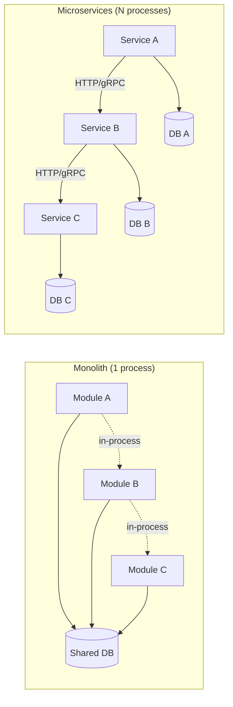
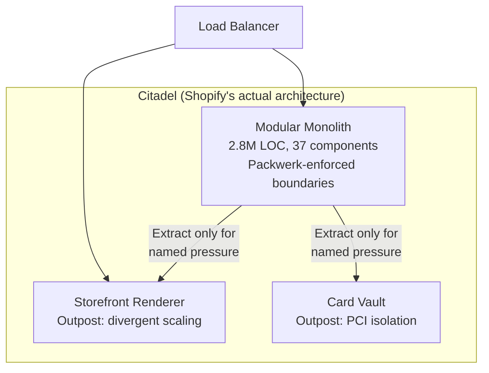
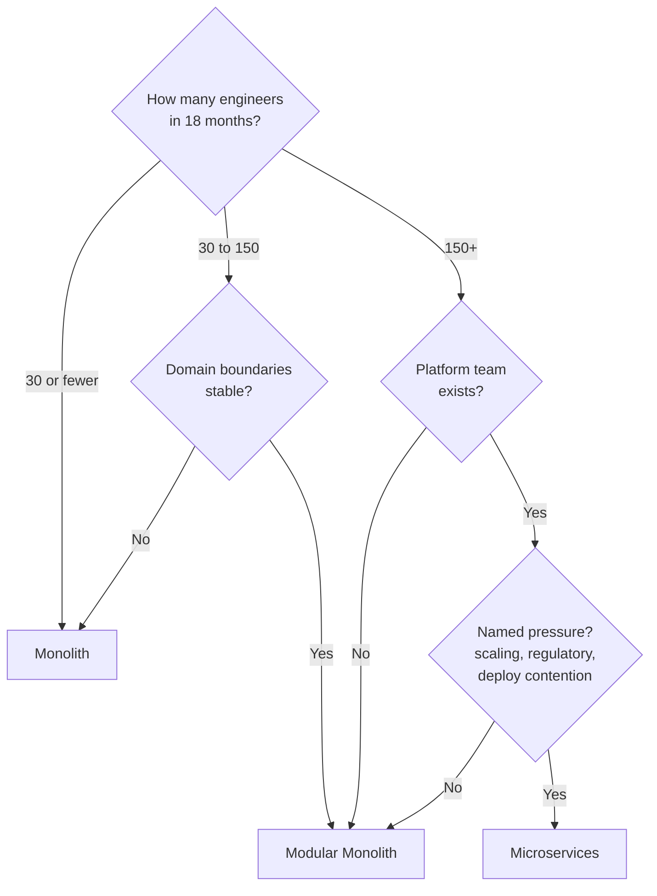

# Monolith vs Microservices

> **TL;DR.** This is an organizational scaling decision disguised as a technical one. Conway's Law[^1] is the real driver: your architecture will mirror your team structure regardless of what the whiteboard says. Default to a monolith (or modular monolith) until you can name a specific pressure, deploy-queue contention, divergent scaling, or regulatory isolation, that justifies the distributed tax. Stack Overflow serves 66 million pageviews/day from 9 servers on a .NET monolith[^2]. Shopify handles tens of millions of requests per minute on a modular monolith during Black Friday[^3]. Microservices are not automatically better; they are automatically more expensive.

## Learning Objectives

- Compare monolith, modular monolith, and microservices across deploy independence, operational cost, and team autonomy.
- Identify the team-size and domain-stability thresholds that tip the decision toward microservices.
- Justify the modular monolith as the default for growing teams (30 to 150 engineers).
- Evaluate Segment's reverse migration and Uber's DOMA as evidence for when each approach fails.

## The Core Trade-off

The fundamental tension is **deployment independence vs operational overhead**. A monolith gives you in-process calls, ACID transactions across every module, one debugger, one log stream, and zero network tax[^4]. Microservices buy team-level deploy independence by paying a recurring tax on every request: timeouts, retries, circuit breakers, distributed tracing, service mesh, saga coordination, and contract versioning[^5].

That tax is not theoretical. With 100 service dependencies each slow 1% of the time, the probability of at least one slow response per request is 1 - 0.99^100 = 63%[^6]. Segment documented 3 full-time engineers consumed by keeping 140 services alive; operational overhead "increased linearly with each added destination"[^7].

The decision compresses to three questions: (1) how many engineers will touch this codebase in 18 months, (2) are the domain boundaries stable, and (3) what operational budget exists for distributed-system debugging? Traffic volume is rarely the binding constraint.

*In-process calls (dotted) are free; network calls (solid) carry the full distributed tax: timeouts, retries, versioning, and observability per hop.*

## Side-by-Side Comparison

| Dimension | Monolith | Microservices |
|---|---|---|
| Deploy independence | None; all teams share one pipeline | Full; each team ships independently |
| Inter-module cost | In-process function call (nanoseconds) | Network RPC (milliseconds + failure modes) |
| Transaction model | ACID across all modules | Sagas, eventual consistency, compensation[^8] |
| Scaling model | Vertical or identical replicas | Per-service horizontal scaling |
| Tech-stack flexibility | Single runtime | Polyglot (Go, Python, JVM side by side)[^6] |
| Operational overhead | One log stream, one debugger | Service mesh, distributed tracing, per-service CI/CD |
| Failure blast radius | Entire application | One service (if boundaries are clean) |
| Team ceiling before pain | ~30 engineers | Hundreds, with platform team investment |

The table misleads on "failure blast radius." In practice, most microservice architectures form synchronous call chains where one slow dependency cascades upstream. Uber's "death star" dependency graph demonstrated this: "The time when Uber is most reliable is on the weekends because that is when the engineers aren't making changes"[^6]. True fault isolation requires async boundaries, not just process boundaries.

The dimension that dominates in practice is **team coordination cost**. If your teams already deploy in lockstep and share a sprint cadence, microservices add overhead without adding independence.

## When to Pick Monolith

- **Team size under 30 engineers, single product.** One codebase, one deploy pipeline, one database. Refactoring across modules is strictly easier than across services[^4]. Stack Overflow serves ~66 million pageviews/day from 9 web servers on a single .NET monolith with average render time under 23 ms[^2].
- **Domain boundaries are unstable.** Early-stage products rename entities monthly. Microservice boundaries lock in today's (wrong) model as network contracts. Fowler's MonolithFirst heuristic: "Almost all the cases where I've heard of a system that was built as a microservice system from scratch, it has ended up in serious trouble"[^4].
- **Operational budget is minimal.** No service mesh, no distributed tracing, no eventual-consistency debugging. One process, one log stream, one on-call rotation.
- **Basecamp/HEY (37signals):** DHH's "Majestic Monolith" pattern, a single Rails app serving millions of users with a team under 20 engineers[^9].

## When to Pick Microservices

- **150+ engineers across multiple autonomous teams with a platform team.** Conway's Law guarantees the architecture mirrors the org[^1]. If 8 teams each own a domain, they will produce 8 services whether you plan for it or not.
- **Independent deploy cadences are a named pain.** Payments ships weekly; search ships hourly; admin tools ship monthly. A shared pipeline ties them all to the slowest.
- **Divergent scaling or runtime requirements.** ML inference needs GPUs; ingestion needs Go; the gateway needs Node. One monolith cannot host all three cleanly.
- **Regulatory isolation.** PCI scope reduction, HIPAA boundaries, or data-residency requirements that demand separate process and data ownership.
- **Netflix, Amazon, Uber:** thousands of deploys per day because services ship independently. Uber runs 4,500 services with 100,000+ deployments per week[^10].

## The Hybrid Path

The realistic production endpoint is not 200 microservices or one 5M-line monolith. It is a modular monolith at the core plus targeted extractions where a concrete pressure justifies the split.

**Shopify** is the reference implementation. A 2.8-million-line Ruby monolith with 37 internal components enforced by Packwerk (static-constant-reference analysis on every PR)[^11][^12]. Stores are sharded into pods for tenant isolation. Only two capabilities were extracted into services: storefront rendering (divergent read throughput) and credit-card vaulting (PCI scope reduction)[^11]. This handles Black Friday at tens of millions of requests per minute[^3].

DHH named this the "Citadel" pattern: monolith at the center, small outposts for genuinely divergent workloads[^9].

*Extract services only when you can name the specific pressure (scaling divergence, regulatory isolation). Everything else stays in the monolith.*

## Real-World Examples

**Segment (2018):** 140+ microservices (one per analytics destination), 3 FTEs consumed by operations. Shared libraries diverged across repos because "when pressed for time, engineers would only include the updated versions on a single destination's codebase"[^7]. Consolidated back to one service. Shared-library improvements jumped from 32 (microservices era) to 46 in the first year post-consolidation[^7].

**Uber (2013 to 2020):** Grew from 2 services to 4,000+. The "death star" dependency graph made weekends the most reliable time[^6]. Solution was not fewer services but more structure: DOMA grouped 2,200 critical services into 70 domains with gateway-mediated lateral calls. For one early platform consumer, feature integration dropped from ~3 days to ~3 hours[^13].

**Stack Overflow (2016):** 66 million pageviews/day, 9 web servers, one .NET monolith, average question render time 22.71 ms[^2]. Proof that monoliths scale to surprising traffic when the team is disciplined.

## Common Mistakes

> [!WARNING]
> **Premature microservices.** A 15-engineer team builds 20 services and spends 40% of capacity on platform work. If you have no deploy-coordination pain, you have no microservices justification. Consolidate[^4].

> [!WARNING]
> **Distributed monolith.** Services split on paper but deploying together, sharing a database, or forming 3+ hop synchronous chains. All of the distributed tax, none of the independence. Litmus test: does a library bump redeploy the fleet?[^14]

> [!WARNING]
> **Copying someone else's org chart.** Jeremiah Lee, who worked at Spotify, wrote that the squad model "was only ever aspirational and never fully implemented." Joakim Sunden, agile coach at Spotify, confirmed: "Even at the time we wrote it, we weren't doing it"[^15]. Use Team Topologies[^16] instead of cargo-culting.

> [!WARNING]
> **Extracting the wrong boundary first.** If the new service cannot function when the monolith is down, you extracted a dependency, not a capability. Extract high-cohesion, low-coupling business capabilities with self-contained data[^11].

## Decision Checklist

*The decision is dominated by team size and domain stability, not request volume. Jump to microservices only when a named pain justifies the distributed tax.*

- [ ] How many engineers will touch this codebase concurrently in 18 months?
- [ ] Are your domain boundaries stable or still shifting weekly?
- [ ] Can you name a specific deploy-coordination pain that costs measurable velocity?
- [ ] Do you have operational budget for distributed tracing, service mesh, and saga debugging?
- [ ] Does a divergent runtime requirement (GPU, polyglot, regulatory) exist today?
- [ ] Is modular-monolith tooling available in your stack (Packwerk, ArchUnit, Go internal packages)?

## Key Takeaways

- Conway's Law decides your architecture. Shape teams first; the system follows[^1].
- Default to monolith (or modular monolith) until a named pressure justifies the distributed tax.
- The modular monolith is the correct middle ground for 30 to 150 engineers: team ownership without network boundaries.
- Microservices are an organizational scaling tool, not a performance optimization.
- If a library bump redeploys the fleet, you have a distributed monolith, the worst of both worlds[^14].

## Further Reading

- [MonolithFirst](https://martinfowler.com/bliki/MonolithFirst.html) by Martin Fowler, 2015: the one-page contrarian default; the citable authority for "do not start with microservices."
- [Goodbye Microservices](https://www.twilio.com/en-us/blog/developers/best-practices/goodbye-microservices) by Alexandra Noonan, Segment, 2018: the canonical reverse-migration case study with specific operational-cost numbers.
- [Under Deconstruction: The State of Shopify's Monolith](https://shopify.engineering/shopify-monolith) by Philip Muller, 2020: modular monolith at 2.8M LOC; honest about what did not work.
- [Introducing Domain-Oriented Microservice Architecture](https://www.uber.com/blog/microservice-architecture/) by Adam Gluck, Uber, 2020: what 2,200 microservices plus structure looks like at scale.
- [The Majestic Monolith can become The Citadel](https://www.signalvnoise.com/svn3/the-majestic-monolith-can-become-the-citadel/) by DHH, 2020: the named pattern for monolith-plus-outposts.
- [Team Topologies](https://teamtopologies.com/book) by Skelton and Pais, 2019: cognitive-load-first organizational design that replaces cargo-culted squad models.

## Flashcards

<strong>Q: What is the fundamental trade-off between monolith and microservices?</strong>

A: Deployment independence vs operational overhead. Monoliths give zero network tax and ACID transactions; microservices buy team-level deploy independence by paying a recurring distributed-system tax on every request.

<strong>Q: At what team size should you consider microservices?</strong>

A: Around 150+ engineers with a platform team and named pressures (deploy contention, divergent scaling, regulatory isolation). Below 30, monolith. Between 30 and 150, modular monolith.

<strong>Q: What is a distributed monolith and how do you detect it?</strong>

A: Services that must deploy together, share a database, or form deep synchronous call chains. Litmus test: does a library version bump require redeploying the entire fleet? If yes, you have all the distributed tax with none of the independence.

<strong>Q: How does Shopify enforce modular-monolith boundaries?</strong>

A: Packwerk, a Ruby static-constant-reference analyzer, runs on every PR and blocks new boundary violations from merging. This enforces 37 internal component boundaries across 2.8 million lines of code without splitting into services.

<strong>Q: Why did Segment consolidate 140 microservices back to one?</strong>

A: Operational overhead increased linearly with each service. 3 FTEs were consumed by maintenance. Shared libraries diverged across repos. After consolidation, shared-library improvements jumped from 32 to 46 in the first year.

<strong>Q: What is Uber's DOMA and why was it needed?</strong>

A: Domain-Oriented Microservice Architecture. It grouped 2,200 critical services into 70 domains with gateway-mediated lateral calls and 5 dependency layers. Uber did not reduce service count; it added structure because services had a 1.5-year half-life.

<strong>Q: What probability of a slow request do you face with 100 service dependencies each 1% slow?</strong>

A: 63%. Calculated as 1 - 0.99^100. This is why synchronous microservice call chains degrade tail latency even when individual services are healthy.

<strong>Q: What does Conway's Law state and why does it matter here?</strong>

A: Organizations produce system designs that mirror their communication structures. Architecture follows org chart, not the reverse. This means the monolith-vs-microservices decision is fundamentally an organizational scaling decision, not a technical one.

## References

[^1]: Melvin E. Conway, "How Do Committees Invent?", Datamation, April 1968. http://www.melconway.com/Home/Committees_Paper.html
[^2]: Nick Craver, "Stack Overflow: The Architecture - 2016 Edition", Stack Overflow Blog, 17 Feb 2016. https://stackoverflow.blog/2016/02/17/stack-overflow-the-architecture-2016-edition/
[^3]: Faun.dev, "How Shopify Handles 30TB of Data Every Minute with a Monolithic Architecture", Oct 2025. Secondary aggregator citing Shopify BFCM scale. https://www.faun.dev/c/links/devopslinks/how-shopify-handles-30tb-of-data-every-minute-with-a-monolithic-architecture/
[^4]: Martin Fowler, "MonolithFirst", martinfowler.com, 3 June 2015. https://martinfowler.com/bliki/MonolithFirst.html
[^5]: James Lewis and Martin Fowler, "Microservices", martinfowler.com, 25 March 2014. https://martinfowler.com/articles/microservices.html
[^6]: Sujeet Jaiswal, "Uber: From Monolith to Domain-Oriented Microservices", 2026. Annotated case study citing Matt Ranney's QCon SF 2016 talk. https://sujeet.pro/articles/uber-microservices-journey
[^7]: Alexandra Noonan, "Goodbye Microservices: From 100s of problem children to 1 superstar", Twilio Segment blog, 10 July 2018. https://www.twilio.com/en-us/blog/developers/best-practices/goodbye-microservices
[^8]: Microsoft Azure, "Saga design pattern", Azure Architecture Center. https://learn.microsoft.com/en-us/azure/architecture/reference-architectures/saga/saga
[^9]: David Heinemeier Hansson, "The Majestic Monolith can become The Citadel", Signal v. Noise, 8 April 2020. https://www.signalvnoise.com/svn3/the-majestic-monolith-can-become-the-citadel/
[^10]: Mathias Schwarz and Andrew Neverov, "Up: Portable Microservices Ready for the Cloud", Uber Engineering Blog, 7 Sep 2023. https://www.uber.com/blog/up-portable-microservices-ready-for-the-cloud/
[^11]: Philip Muller, "Under Deconstruction: The State of Shopify's Monolith", Shopify Engineering, 16 Sep 2020. https://shopify.engineering/shopify-monolith
[^12]: Shopify, "Packwerk README", GitHub repository. https://github.com/Shopify/packwerk
[^13]: Adam Gluck, "Introducing Domain-Oriented Microservice Architecture", Uber Engineering Blog, July 2020. https://www.uber.com/blog/microservice-architecture/
[^14]: Hacker News discussion, "Why Twilio Segment moved from microservices back to a monolith", 2024. https://news.ycombinator.com/item?id=46257714
[^15]: Jeremiah Lee, "Spotify's Failed #SquadGoals", jeremiahlee.com, 19 April 2020. https://www.jeremiahlee.com/posts/failed-squad-goals/
[^16]: Matthew Skelton and Manuel Pais, "Team Topologies", teamtopologies.com, 2019. https://teamtopologies.com/book
