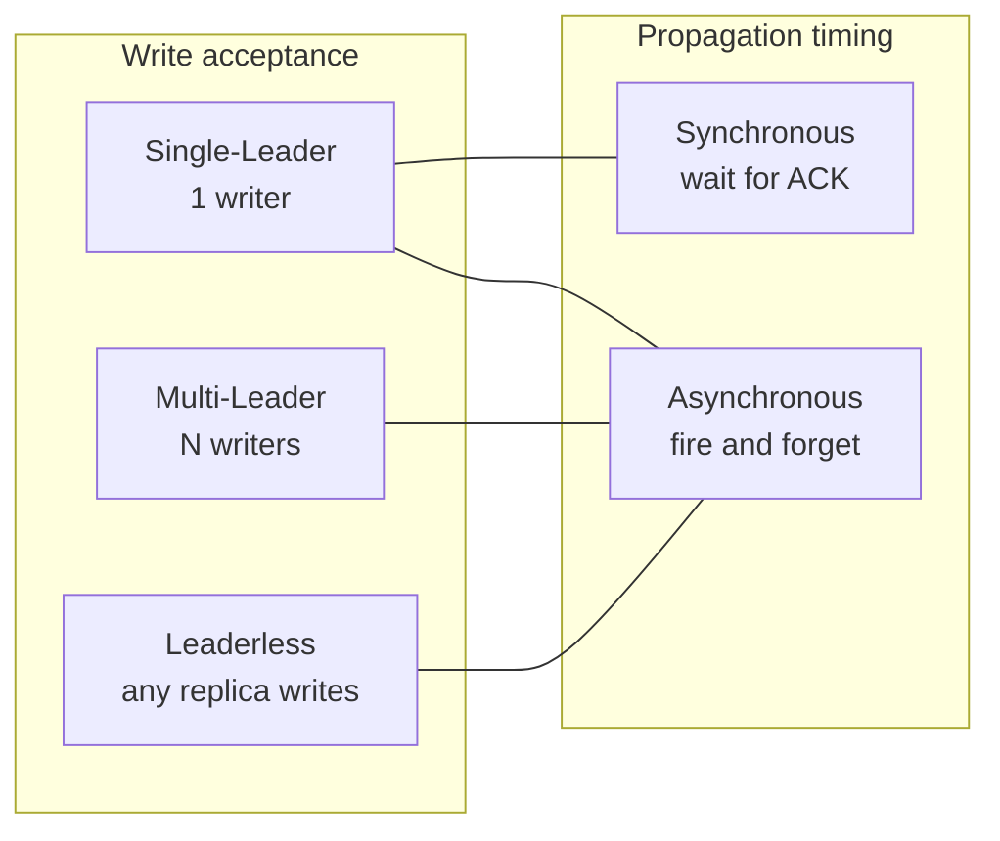
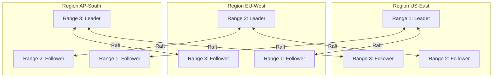
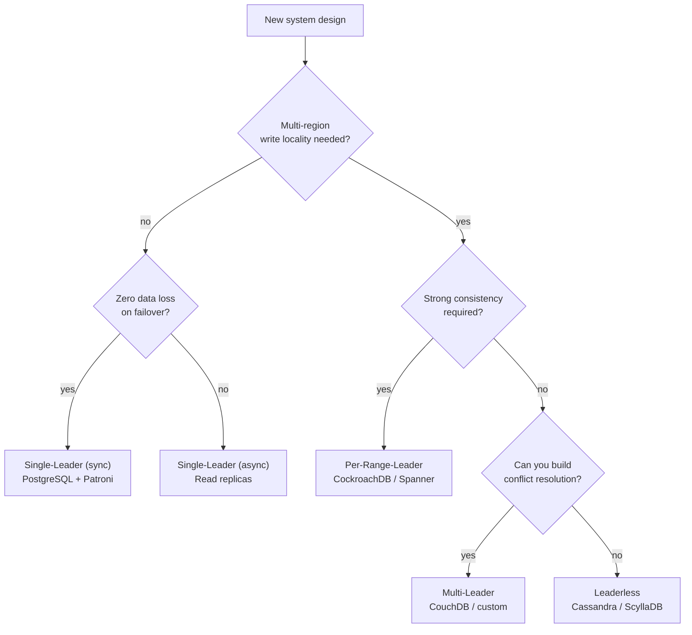

# Replication Topologies: Leader-Follower, Multi-Leader, Leaderless

> **TL;DR.** Replication topology decides who can accept writes and how those writes reach other replicas. Single-leader serializes all writes through one node for simple consistency but caps write throughput and adds failover risk. Multi-leader allows concurrent writes at multiple nodes for geo-distributed low latency but forces you to solve conflict resolution. Leaderless (Dynamo-style) removes the leader entirely for maximum availability but demands quorum math and anti-entropy. Default to single-leader with async replication unless you need multi-region writes (per-range-leader hybrid) or availability-first semantics (leaderless). The sync/async dimension is orthogonal: it controls durability guarantees, not topology[^1].

## Learning Objectives

- Compare single-leader, multi-leader, leaderless, and per-range-leader topologies across latency, consistency, availability, and operational complexity.
- Identify the workload characteristics (geo-distribution, write ratio, consistency needs) that determine the correct topology.
- Justify the per-range-leader hybrid as the default for global OLTP needing strong consistency.
- Evaluate DynamoDB's evolution from leaderless to single-leader-per-partition and explain why Amazon made that shift.

## The Core Trade-off

The fundamental tension: as you allow more nodes to accept writes, write latency drops and availability rises, but consistency becomes harder to maintain. A single-leader topology serializes all writes through one node, giving you a total order for free. Multi-leader and leaderless topologies accept writes at multiple nodes simultaneously, which means concurrent conflicting writes are possible and the system must reconcile them.

Orthogonal to topology is the sync/async dimension. Synchronous replication waits for follower acknowledgment before confirming a write. PostgreSQL benchmarks show synchronous-apply mode incurs roughly 50% write throughput penalty compared to async[^1]. Asynchronous replication confirms immediately on the leader, risking data loss if the leader fails before replication completes. These two axes (topology and timing) combine into six meaningful configurations; three dominate production systems.

*Two orthogonal axes: topology controls who accepts writes; timing controls when the writer gets confirmation. Multi-leader and leaderless are almost always async.*

## Side-by-Side Comparison

| Dimension | Single-Leader | Multi-Leader | Leaderless |
|---|---|---|---|
| Write latency | 1-5 ms same-AZ (sync), sub-ms (async)[^1] | Local-leader latency, single-digit ms | Quorum write, single-digit ms[^2] |
| Read freshness | Always fresh from leader; followers may lag | Per-leader fresh; cross-leader eventually consistent | Tunable via R + W > N[^3] |
| Availability during partition | Minority side loses writes[^4] | Both sides accept writes[^5] | Any replica accepts writes |
| Conflict resolution | Not needed; total order exists | Required: LWW, CRDTs, or app-level merge[^6] | Required: read-repair, anti-entropy[^7] |
| Operational complexity | Low; well-understood failover | High; conflict debugging is hard[^6] | Medium-high; quorum tuning, repair jobs |
| Scale ceiling | Single-writer bottleneck per shard | Near-linear write scale across regions | Near-linear; any node serves any request |
| Failover risk | Data loss if async; zero loss if sync[^1] | No single point of failure | No single point of failure |

The table misleads on "leaderless availability." Sloppy quorums and hinted handoff let writes succeed even when the preferred replicas are down, but the resulting data may diverge and require reconciliation[^3]. High availability is not free; it is paid in reconciliation complexity.

The "conflict resolution" row dominates the decision. If your team cannot invest in CRDT design or application-level merge logic, multi-leader and leaderless topologies will produce silent data loss via last-writer-wins[^6].

## When to Pick Single-Leader

**OLTP with strong consistency requirements.** Bank ledgers, inventory systems, seat reservations. A single writer provides a total order without conflict resolution. PostgreSQL streaming replication and MySQL semi-sync are battle-tested for this pattern[^4].

**Read-heavy workloads needing scale-out.** Async followers serve reads. TimescaleDB/PostgreSQL benchmarks show 2.5x read throughput with 3 nodes and 4.8x with 5 nodes[^1]. The primary handles all writes; followers absorb read traffic.

**Single-region deployments.** When all clients are within one region, the latency penalty of routing writes to a single leader is negligible (1-5 ms same-AZ). The simplicity of a single writer outweighs any theoretical availability gain from multi-leader.

**Named systems:** PostgreSQL with Patroni, MySQL with Group Replication, Amazon RDS Multi-AZ, Aurora (storage-level quorum but single compute writer)[^8].

## When to Pick Leaderless

**Availability-first workloads tolerating eventual consistency.** Shopping carts, session stores, time-series telemetry. Cassandra with LOCAL_QUORUM delivers low single-digit millisecond p99 writes in multi-region deployments[^2]. Any replica can serve any request; no failover needed.

**Tunable consistency per operation.** The same Cassandra cluster can serve ONE consistency for analytics queries and QUORUM for user-facing reads. This per-query flexibility is a distinctive strength of leaderless systems[^2].

**Write-heavy workloads with independent keys.** When writes rarely conflict (distinct user sessions, IoT sensor data), the reconciliation cost is low and the write distribution benefit is high.

**Named systems:** Apache Cassandra, ScyllaDB, Amazon DynamoDB (original Dynamo paper[^3]), Riak.

> [!IMPORTANT]
> DynamoDB evolved away from pure leaderless. The 2022 USENIX paper reveals modern DynamoDB uses Multi-Paxos per partition, making it single-leader-per-partition despite its Dynamo heritage[^9][^10]. Even Amazon decided leaderless conflict resolution was too costly for their flagship database.

## The Hybrid Path

Most production systems needing global strong consistency use the per-range-leader pattern: partition data into ranges, elect a consensus leader per range via Raft or Paxos, and place leaders near traffic sources.

CockroachDB divides the keyspace into ranges (default 512 MiB `range_max_bytes`), each replicated 3 times as an independent Raft group[^11][^12]. Large clusters run tens of thousands of consensus groups[^13]. Spanner uses Paxos per shard with TrueTime for external consistency, absorbing clock uncertainty of typically 1-7 ms via commit-wait[^14].

The result: globally it looks like multi-region active-active (any region can serve writes for its local ranges). Per-range it is classic leader-follower with consensus. You get strong consistency plus regional write locality without application-level conflict resolution.

*Per-range-leader hybrid: each range has one Raft leader placed near its traffic. Globally the system appears active-active; per-range it is single-leader with consensus.*

## Real-World Examples

**Amazon DynamoDB** peaked at 89.2 million requests/sec during Prime Day 2021 with single-digit millisecond latency[^9]. The original 2007 Dynamo paper described a leaderless system with consistent hashing and vector clocks[^3]. In production, only 0.06% of Dynamo reads returned divergent (multiple) versions; 99.94% returned a single consistent version[^3]. By 2022, DynamoDB had evolved to Multi-Paxos per partition for stronger consistency guarantees[^10]. The metadata cache achieves 99.75% hit rate, but the backing store is always provisioned for full traffic to eliminate metastable failure modes[^9].

**Amazon Aurora** uses 6-way replication across 3 AZs with a write quorum of 4/6 and read quorum of 3/6[^8]. Storage is segmented into 10 GB Protection Groups, each independently replicated. A failed segment repairs in under one minute on a 10 Gbit network[^8]. This design tolerates losing an entire AZ without losing write availability.

**CockroachDB** runs tens of thousands of Raft groups in large clusters[^13]. The leaseholder mechanism separates read coordination from Raft leadership: one replica per range handles all reads and writes without a full consensus round for reads[^11]. Cross-range transactions use two-phase commit over Raft, adding latency influenced by the number of ranges touched[^11].

## Common Mistakes

> [!WARNING]
> **Split-brain in leader-follower without fencing.** Network partition isolates the old primary from the failover orchestrator. The old primary continues accepting writes, causing data divergence. Use STONITH fencing, lease-based leadership, or consensus-based election (Patroni, Raft)[^4].

> [!WARNING]
> **Choosing multi-leader without a conflict strategy.** Last-writer-wins silently drops one of two concurrent writes to the same key. If you cannot articulate your merge function before deployment, you will lose data[^6]. CouchDB stores all conflicting revisions for application-level resolution[^15]; most teams do not build this.

> [!WARNING]
> **Setting W + R <= N in leaderless systems.** This breaks the quorum overlap guarantee. Reads may not intersect with writes, returning arbitrarily stale data. Default to W=R=majority (N=3, W=2, R=2) and only relax with explicit justification[^3].

> [!WARNING]
> **Assuming async replication means zero data loss.** PostgreSQL async mode shows negligible throughput difference from standalone[^1], but any writes not yet replicated are lost on primary failure. If zero data loss matters, synchronous replication to at least one follower is non-negotiable, despite the 50% throughput cost[^1].

## Decision Checklist

- [ ] Does the workload need writes from multiple regions with sub-50 ms latency? If yes, single-leader is out; choose per-range-leader (strong) or multi-leader (eventual).
- [ ] Is zero data loss on failover a hard requirement? If yes, synchronous replication to quorum is mandatory.
- [ ] Can you articulate a conflict resolution strategy (LWW, CRDTs, app-merge)? If not, avoid multi-leader and leaderless.
- [ ] What is the read:write ratio? Heavy-read with tolerance for seconds of lag favors async leader-follower for read scale-out.
- [ ] Does the system need per-operation tunable consistency? Leaderless (Cassandra) or per-range-leader (CockroachDB) support this; pure leader-follower does not.
- [ ] Is failover automated (Raft, Patroni) or manual? Manual failover with async replication guarantees data loss.

*Decision flowchart: multi-region write locality is the first fork. Strong consistency pushes you to per-range-leader; without it, your conflict resolution capability determines multi-leader vs leaderless.*

## Key Takeaways

- Single-leader is the correct default for single-region OLTP. It provides a total order without conflict resolution and scales reads via async followers.
- Multi-leader solves geo-distributed write latency but forces you to solve conflict resolution. If you cannot build the merge logic, do not pick this topology.
- Leaderless maximizes availability and write distribution but requires quorum math, anti-entropy, and reconciliation. DynamoDB itself moved away from pure leaderless to Multi-Paxos per partition[^10].
- The per-range-leader hybrid (CockroachDB, Spanner) is the modern answer for global OLTP: strong consistency plus regional write locality without application-level conflicts.
- Sync vs async is orthogonal to topology. It controls durability, not who accepts writes. Choose sync for zero-data-loss failover; accept the 50% throughput cost[^1].

## Further Reading

- [Amazon DynamoDB USENIX ATC 2022](https://www.usenix.org/conference/atc22/presentation/elhemali): how DynamoDB evolved from leaderless Dynamo to Multi-Paxos per partition; the definitive case study in topology migration.
- [Amazon Aurora: Quorums and Correlated Failure](https://aws.amazon.com/blogs/database/amazon-aurora-under-the-hood-quorum-and-correlated-failure/): why Aurora chose 6-copy quorum over simpler 2/3 models; essential reading for storage-layer replication.
- [CockroachDB: The Resilient Geo-Distributed SQL Database, SIGMOD 2020](https://www.cockroachlabs.com/guides/cockroachdb-the-resilient-geo-distributed-sql-database-sigmod-2020/): per-range Raft at scale with tens of thousands of consensus groups.
- [High Availability and Scalable Reads in PostgreSQL, Timescale 2024](https://www.timescale.com/blog/scalable-postgresql-high-availability-read-scalability-streaming-replication-fb95023e2af): concrete benchmarks comparing sync, async, and standalone PostgreSQL throughput.
- [Chain Replication for Supporting High Throughput and Availability, OSDI 2004](https://www.usenix.org/legacy/publications/library/proceedings/osdi04/tech/full_papers/renesse/renesse_html/index.html): the chain replication paper; relevant for understanding Azure Storage and HDFS pipelines.
- [MySQL Semi-Sync: Durability, Consistency, and Split Brains](https://www.planetscale.com/blog/mysql-semi-sync-replication-durability-consistency-and-split-brains): practical analysis of semi-sync failure modes and split-brain scenarios.

## Flashcards

<strong>Q: What is the throughput cost of synchronous replication in PostgreSQL?</strong>

A: Synchronous-apply mode incurs roughly 50% write throughput penalty compared to async mode, while async shows negligible difference from a standalone server.

<strong>Q: Why did DynamoDB move from leaderless to single-leader-per-partition?</strong>

A: Stronger consistency guarantees. The 2022 USENIX paper shows DynamoDB now uses Multi-Paxos per partition, eliminating the conflict resolution complexity of the original Dynamo design while maintaining single-digit millisecond latency at 89.2M req/sec peak.

<strong>Q: What quorum configuration does Aurora use and why?</strong>

A: 6 copies across 3 AZs with write quorum 4/6 and read quorum 3/6. This tolerates losing an entire AZ without losing write availability, and an AZ plus one additional fault without losing data.

<strong>Q: What is the quorum overlap rule for leaderless systems?</strong>

A: W + R > N ensures at least one replica in the read set has the latest write. With N=3, W=2, R=2, the overlap is guaranteed. Setting W + R <= N breaks consistency.

<strong>Q: When should you pick per-range-leader over multi-leader?</strong>

A: When you need multi-region write locality AND strong consistency. Per-range-leader (CockroachDB, Spanner) gives linearizable reads and writes without application-level conflict resolution. Multi-leader trades consistency for simpler deployment.

<strong>Q: What is the primary risk of last-writer-wins conflict resolution?</strong>

A: Silent data loss. When two leaders concurrently modify the same record, LWW uses timestamps to pick a winner and silently discards the other write. The application never learns a conflict occurred.

<strong>Q: How does CockroachDB achieve horizontal write scaling with strong consistency?</strong>

A: It divides the keyspace into ranges (default 512 MiB), each forming an independent Raft consensus group. Leaders are placed near traffic sources. This distributes write load across thousands of independent consensus groups while maintaining linearizability per range.

## References

[^1]: Hampton, "High Availability and Scalable Reads in PostgreSQL," Timescale Blog, March 2024. https://www.timescale.com/blog/scalable-postgresql-high-availability-read-scalability-streaming-replication-fb95023e2af
[^2]: Apache Cassandra Documentation, "Architecture Overview." https://cassandra.apache.org/doc/latest/cassandra/architecture/
[^3]: DeCandia et al., "Dynamo: Amazon's Highly Available Key-value Store," SOSP 2007. https://www.allthingsdistributed.com/files/amazon-dynamo-sosp2007.pdf
[^4]: Noach, "MySQL Semi-Sync Replication: Durability, Consistency, and Split Brains," PlanetScale, October 2020. https://www.planetscale.com/blog/mysql-semi-sync-replication-durability-consistency-and-split-brains
[^5]: Kleppmann, "Designing Data-Intensive Applications," Ch. 5: Replication. O'Reilly, 2017.
[^6]: "From Last-Writer-Wins to CRDTs," Codelit.io, 2025. https://codelit.io/blog/data-replication-conflict-resolution
[^7]: Riak Documentation, "Active Anti-Entropy." https://docs.riak.com/riak/kv/latest/learn/concepts/active-anti-entropy/
[^8]: Gupta, "Amazon Aurora Under the Hood: Quorums and Correlated Failure," AWS Database Blog, August 2017. https://aws.amazon.com/blogs/database/amazon-aurora-under-the-hood-quorum-and-correlated-failure/
[^9]: Elhemali et al., "Amazon DynamoDB: A Scalable, Predictably Performant, and Fully Managed NoSQL Database Service," USENIX ATC 2022. https://www.usenix.org/conference/atc22/presentation/elhemali
[^10]: Lu Pan, "Notes on Amazon's DynamoDB USENIX ATC'22 Paper," August 2022. https://blog.the-pans.com/dynamodb/
[^11]: Taft et al., "CockroachDB: The Resilient Geo-Distributed SQL Database," SIGMOD 2020. https://www.cockroachlabs.com/guides/cockroachdb-the-resilient-geo-distributed-sql-database-sigmod-2020/
[^12]: CockroachDB Documentation v26.2, "Replication Controls" (`range_max_bytes` default = 536870912 / 512 MiB). https://www.cockroachlabs.com/docs/stable/configure-replication-zones
[^13]: CockroachDB Blog, "Scaling Raft," June 2015. https://www.cockroachlabs.com/blog/scaling-raft/
[^14]: Corbett et al., "Spanner: Google's Globally-Distributed Database," OSDI 2012. https://research.google.com/archive/spanner.html
[^15]: Apache CouchDB Documentation, "Replication and Conflict Model." https://docs.couchdb.org/en/stable/replication/conflicts.html
