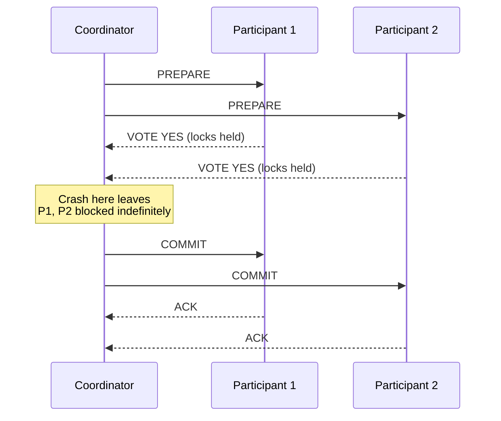
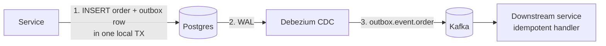
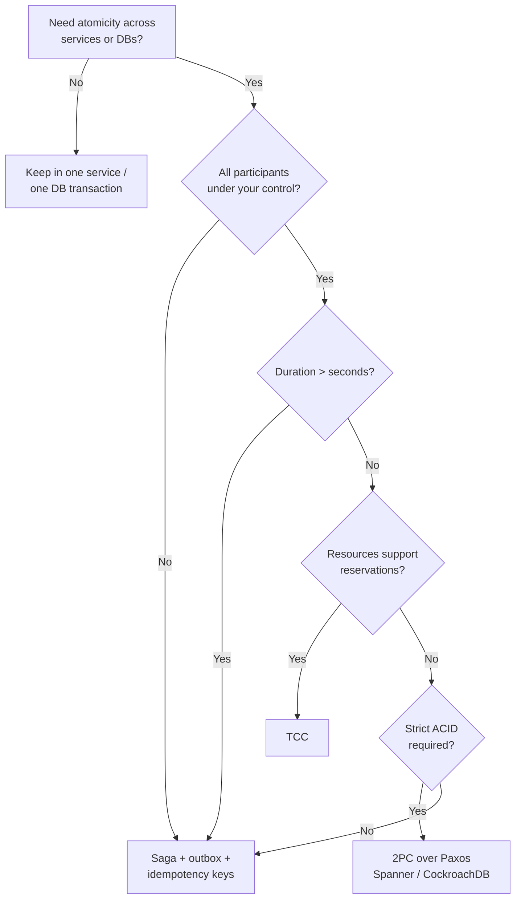

# Distributed Transactions: 2PC vs Saga vs TCC

> **TL;DR.** Two-phase commit (2PC) gives you ACID atomicity across services but blocks on coordinator failure and holds locks for two network round-trips[^1]. Sagas give you availability and long-running durability but sacrifice isolation: observers see partial state between steps[^2]. TCC gives stronger isolation than Saga via resource reservations but triples the code surface per operation[^3]. The deciding dimension is how much intermediate-state visibility the business can tolerate. For most microservices in 2025, the default is Saga + transactional outbox + idempotency keys[^4][^5].

## Learning Objectives

- Compare 2PC, Saga, and TCC across isolation, availability, latency, and implementation cost.
- Identify workload characteristics (duration, participant control, reversibility) that favor each approach.
- Justify the Saga + outbox + idempotency hybrid as the modern microservices default.
- Evaluate Spanner, CockroachDB, and Uber Cadence as production decision examples.

## The Core Trade-off

Any protocol that coordinates commit across N nodes must either block until all participants respond (hurting availability) or allow participants to make independent local decisions that may later need compensation (hurting isolation)[^1][^4]. There is no third option. Gray and Lamport showed that only a consensus-backed commit protocol (Paxos Commit) avoids the blocking problem of classical 2PC by running Paxos among 2F+1 acceptors per participant[^1]. Helland went further, arguing that the failure of a single node causes transaction commit to stall, and the larger the system gets, the more likely it is to be down[^4].

The metric that moves in opposite directions is isolation vs. availability. Strengthen isolation (2PC holds locks across all participants) and availability drops because any participant failure blocks the entire transaction. Weaken isolation (Saga commits each step independently) and availability rises because no cross-service locks exist, but observers see intermediate states.

*The window between prepare-ack and commit is where a coordinator crash leaves participants holding locks indefinitely, the fundamental blocking problem of 2PC.*

## Side-by-Side Comparison

| Dimension | 2PC (XA, Spanner) | Saga (Temporal, Step Functions) | TCC (Seata) |
|---|---|---|---|
| Isolation | Full ACID across participants | None between steps; partial state visible[^2] | Reservation-level; resources hidden until Confirm[^3] |
| Availability | Blocks on coordinator or participant failure[^1] | Non-blocking; each step commits locally | Non-blocking; Try is a local commit |
| Latency | 2 sequential consensus rounds (1 with Parallel Commits)[^6] | Sum of local transaction latencies | Try + Confirm/Cancel round-trip |
| Duration ceiling | Seconds (locks held across prepare) | Minutes to days | Seconds to minutes (reservation TTL) |
| Participant control | All must implement prepare/commit | Any service with compensation logic | All must expose Try/Confirm/Cancel[^3] |
| Failure mode | Indefinite lock hold on coordinator crash | Compensation may fail; requires idempotent retry | Empty rollback, suspension, idempotence pathologies[^7] |
| Code complexity | Low (database handles protocol) | Medium (compensators per step) | High (3 methods per operation) |
| Third-party APIs | Requires XA support (rare) | Works with any API that can be compensated | Requires reservation primitive (rare externally) |

The table understates one dimension: operational maturity. 2PC is well-understood inside a single database (Spanner, CockroachDB handle it transparently). Saga tooling (Temporal, Cadence) is production-grade but requires workflow-determinism discipline[^8]. TCC is niche: Seata is the only major open-source implementation, and its fence-log plumbing is non-trivial[^7].

## When to Pick 2PC

**Strict ACID is a regulatory requirement.** Financial reconciliation, double-entry ledger commits, compliance systems where partial commit is a breach. Google Spanner uses 2PC over Paxos groups with TrueTime to deliver external consistency at global scale[^9][^10].

**Transaction duration is short (sub-second).** 2PC holds locks across all participants until decision. CockroachDB Parallel Commits halves the latency from 2 consensus round-trips to 1[^6], making short cross-range transactions practical.

**All participants are under your operational control.** 2PC requires every participant to implement the prepare-commit interface. External APIs (Stripe, Twilio, SendGrid) do not expose XA.

**You are building a database, not using one.** If you control the storage layer, Paxos Commit eliminates the blocking problem. Spanner, CockroachDB, and TiDB all run 2PC internally so application developers never see it.

## When to Pick Saga

**Long-running business processes spanning services.** Order fulfillment, travel booking, employee onboarding. Each step commits locally; the orchestrator tracks progress across minutes or days[^2][^11].

**Third-party APIs are involved.** Stripe charges, email sends, SMS dispatches. These cannot participate in 2PC but can be compensated (refund, retract, cancel).

**Eventual consistency is acceptable.** Between step N success and step N+1 attempt, observers see partial state. If the business can tolerate "order placed but payment pending" for seconds, Saga works.

**The team uses Temporal, Cadence, or Step Functions.** These orchestrators persist workflow state durably, retry activities with backoff, and make compensation sequences debuggable[^8]. Uber reports that Cadence powers over 1,000 services internally and runs over 12 billion workflow executions and 270 billion actions per month, spanning long-running workflows, microservice orchestration, and distributed cron[^8].

## The Hybrid Path

The 2025-era production default is not pure Saga, pure 2PC, or pure TCC. It is: **Saga orchestration + transactional outbox + idempotency keys**. This combination gives at-least-once atomicity between state changes and events without any distributed transaction protocol.

*The outbox row is committed atomically with the business change; Debezium tails the WAL and publishes to Kafka, avoiding any distributed transaction.*

The service inserts into an `outbox` table inside the same local transaction as the business write. Debezium reads the WAL and routes each row to the correct Kafka topic[^12]. Consumers handle at-least-once delivery via idempotency keys (Stripe prunes its `Idempotency-Key` entries after at least 24 hours[^5]). The orchestrator (Temporal, Cadence) coordinates the saga sequence, persisting every workflow event for replay on failure[^8][^13].

This is not exotic. Stripe, Uber, and virtually every modern payment system operates this way[^5][^14][^15].

## Real-World Examples

**Google Spanner (2PC over Paxos + TrueTime).** Spanner shards data into Paxos groups replicated across 3-5 zones. A read-write transaction acquires locks at each Paxos leader, picks a commit timestamp using TrueTime's bounded uncertainty, and performs 2PC where the coordinator itself is Paxos-replicated[^9][^10]. Cloud Spanner recommends a 20-100 ms commit delay for throughput optimization[^16]. This is 2PC done right: the blocking problem is eliminated by consensus, but it requires GPS + atomic clock infrastructure.

**CockroachDB Parallel Commits.** CockroachDB reworked 2PC so a transaction writes a STAGING record plus intent writes concurrently. The transaction is "implicitly committed" the moment all achieve Raft consensus, cutting latency from 2x inter-node RTT to 1x RTT[^6]. The protocol was formally verified in TLA+ with a safety property (`AckImpliesCommit`) and a liveness property (`ImplicitCommitLeadsToExplicitCommit`)[^6].

**Uber Cadence (Saga orchestration).** Cadence durably records every workflow event to a sharded persistence layer, powering long-running workflows, microservice orchestration, and distributed cron across more than 1,000 services at Uber at 12+ billion executions per month[^8]. Payment workflows use orchestrated sagas where each step (auth, capture, settle, refund) has an explicit compensation[^14][^15].

## Common Mistakes

> [!WARNING]
> **Treating saga compensation as rollback.** Compensation is forward recovery, not undo. The committed step is visible during the compensation window. Mark records as PENDING/CONFIRMED so downstream readers can filter partial state[^11].

> [!WARNING]
> **Non-idempotent activities in saga workflows.** Temporal and Cadence retry failed activities by design. Without an idempotency key derived from workflow ID + step name, retries cause double charges or duplicate shipments[^5][^8].

> [!WARNING]
> **Using 2PC across services you do not own.** External APIs rarely implement XA prepare/commit. A coordinator crash leaves you with no way to resolve the transaction. Use Saga + idempotency keys for any flow involving third-party calls.

> [!WARNING]
> **Ignoring TCC's three pathologies.** Empty rollback (Cancel before Try), idempotence (double Confirm), and suspension (Try after Cancel) all occur in production. Seata solves them with a `tcc_fence_log` table using primary-key uniqueness on (xid, branch_id)[^7].

## Decision Checklist

*Decision flowchart: most microservices land on Saga + outbox; 2PC is reserved for database internals or strict-ACID short transactions.*

- [ ] Can the business survive intermediate-state visibility between steps? If no, keep it in one service.
- [ ] Can each step be compensated, and is the compensator idempotent and reversible?
- [ ] What is the expected duration? 2PC caps at seconds; Saga handles days.
- [ ] Are all participants under your operational control, or are third-party APIs involved?
- [ ] Is at-least-once delivery with app-level idempotency acceptable?
- [ ] Do resources support a native reservation primitive (seats, inventory, calendar holds)?
- [ ] Does the team have Temporal/Cadence operational experience?

## Key Takeaways

- 2PC gives ACID but blocks on failure and caps at sub-second durations. Use it inside databases (Spanner, CockroachDB), not across microservices.
- Saga gives availability and handles long-running flows but sacrifices isolation. Compensations are forward recovery, not rollback.
- TCC gives stronger isolation than Saga via reservations but triples code surface and requires all participants to expose Try/Confirm/Cancel.
- The modern default is Saga + transactional outbox + idempotency keys + orchestrator (Temporal/Cadence). This is not exotic; it is mainstream.
- Helland's rule holds: at scale, avoid distributed transactions entirely. Build from independent entities linked by at-least-once messaging with app-level idempotency[^4].

## Further Reading

- [Consensus on Transaction Commit (Gray and Lamport, 2006)](https://www.microsoft.com/en-us/research/publication/consensus-on-transaction-commit/): Paxos Commit, the non-blocking replacement for classic 2PC, foundational to Spanner and CockroachDB.
- [Life Beyond Distributed Transactions (Helland, 2016)](https://queue.acm.org/detail.cfm?id=3025012): the canonical argument for replacing DTX with entities, activities, and at-least-once messaging.
- [Parallel Commits (VanBenschoten, Cockroach Labs)](https://www.cockroachlabs.com/blog/parallel-commits/): CockroachDB's 1-RTT 2PC with TLA+ verification; the state of the art in optimized atomic commit.
- [Designing robust APIs with idempotency (Stripe)](https://stripe.com/blog/idempotency): Stripe's canonical idempotency-key pattern that makes saga retries safe.
- [To choreograph or orchestrate your saga (Temporal)](https://www.temporal.io/blog/to-choreograph-or-orchestrate-your-saga-that-is-the-question): the mainstream pro-orchestration argument with concrete Temporal examples.
- [Debezium Outbox Event Router](https://debezium.io/documentation/reference/stable/transformations/outbox-event-router.html): CDC-backed outbox implementation that eliminates dual-write problems.

## Flashcards

<strong>Q: Why does classic 2PC block on coordinator failure?</strong>

A: A participant that voted YES cannot unilaterally commit or abort because only the coordinator knows whether all votes were YES. It holds locks indefinitely until the coordinator recovers. Paxos Commit solves this with 2F+1 acceptors per participant running consensus on the decision[^1].

<strong>Q: What is the key difference between saga compensation and a database rollback?</strong>

A: Compensation is forward recovery: it runs a new committed transaction (e.g., "refund the charge") rather than aborting an uncommitted one. Between the original step and its compensation, observers see the intermediate state[^2][^11].

<strong>Q: How does CockroachDB Parallel Commits reduce transaction latency?</strong>

A: It pipelines the transaction-record write (STAGING) with intent writes so only one round of Raft consensus is needed instead of two. Latency drops from 2x inter-node RTT to 1x RTT[^6].

<strong>Q: What are TCC's three pathologies and how does Seata solve them?</strong>

A: Empty rollback (Cancel before Try), idempotence (double Confirm/Cancel), and suspension (Try after Cancel). Seata uses a `tcc_fence_log` table with primary-key uniqueness on (xid, branch_id) to detect and reject out-of-order calls[^7].

<strong>Q: What is the transactional outbox pattern?</strong>

A: Insert the event into an `outbox` table inside the same local DB transaction as the business write. A CDC connector (Debezium) tails the WAL and publishes to Kafka, giving at-least-once delivery without a distributed transaction[^12].

<strong>Q: When should you use 2PC across microservices?</strong>

A: Almost never. 2PC requires all participants to implement prepare/commit, holds locks across the network, and blocks on failure. Use it inside a database (Spanner, CockroachDB) where the storage layer manages the protocol transparently. Across services, use Saga + idempotency keys.

<strong>Q: Why is Saga + outbox + idempotency the 2025 default?</strong>

A: It avoids cross-service locks (availability), handles long-running flows (days), works with third-party APIs (no XA needed), and guarantees at-least-once atomicity between state and events. Stripe and Uber operate this way[^4][^5][^14].

## References

[^1]: Gray, J. and Lamport, L. "Consensus on Transaction Commit." ACM TODS 2006. https://www.microsoft.com/en-us/research/publication/consensus-on-transaction-commit/
[^2]: Garcia-Molina, H. and Salem, K. "Sagas." Proc. ACM SIGMOD 1987. https://dl.acm.org/doi/10.1145/38713.38742
[^3]: Zhang Chenghui. "In-Depth Analysis of Seata TCC Mode." Apache Seata, 2022. https://seata.apache.org/blog/seata-tcc/
[^4]: Helland, P. "Life Beyond Distributed Transactions: an Apostate's Opinion." ACM Queue 2016. https://queue.acm.org/detail.cfm?id=3025012
[^5]: Leach, B. "Designing robust and predictable APIs with idempotency." Stripe Engineering, 2017. https://stripe.com/blog/idempotency
[^6]: VanBenschoten, N. "Parallel Commits: An atomic commit protocol for globally distributed transactions." Cockroach Labs, 2019. https://www.cockroachlabs.com/blog/parallel-commits/
[^7]: Zhu Jinjun. "Alibaba Seata Resolves Idempotence, Dangling, and Empty Rollback Issues in TCC Mode." Apache Seata, 2022. https://seata.apache.org/blog/seata-tcc-fence/
[^8]: Uber Engineering. "Announcing Cadence 1.0." 2023. https://www.uber.com/en-IN/blog/announcing-cadence/
[^9]: Google Cloud. "Spanner: TrueTime and external consistency." https://cloud.google.com/spanner/docs/true-time-external-consistency
[^10]: Brewer, E. "Spanner, TrueTime and the CAP Theorem." Google Research, 2017. https://research.google/pubs/spanner-truetime-and-the-cap-theorem/
[^11]: Richardson, C. "Pattern: Saga." microservices.io. https://microservices.io/patterns/data/saga.html
[^12]: Debezium Documentation. "Outbox Event Router." https://debezium.io/documentation/reference/stable/transformations/outbox-event-router.html
[^13]: temporalio/samples-go. "saga/workflow.go." https://github.com/temporalio/samples-go/blob/main/saga/workflow.go
[^14]: Uber Engineering. "Engineering Uber's Next-Gen Payments Platform." https://www.uber.com/en-LK/blog/payments-platform/
[^15]: Uber Engineering. "Building High Throughput Payment Account Processing." https://www.uber.com/ca/en/blog/high-throughput-processing/
[^16]: Google Cloud. "Throughput optimized writes (Spanner)." https://cloud.google.com/spanner/docs/throughput-optimized-writes
