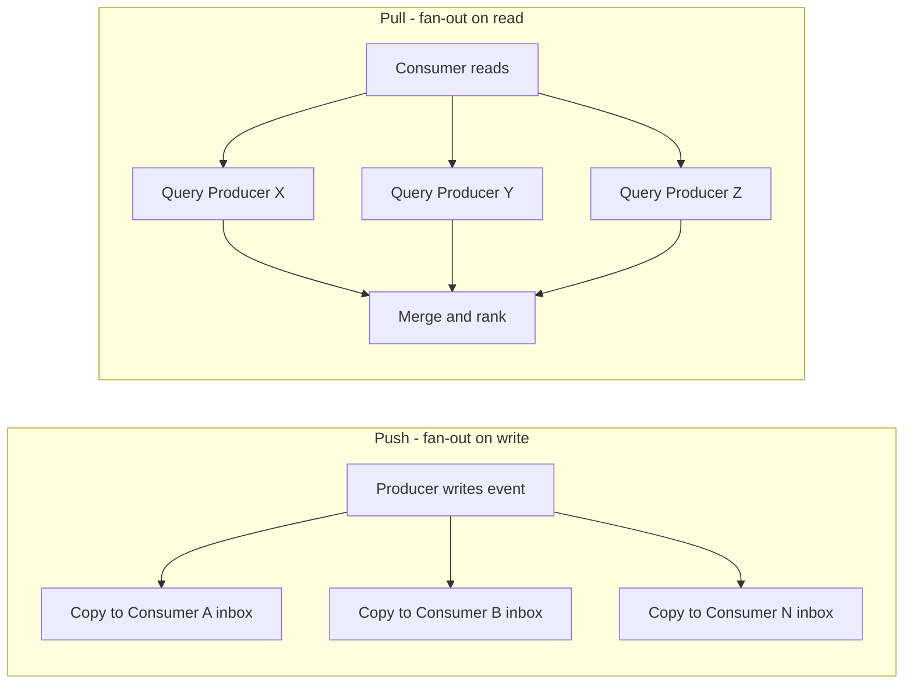
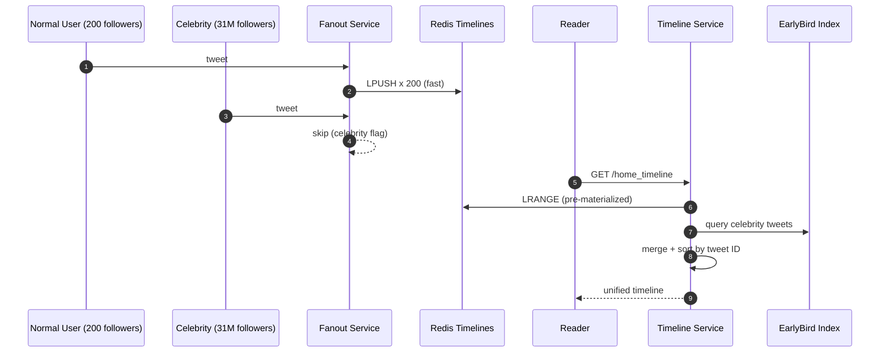
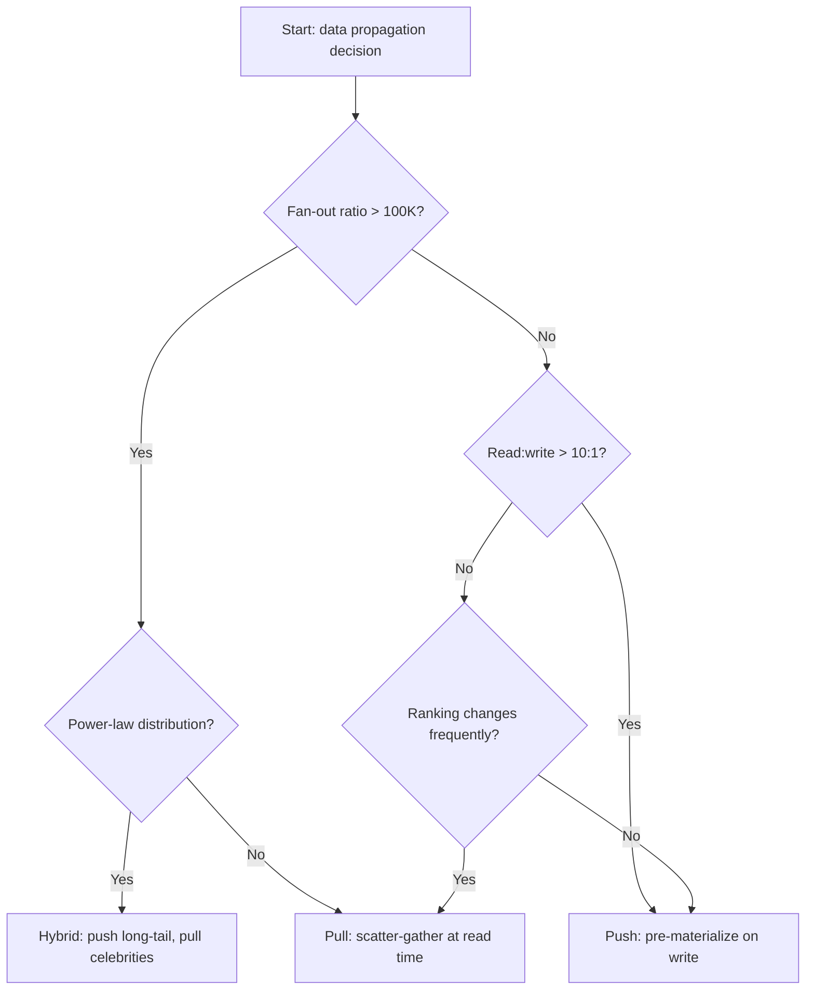

# Push vs Pull (Fan-out, Messaging, Feed)

> **TL;DR.** Push front-loads compute into the write path so reads are O(1). Pull back-loads compute into the read path so writes are O(1). The decision is pinned to two numbers: the fan-out ratio (consumers per event) and the read:write ratio. When reads dominate and fan-out is bounded, push wins (Twitter: 300K reads/sec vs 6K writes/sec, 50:1 ratio).[^1] When fan-out is unbounded or ranking changes frequently, pull wins (LinkedIn: 62x less storage than push).[^2] Most production systems at scale use a hybrid: push for the 99% long tail, pull for the celebrity head.

## Learning Objectives

- Compare push and pull across latency, write amplification, storage cost, and operational complexity.
- Identify the fan-out ratio and read:write ratio thresholds that flip the choice.
- Justify a hybrid push-pull approach for power-law follower distributions.
- Evaluate how the same trade-off manifests across feeds, messaging brokers, and observability systems.

## The Core Trade-off

Push converts one write into N consumer deliveries at write time. Pull converts one read into a scatter-gather across producers at read time. The expensive operation moves between the write path and the read path, and the right answer is the one whose expensive side you can scale more easily.

Twitter in 2013 ran 300,000 timeline reads per second against 6,000 tweet writes per second.[^1] A 50:1 read:write ratio made pre-materializing timelines (push) the obvious choice: pay once on write, serve cheaply on every read. But a single Lady Gaga tweet fanning out to 31 million followers meant 31 million Redis inserts, taking over 5 minutes to complete.[^1][^3] Above a certain follower count, the write cost dominates and pull becomes mandatory.

LinkedIn made the opposite call. Their ranked feed changes ranking models frequently, and fan-out-on-write data was 62x larger than fan-out-on-read.[^2] Re-scoring pre-materialized feeds on every model change was IO-intensive and slow. Pull let them iterate on ranking without touching stored data.

*Push does O(N) work at write time for O(1) reads; pull does O(1) work at write time for O(M) reads, where M is the number of producers the consumer follows.*

## Side-by-Side Comparison

| Dimension | Push (fan-out on write) | Pull (fan-out on read) |
|-----------|------------------------|------------------------|
| Read latency | O(1), single lookup. Twitter: p50 5 ms, p99 100 ms[^1] | O(M) scatter-gather. LinkedIn: p99 140 ms[^2] |
| Write latency | O(N) where N = follower count. 3.5 s to 1M followers[^1] | O(1), single append to author timeline |
| Storage cost | N copies per event (high) | 1 copy per event (low). LinkedIn: 62x less[^2] |
| Ranking flexibility | Requires re-grandfathering all materialized feeds on model change[^2] | Re-scores at read time; model deploys are instant |
| Backpressure | Must be explicit (prefetch, 429, credit flow)[^4] | Implicit: consumer fetches only what it can handle[^5] |
| Failure mode | Write amplification cascades; celebrity tweets back up queues[^1] | Slowest shard in scatter-gather dominates p99[^2] |
| Offline consumers | Requires durable broker or messages are lost | Consumer pulls on reconnect with a cursor; no server-side buffering |

The table misleads on read latency. Push's O(1) read assumes the timeline is warm in cache. A user who has not logged in for 30+ days gets evicted from Redis; their first read triggers a full reconstruction from disk, spiking to hundreds of milliseconds.[^1] Pull's scatter-gather latency is consistent regardless of user activity patterns.

The dominant dimension in practice is the fan-out ratio. If your maximum fan-out is bounded (say, under 10,000), push is straightforward. If you have a power-law distribution with a heavy tail reaching millions, pure push breaks.

## When to Pick Push

- **Read:write ratio exceeds 10:1 and fan-out is bounded.** Twitter's 50:1 ratio made push the clear winner for normal users (most have a few hundred followers or fewer).[^1] Notification systems, activity feeds for enterprise apps, and real-time dashboards all fit this profile.
- **Latency to consumers must be near-zero.** Pre-materialized inboxes serve in single-digit milliseconds. Trading signals, live scoreboards, and chat message delivery all demand this.
- **Consumers cannot afford per-read computation.** Mobile apps opening a feed should not trigger a scatter-gather across hundreds of shards. Push pays the cost once so every open is cheap.
- **The producer-to-consumer relationship is stable.** If the follow graph changes rarely, the materialized timelines stay valid longer. Frequent unfollows and refollows waste push work.

## When to Pick Pull

- **Fan-out is huge or unbounded.** Lady Gaga's 31M followers already pushed Twitter's write-time fan-out past a 5-minute SLA; accounts with 100M+ followers make pure push physically impossible.[^1] Any system with celebrity-scale producers needs pull for the head of the distribution.
- **Ranking models change frequently.** LinkedIn's FollowFeed chose pull because "grandfathering every pre-materialised feed" on each model A/B test was IO-intensive and blocked iteration.[^2] If your feed is relevance-ranked and you ship model changes weekly, pull is the only sane choice.
- **Consumers are transient.** Mobile apps that wake, sync, and sleep. Browser tabs that go idle. RSS readers. The consumer remembers a cursor and asks "what is new since T?" No server-side per-consumer buffering required.
- **Storage cost matters.** Push replicates data N times. At LinkedIn's scale, that 62x storage multiplier was the deciding factor.[^2]

## The Hybrid Path

Pure push breaks for celebrities. Pure pull is too slow for the common case. Every large social platform converges on the same hybrid: push for the long tail, pull for the head.

Twitter's model (2012 to 2016): the Fanout Service pushes tweet IDs into each follower's Redis list for normal accounts. For high-follower accounts (threshold undisclosed, but consistent with ~1,000 accounts above 1M followers), the write-time fan-out is skipped. At read time, the Timeline Service merges the pre-materialized Redis timeline with a real-time query to EarlyBird (the search index) for recent celebrity tweets, re-sorts by tweet ID, and returns the merged result.[^1][^3]

Instagram ran the same pattern: non-celebrity posts fanned out at write time to each follower's Cassandra wide-row; celebrity posts stored once and pulled at read time; the feed renderer issued both fetches in parallel and merged by timestamp.[^6]

*Normal tweets are pushed at write time; celebrity tweets are pulled at read time and merged, keeping write cost bounded while preserving sub-100 ms read latency for the common case.*

## Real-World Examples

**Twitter (hybrid, 2013).** 300K timeline reads/sec, 6K tweet writes/sec, 30 billion fan-out deliveries per day across a Redis cluster with terabytes of RAM. Home timelines capped at 800 tweet IDs, replicated 3x, served in p50 5 ms. Celebrity tweets pulled from EarlyBird at read time.[^1][^3]

**LinkedIn FollowFeed (pure pull, 2016).** 400M+ members served. Feed p99 latency: 140 ms (5x faster than the prior push-based Sensei system). 50% hardware reduction. 720 RocksDB partitions with relevance scoring co-located on storage nodes. The Broker fires duplicate requests to 2-3 replicas to mask p99 GC pauses.[^2] A 2018 load test exposed a death-spiral: a Jetty request queue sized at 5,000 (vs recommended 50 to 500) caused cascading GC pressure and 40% of queries received degraded results. Fix: cut queue to 500, add per-host rate limiters.[^4]

**Kafka (consumer pull, messaging).** Explicit rejection of broker-push: "a push-based system has difficulty dealing with diverse consumers as the broker controls the rate... the consumer tends to be overwhelmed when its rate of consumption falls below the rate of production."[^5] Long-poll (`fetch.min.bytes` + `fetch.max.wait.ms`) eliminates busy-waiting. Consumers own offsets, enabling trivial replay and rewind.[^5] RabbitMQ takes the opposite default: `basic.consume` registers a push subscription with `prefetch_count` as the backpressure valve; its own documentation calls the polling alternative (`basic.get`) "highly discouraged."[^7]

**Prometheus (pull/scrape, observability).** A single server handles ~800,000 samples/sec (2016 benchmark), monitoring 10,000+ machines.[^8] Service discovery enumerates the expected target set; a missing scrape immediately signals "target down" rather than relying on absence-of-push, which cannot distinguish dead from silent.[^9]

## Common Mistakes

> [!WARNING]
> **Pure push with power-law followers.** Fan-out-on-write latency blows past SLA for the few accounts with millions of followers. A Lady Gaga tweet took over 5 minutes to fan out while normal tweets completed in seconds.[^1] Use a hybrid threshold: push below 1M followers, pull above.

> [!WARNING]
> **Tight polling without long-poll.** Naive pull loops with short sleeps burn CPU and saturate broker request handlers on empty queues. SQS with `WaitTimeSeconds=0` returns empty responses billed per-request.[^10] Always use long-poll: Kafka `fetch.max.wait.ms`, SQS `WaitTimeSeconds=20`.

> [!WARNING]
> **Unbounded push queues.** A push-based service that "just makes the queue bigger" to handle spikes enters a death spiral: queue grows, GC pressure rises, throughput drops, queue grows faster. LinkedIn's 2018 load test failure traced to a Jetty queue of 5,000 vs the recommended 50 to 500.[^4] Cap queue depth at (peak-QPS * client-timeout).

> [!WARNING]
> **Ignoring ordering inversions.** In hybrid systems, a reply to a celebrity tweet can arrive in followers' timelines before the original, because the reply's fast fan-out completes while the celebrity's pull has not been fetched yet.[^1] Sort by monotonic IDs at read time, not insertion order.

## Decision Checklist

- [ ] What is the maximum fan-out ratio? If any producer has > 100K consumers, pure push is risky.
- [ ] What is the read:write ratio? Above 10:1, push amortizes well. Below 2:1, pull is cheaper.
- [ ] How expensive is per-read computation? If ranking is complex and changes often, pull wins.
- [ ] Are consumers always online (push works) or intermittent (pull with cursors)?
- [ ] Does the follower distribution follow a power law? If yes, plan for a hybrid threshold.
- [ ] Can you tolerate ordering inversions during slow fan-out, or must delivery be strictly ordered?

*Start with the fan-out ratio. If bounded and reads dominate, push. If unbounded or ranking-heavy, pull. If power-law, hybrid.*

## Key Takeaways

- Push is O(N) writes for O(1) reads. Pull is O(1) writes for O(M) reads. The fan-out ratio and read:write ratio decide which is cheaper.
- The celebrity problem makes pure push untenable for any system with power-law follower distributions. Hybrid (push for 99%, pull for 1%) is the production answer at Twitter, Instagram, and Facebook.
- Pull gives you free backpressure: consumers fetch only what they can handle. Push requires explicit backpressure primitives or risks death spirals.
- The same trade-off appears in three domains: feeds (fan-out on write vs read), messaging (broker push vs consumer pull), and observability (metric push vs scrape). Recognizing the pattern lets you reason about all three from first principles.
- LinkedIn's 62x storage reduction by choosing pull over push is the clearest cost argument for pull at scale.

## Further Reading

- [Timelines at Scale, Raffi Krikorian, QCon 2013](https://www.infoq.com/presentations/Twitter-Timeline-Scalability/) - the canonical talk on Twitter's fan-out-on-write, the celebrity problem, and the hybrid resolution. Every Twitter number in this chapter traces here.
- [FollowFeed: LinkedIn's Feed Made Faster and Smarter](https://engineering.linkedin.com/blog/2016/03/followfeed--linkedin-s-feed-made-faster-and-smarter) - the clearest public argument for why a large social platform chose pull over push for ranked feeds.
- [Apache Kafka Design: Push vs Pull](https://kafka.apache.org/42/design/design/) - authoritative primary source on why Kafka chose consumer-pull over broker-push.
- [Pull doesn't scale, or does it?](https://prometheus.io/blog/2016/07/23/pull-does-not-scale-or-does-it/) - demolition of the "pull cannot scale" myth with production numbers from SoundCloud.
- [Making LinkedIn's Organic Feed Handle Peak Traffic](https://engineering.linkedin.com/blog/2018/05/making-linkedin-s-organic-feed-handle-peak-traffic) - the definitive push-backpressure-gone-wrong post-mortem.
- [Why is Prometheus using a pull model?](https://o11y.eu/blog/prometheus-pull-model/) - enumerates six advantages of pull for observability; the most concise statement of the argument.

## Flashcards

<strong>Q: What two numbers determine whether to use push or pull?</strong>

A: The fan-out ratio (consumers per event) and the read:write ratio. High read:write with bounded fan-out favors push. High fan-out or low read:write favors pull.

<strong>Q: Why does pure fan-out-on-write break for celebrities?</strong>

A: A single tweet to 31M followers requires 31M Redis inserts, taking over 5 minutes. The write cost is O(N) where N is follower count, and power-law distributions mean a tiny fraction of users dominate total write volume.

<strong>Q: How does Twitter's hybrid model work?</strong>

A: Normal users' tweets are pushed to followers' Redis timelines at write time. Celebrity tweets skip write-time fan-out. At read time, the Timeline Service merges the pre-materialized timeline with a real-time query to EarlyBird for celebrity content, sorted by tweet ID.

<strong>Q: Why did LinkedIn choose pull over push for FollowFeed?</strong>

A: Two reasons: fan-out-on-write data was 62x larger, and ranking model A/B tests required re-grandfathering every pre-materialized feed, which was IO-intensive and blocked iteration. Pull re-scores at read time, making model deploys instant.

<strong>Q: Why does Kafka use consumer pull instead of broker push?</strong>

A: A push broker overwhelms slow consumers (effectively a DoS). Pull lets consumers fetch at their own rate with automatic backpressure. Long-poll eliminates the busy-waiting downside of naive polling.

<strong>Q: Why does Prometheus pull (scrape) rather than having targets push metrics?</strong>

A: The monitoring server already knows the expected target set via service discovery. A missing scrape immediately signals "target down." Push cannot distinguish a dead target from a silent one. Pull also gives free HA: two Prometheus replicas scrape independently.

<strong>Q: What is the death-spiral failure mode of unbounded push queues?</strong>

A: When a push-based service receives more than it can process, queues grow to RAM limits, GC pressure rises, throughput drops further, queues grow faster, and the service collapses. LinkedIn's 2018 load test failure traced to a Jetty queue of 5,000 vs the recommended 50 to 500.

<strong>Q: What is the storage cost difference between push and pull at LinkedIn scale?</strong>

A: Fan-out-on-write required 62x more storage than fan-out-on-read for LinkedIn's feed workload, because push replicates every event into every follower's materialized timeline.

## References

[^1]: "The Architecture Twitter Uses to Deal with 150M Active Users, 300K QPS, a 22 MB/S Firehose, and Send Tweets in Under 5 Seconds", High Scalability, 2013. https://highscalability.com/the-architecture-twitter-uses-to-deal-with-150m-active-users/
[^2]: Ankit Gupta et al., "FollowFeed: LinkedIn's Feed Made Faster and Smarter", LinkedIn Engineering, 2016. https://engineering.linkedin.com/blog/2016/03/followfeed--linkedin-s-feed-made-faster-and-smarter
[^3]: Sujeet Jaiswal, "Twitter/X: Timeline Architecture and the Recommendation Algorithm", 2026. https://sujeet.pro/articles/twitter-timeline-architecture
[^4]: Val Markovic, "Making LinkedIn's Organic Feed Handle Peak Traffic", LinkedIn Engineering, 2018. https://engineering.linkedin.com/blog/2018/05/making-linkedin-s-organic-feed-handle-peak-traffic
[^5]: Apache Kafka documentation, Design: Push vs Pull, Kafka 4.2. https://kafka.apache.org/42/design/design/
[^6]: Sujeet Jaiswal, "Instagram: From Redis to Cassandra and the Rocksandra Storage Engine", 2026. https://sujeet.pro/articles/instagram-cassandra-migration
[^7]: Lovisa Johansson, "FAQ: RabbitMQ Basic Consumer vs RabbitMQ Basic Get", CloudAMQP, 2020. https://www.cloudamqp.com/blog/rabbitmq-basic-consume-vs-rabbitmq-basic-get.html
[^8]: Julius Volz, "Pull doesn't scale - or does it?", Prometheus blog, 2016. https://prometheus.io/blog/2016/07/23/pull-does-not-scale-or-does-it/
[^9]: Julien Pivotto, "Why is Prometheus using a pull model?", O11y blog, 2023. https://o11y.eu/blog/prometheus-pull-model/
[^10]: "Amazon SQS short and long polling", SQS Developer Guide. https://docs.aws.amazon.com/AWSSimpleQueueService/latest/SQSDeveloperGuide/sqs-short-and-long-polling.html
