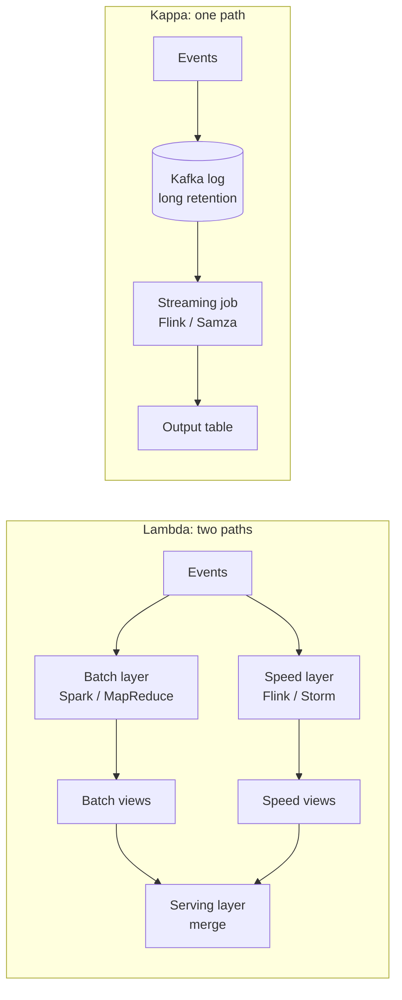
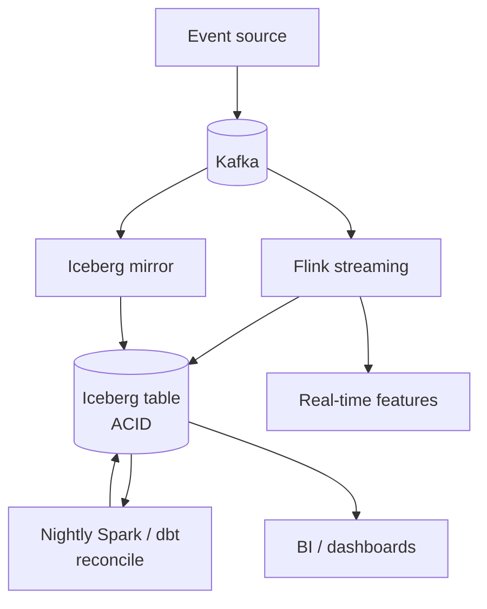
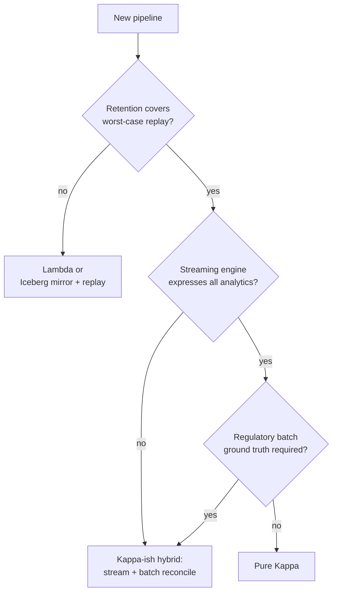

# Lambda vs Kappa Architecture

> **TL;DR.** Lambda runs two pipelines (batch for correctness, stream for freshness) and pays with dual codebases that drift out of sync[^1]. Kappa collapses both into one streaming job and replays the retained log for reprocessing[^1]. Default to Kappa when your streaming engine can express all required analytics and log retention covers your worst-case replay window. Fall back to Lambda (or a Kappa-ish hybrid) when regulatory batch ground truth is required or reprocessing terabytes through a streaming engine is infeasible[^2]. The deciding dimension is whether the batch layer earns its operational cost.

## Learning Objectives

- Compare Lambda and Kappa across operational complexity, correctness guarantees, reprocessing cost, and freshness latency.
- Identify workload characteristics (retention window, analytics expressibility, regulatory requirements) that favor one architecture over the other.
- Justify a hybrid "Kappa-ish" approach combining streaming freshness with periodic batch reconciliation.
- Evaluate LinkedIn, Uber, Netflix, and Spotify as production systems that made this choice and explain why.

## The Core Trade-off

Lambda was proposed by Nathan Marz around 2011[^3] and codified in his 2015 Manning book[^4]. It runs a batch layer (Spark, MapReduce) that recomputes correct views from the full history, a speed layer (Flink, Storm) that computes approximate low-latency views, and a serving layer that merges both at query time. The batch path is the source of truth; the speed path is a best-effort approximation until the next batch run lands.

Kappa was proposed by Jay Kreps in 2014, at the time leading data infrastructure at LinkedIn and co-creator of Kafka (later co-founder and CEO of Confluent)[^1]. It collapses both pipelines into one: a single streaming job reads from a retained log, and "batch" reprocessing is performed by replaying the log from offset zero with a second instance of the same job. Once the replay catches up, reads cut over to the new output table.

The fundamental tension: Lambda pays a permanent operational tax (two codebases, two on-calls, two scaling profiles, constant drift-debugging) in exchange for batch-grade correctness. Kappa eliminates that tax but requires that the streaming engine can express every aggregation the batch layer handled, and that log retention covers every replay you will ever need. Kreps summarizes it bluntly: "maintaining code that needs to produce the same result in two complex distributed systems is exactly as painful as it seems like it would be."[^1]

*Lambda splits every event into two paths that must produce identical results; Kappa keeps one path and replays the log for reprocessing.*

## Side-by-Side Comparison

| Dimension | Lambda | Kappa |
|---|---|---|
| Codebases | Two (batch + stream), must stay in sync[^1] | One streaming job for production and replay |
| Correctness model | Batch is ground truth; stream is approximate[^3] | Stream is ground truth; replay fixes bugs |
| Reprocessing cost | Cheap (batch on spot instances, off-peak)[^3] | Replay from offset zero; temporarily doubles output storage[^1] |
| Freshness | Seconds (speed layer) | Seconds (same streaming job) |
| Operational complexity | High: two on-calls, two scaling profiles, merge logic | Lower: one framework, one deploy, one monitoring stack |
| Retention requirement | Immutable master dataset (HDFS/S3), unlimited | Log retention must cover worst-case replay window[^1] |
| Analytics expressibility | Batch can do arbitrary SQL, global sorts, cross-day dedup | Limited to what the streaming engine supports[^2] |
| Late-data handling | Batch recomputes over full history, no data loss | Watermarks may drop late events; requires tuning[^2] |

The table understates one dimension: drift. In Lambda, the batch and stream paths use different frameworks with different window semantics, null handling, and type coercions. "Programming in distributed frameworks like Storm and Hadoop is complex. Inevitably, code ends up being specifically engineered toward the framework it runs on."[^1] This drift is not a theoretical risk; it is the primary operational pain of Lambda in practice.

The table also understates Kappa's retention cost. LinkedIn keeps "more than a petabyte of Kafka storage online" to support long-retention replay[^1]. That is economical for LinkedIn; it may not be for your team.

## When to Pick Lambda

**Regulatory batch ground truth is required.** Financial risk reconciliation, ad-attribution billing, end-of-month close. The batch path is the auditable source of truth; streaming is a live approximation that regulators do not accept[^2].

**Reprocessing terabytes through a streaming engine is infeasible.** Uber's sessionization pipeline found that "backfilling more than a handful of days' worth of data could easily lead to replaying days' worth of client logs... overwhelming the system's infrastructure and causing lags."[^2] When 10 TB reprocesses in hours on Spark but days on Flink, the batch layer earns its cost.

**Streaming engines cannot express the required analytics.** Cross-day deduplication, global sorts, session stitching across days, and arbitrary windowed joins that Flink handles poorly or not at all[^2].

**Separate teams already own batch and streaming.** Lambda is often the existing architecture, not a green-field choice. Migration to Kappa is a multi-quarter project; Lambda is the pragmatic default until you can invest.

## When to Pick Kappa

**One pipeline's operational burden is your binding constraint.** Two pipelines mean two on-call rotations, two code paths, and constant "why do these numbers disagree?" debugging. Kappa eliminates this entire category of bugs[^1].

**The streaming engine can express all your analytics.** Event-sourcing applications, real-time dashboards, CDC-driven warehousing, feature computation for online ML, and fraud detection all fit Kappa well[^5].

**Reprocessing is cheap.** Your retention window covers the worst-case replay, and replaying a week finishes in hours. Kafka's cheap consumers and long retention make this viable: "adding the second reprocessing job is just a matter of firing up a second instance of your code but starting from a different position in the log."[^1]

**Netflix runs over 15,000 Flink jobs processing more than 60 PB per day on its Keystone platform**[^5]. At that scale, maintaining a parallel batch pipeline for the same logic would be operationally catastrophic.

## The Hybrid Path

In 2026, most large pipelines are neither pure Lambda nor pure Kappa. They are "Kappa-ish": Kafka is the event log, Flink computes streaming features and live dashboards, and a nightly Spark or dbt job writes reconciled aggregates to an Iceberg or Delta lakehouse[^6][^7]. The batch job is not a duplicate of the streaming logic; it is a different query (reconciliation, not real-time aggregation) over the same source of truth.

Apache Beam (based on the 2015 Dataflow Model paper[^8]) provides a single SDK that compiles to multiple runners (Dataflow, Flink, Spark). The same pipeline runs on bounded or unbounded data. Spotify reportedly processes over 1.4 trillion events per day across more than 38,000 production pipelines using Beam/Scio[^9][^10]. Their Wrapped 2020 job joined roughly 1 PB in a single pipeline[^9].

Lakehouse table formats (Iceberg, Delta Lake) add ACID transactions and time travel to cloud object stores, so both Flink and Spark can read and write the same table with snapshot isolation[^7][^11]. This eliminates the Lambda-era split between batch stores and streaming stores.

*Modern hybrid: Kafka as the single source of truth, Flink for sub-second freshness, Spark/dbt for batch reconciliation, all reading and writing the same Iceberg table.*

## Real-World Examples

**LinkedIn (2014-present).** The birthplace of Kappa. Over 7 trillion Kafka messages per day across 4,000+ brokers and 100,000 topics[^12]. Kreps's essay documented the pain of their prior Lambda approach: "We have built various hybrid-Hadoop architectures... none were very pleasant or productive."[^1] New pipelines from 2014 onward follow Kappa with Kafka as the retained log and Samza for processing.

**Uber (2020).** Uber's sessionization pipeline (dynamic pricing, fraud detection) rejected both pure Kappa (log replay would overwhelm Kafka infrastructure) and pure batch (would require excess cluster resources). Their solution: treat a Hive table as a streaming source, relaxing watermarks from 10 seconds to 2 hours in backfill mode[^2]. One codebase, two modes. Production job: 75 cores, 1.2 TB memory. Backfill: ~10 TB over 9 days[^2].

**Netflix Keystone (2018-present).** Over 15,000 Flink jobs processing more than 60 PB of data per day[^5]. Each job runs in an isolated cluster on Titus containers to bound blast radius[^5]. Netflix pairs Keystone streaming with Iceberg tables for batch-like parts of its warehouse (Netflix originally created Iceberg), making it a Kappa-ish hybrid[^11].

## Common Mistakes

> [!WARNING]
> **Running two codebases and calling it "just Lambda."** The operational cost is not the two pipelines; it is keeping them in sync. If your batch and stream outputs diverge by more than a threshold and nobody notices for weeks, you have a correctness bug masquerading as architecture.

> [!WARNING]
> **Setting Kafka retention too short for Kappa reprocessing.** A code bug discovered today that requires replaying 90 days of events is unrecoverable if retention is 30 days. Mirror Kafka into S3/Iceberg for long-term replay[^1].

> [!WARNING]
> **Assuming the streaming engine can express everything batch does.** Cross-day deduplication, global sorts, and complex windowed joins may be infeasible in Flink. Enumerate every batch query before committing to Kappa[^2].

> [!WARNING]
> **Forgetting that Kappa replay doubles output storage.** Kreps notes: "my proposal requires temporarily having 2x the storage space in the output database."[^1] Provision for the peak or replay in key-range batches.

## Decision Checklist

- [ ] Can your streaming engine express all required analytics (windows, joins, dedup)?
- [ ] Does your log retention cover the worst-case replay window?
- [ ] Is reprocessing through the streaming engine feasible in acceptable time at your data volume?
- [ ] Do you have regulatory or accounting requirements for batch-as-ground-truth?
- [ ] Do you have one team or two? Two pipelines need two owners.
- [ ] How often does the batch path "correct" the streaming path? If rarely, the batch pipeline is waste.
- [ ] Can your output store handle 2x storage during Kappa replay cutover?

*Decision flowchart: default to Kappa; fall back to Lambda or hybrid only when specific constraints force it.*

## Key Takeaways

- Kappa is the default for new pipelines. Lambda's dual-codebase cost is justified only when batch semantics are genuinely required or streaming reprocessing is infeasible.
- The operational pain of Lambda is not running two pipelines; it is keeping them in sync. Drift between batch and stream outputs is the primary failure mode.
- Most 2026 production systems are Kappa-ish hybrids: Kafka as the log, Flink for speed, Spark/dbt for reconciliation, Iceberg as the unified table.
- Beam and lakehouse formats (Iceberg, Delta) are the modern answer to "why choose?" One codebase, batch or streaming, same table.
- Know your binding constraint: if it is correctness, keep the batch layer. If it is operational simplicity, eliminate it.

## Further Reading

- [Questioning the Lambda Architecture](https://www.oreilly.com/radar/questioning-the-lambda-architecture/): Kreps's 2014 founding Kappa essay; the single most important primary source for this decision.
- [Designing a Production-Ready Kappa Architecture](https://www.uber.com/blog/kappa-architecture-data-stream-processing/): Uber's honest case study of what had to be modified to make Kappa work at scale.
- [The Dataflow Model (Akidau et al., VLDB 2015)](http://www.vldb.org/pvldb/vol8/p1792-Akidau.pdf): the theoretical basis for Beam's unified batch/streaming; read before betting on a unified SDK.
- [How Spotify Optimized the Largest Dataflow Job Ever](https://engineering.atspotify.com/2021/2/how-spotify-optimized-the-largest-dataflow-job-ever-for-wrapped-2020): 1 PB join using Beam/Scio; the best public Beam-at-scale write-up.
- [Keystone Real-time Stream Processing Platform](https://netflixtechblog.com/keystone-real-time-stream-processing-platform-a3ee651812a): Netflix's architecture at trillions of events per day; Kappa-ish at extreme scale.
- [Apache Iceberg documentation](https://iceberg.apache.org/): the lakehouse table format that eliminates the Lambda-era batch-store vs streaming-store split.

## Flashcards

<strong>Q: What is the core operational pain of Lambda architecture?</strong>

A: Maintaining two codebases (batch + stream) that must produce identical results for the same input. Different frameworks have different window semantics, null handling, and type coercions, causing the outputs to drift out of sync.

<strong>Q: How does Kappa handle reprocessing without a batch layer?</strong>

A: Start a second instance of the streaming job from offset zero in the retained log. It writes to a new output table. Once caught up, redirect reads to the new table and tear down the old job and table.

<strong>Q: What are the three preconditions for pure Kappa to work?</strong>

A: (1) Log retention covers the worst-case replay window. (2) The streaming engine can express all required analytics. (3) Reprocessing through the streaming engine finishes in acceptable time.

<strong>Q: Why did Uber reject pure Kappa for their sessionization pipeline?</strong>

A: Replaying days of data into Kafka would overwhelm their self-serve Kafka infrastructure. Instead, they treated Hive as a streaming source with relaxed watermarks (2 hours instead of 10 seconds), preserving one codebase while avoiding log replay.

<strong>Q: What is the storage cost of Kappa replay?</strong>

A: Output storage temporarily doubles during cutover because both the old and new output tables exist simultaneously until the switch completes.

<strong>Q: What is the "Kappa-ish hybrid" pattern used by most 2026 systems?</strong>

A: Kafka as the event log, Flink for sub-second streaming views, nightly Spark/dbt for batch reconciliation, all reading and writing the same Iceberg or Delta table. The batch job is a different query (reconciliation), not a duplicate of the streaming logic.

<strong>Q: How does Apache Beam address the Lambda vs Kappa choice?</strong>

A: Beam provides a single SDK (PCollection, PTransform) that compiles to multiple runners. The same pipeline runs in batch mode on bounded data or streaming mode on unbounded data, eliminating the dual-codebase problem without requiring pure Kappa's log-replay approach.

<strong>Q: At what scale does LinkedIn run Kappa?</strong>

A: Over 7 trillion Kafka messages per day across 4,000+ brokers, 100,000 topics, and 7 million partitions, with more than a petabyte of Kafka storage retained online for replay.

## References

[^1]: Jay Kreps, "Questioning the Lambda Architecture", O'Reilly Radar, July 2014. https://www.oreilly.com/radar/questioning-the-lambda-architecture/
[^2]: Amey Chaugule, "Designing a Production-Ready Kappa Architecture for Timely Data Stream Processing", Uber Engineering, January 2020. https://www.uber.com/blog/kappa-architecture-data-stream-processing/
[^3]: "Lambda architecture", Wikipedia. https://en.wikipedia.org/wiki/Lambda_architecture
[^4]: Nathan Marz and James Warren, "Big Data: Principles and best practices of scalable realtime data systems", Manning Publications, 2015.
[^5]: "Building a Scalable Flink Platform: A Tale of 15,000 Jobs at Netflix", Current 2024. https://current.confluent.io/2024-sessions/building-a-scalable-flink-platform-a-tale-of-15-000-jobs-at-netflix
[^6]: Kai Waehner, "Kappa Architecture is Mainstream Replacing Lambda", 2021. https://www.kai-waehner.de/blog/2021/09/23/real-time-kappa-architecture-mainstream-replacing-batch-lambda/
[^7]: Michael Armbrust et al., "Delta Lake: High-Performance ACID Table Storage over Cloud Object Stores", VLDB 2020. https://dl.acm.org/doi/10.14778/3415478.3415560
[^8]: Tyler Akidau et al., "The Dataflow Model", VLDB 2015. http://www.vldb.org/pvldb/vol8/p1792-Akidau.pdf
[^9]: Neville Li et al., "How Spotify Optimized the Largest Dataflow Job Ever for Wrapped 2020", Spotify Engineering, February 2021. https://engineering.atspotify.com/2021/2/how-spotify-optimized-the-largest-dataflow-job-ever-for-wrapped-2020
[^10]: "Spotify Data Tech Stack", Junaid Effendi, 2024. https://www.junaideffendi.com/p/spotify-data-tech-stack
[^11]: Apache Iceberg documentation. https://iceberg.apache.org/
[^12]: LinkedIn Engineering, "How LinkedIn customizes Apache Kafka for 7 trillion messages per day", 2019. https://engineering.linkedin.com/blog/2019/apache-kafka-trillion-messages
