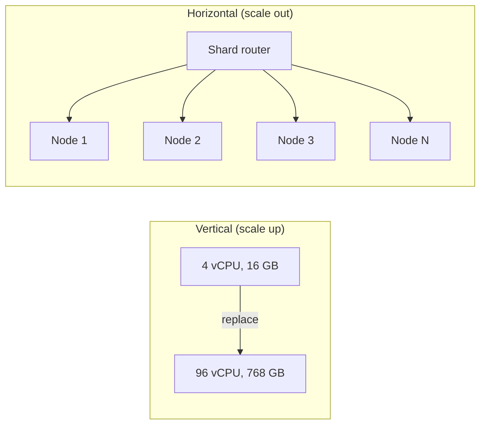
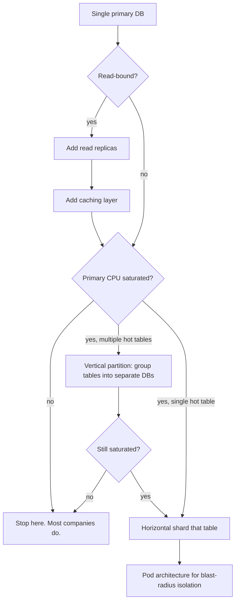
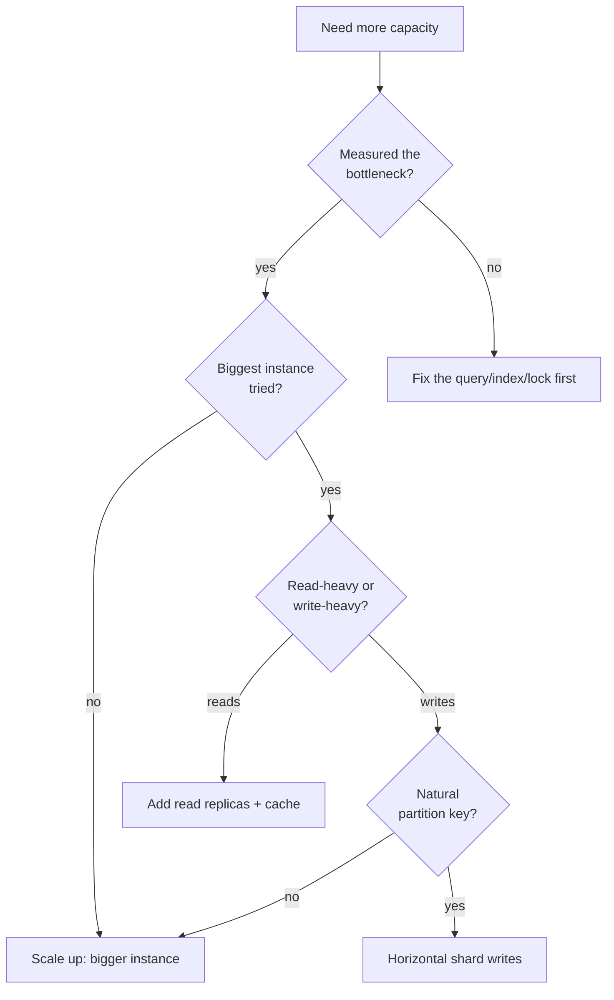

# Vertical vs Horizontal Scaling

> **TL;DR.** Vertical scaling (bigger box) preserves single-writer simplicity, ACID guarantees, and operational sanity. Horizontal scaling (more boxes) removes the ceiling but introduces partitioning, replication lag, and months of engineering work. The production-canonical answer is "scale vertically first, then horizontally where you must." A single AWS instance today offers up to 1,920 vCPUs and 32 TiB of RAM[^1]. Most systems never exhaust that. The dimension that decides is operational complexity per unit of throughput gained.

## Learning Objectives

- Compare vertical and horizontal scaling across cost, complexity, availability, and ceiling dimensions.
- Identify the workload characteristics that justify staying on one machine versus sharding across many.
- Justify the hybrid path (vertical primary, read replicas, shard last) as the default progression.
- Evaluate real systems (Stack Overflow, Figma, Shopify) and explain why each chose its scaling strategy.

## The Core Trade-off

The tension is not performance. Both approaches deliver throughput. The tension is coupling. Vertical scaling keeps one failure domain, one write-ahead log, one query plan cache, and one set of runbooks. Horizontal scaling introduces partitioning, replication, consensus, cross-partition queries, rebalancing, and schema coordination. Each of those is a multi-quarter engineering project[^2].

The interview-canonical answer is "scale horizontally" because infinite boxes sound impressive. The production-canonical answer, for most systems, is the opposite. Figma's databases team spent nine months to shard their first Postgres table and described horizontal sharding as "an order of magnitude more complex than our previous scaling efforts"[^2]. Shopify's 2015 pivot to sharding was not a design choice but a forced move when they could no longer buy a larger database server[^3].

*Vertical scaling replaces one box with a bigger box; horizontal scaling adds peer boxes and distributes work across them.*

## Side-by-Side Comparison

| Dimension | Vertical (scale up) | Horizontal (scale out) |
|---|---|---|
| Ceiling | Hard: 1,920 vCPU, 32 TiB RAM max on AWS[^1] | Effectively unbounded |
| Complexity | One primary, one log, no sharding logic | Partitioning, rebalancing, cross-shard queries |
| ACID | Full, across all rows | Lost across shards; per-shard only[^2] |
| Cost curve | Linear within a family; super-linear at top tier[^4][^5] | Linear per node added |
| Availability | Single failure domain (SPOF) | Multiple failure domains per shard |
| Scaling event | Instance resize + failover (seconds)[^6] | Add node + rebalance (hours to days) |
| Engineering lead time | Minutes (one API call) | Months (Figma: 9 months for first shard)[^2] |
| Operational surface | One runbook | Schema migrations across N shards, shard balancer tooling[^7] |

The table misleads on availability. "Multiple failure domains" only holds if each shard's dependencies are also isolated. Shopify identified this risk when all database shards shared a single Redis instance, leading them to restructure for per-pod isolation[^8]. True blast-radius isolation requires per-pod duplication of caches, queues, and config[^3].

The cost row hides a discontinuity. Within the `r5` family, pricing is perfectly linear: `r5.12xlarge` at $3.024/hr is exactly half of `r5.24xlarge` at $6.048/hr[^9][^4]. Step to memory-optimized silicon and the curve breaks: `u7i-12tb.224xlarge` (896 vCPU, 12 TiB) runs $125.58/hr[^5], a 20.8x price jump for only 9.3x the vCPUs over `r5.24xlarge`.

## When to Pick Vertical

**The workload fits on one machine.** Most do. Stack Overflow served 209 million HTTP requests per day, 505 million SQL queries per day, and 160 billion Redis ops per month on four SQL Servers (two clusters of primary plus replica) and two Redis nodes for 16 years[^10]. They could run the entire Q&A network on a single web server during testing[^10].

**Single-writer OLTP with cross-row transactions.** If your queries join arbitrary rows or need atomic multi-table commits, a single primary gives you ACID for free. Sharding removes it[^2].

**Operational simplicity is the priority.** WhatsApp served 465 million monthly users with only about 10 engineers running the Erlang platform end-to-end[^11]. Their philosophy: "Keep down management overhead by getting really big boxes and running efficiently on SMP machines"[^11].

**You have not exhausted cheaper levers.** Query optimization, indexing, connection pooling, and caching routinely claw back 10x headroom. Stack Overflow dropped ASP.Net processing time from 757 hours/day to 447 hours/day through code optimization alone, despite adding 61 million requests/day[^10].

## When to Pick Horizontal

**You have genuinely exhausted vertical capacity.** Measured, not assumed. The workload saturates the largest available instance after query optimization, indexing, and caching are applied. Shopify hit this wall in 2015: "it was no longer possible to continue buying a larger database server"[^3].

**Availability requires independent failure domains.** Even if one machine handles the load, you need replicas across AZs or regions for survival. Shopify's pod architecture exists so that "a single pod's failure wouldn't spiral to a platform outage"[^3].

**Write throughput exceeds single-node IO.** Shopify's 2024 Black Friday peaked at 7.6 million database writes per second across 100+ MySQL shards[^8]. No single node handles that.

**The data model has a natural partition key.** Shopify shards by `shop_id`[^12]. Figma shards by `UserID`, `FileID`, or `OrgID`[^2]. Discord shards by `(channel_id, time_bucket)`[^13]. If your data has no clean partition boundary, sharding will be painful.

## The Hybrid Path

Most production systems follow a canonical progression: vertical primary, then read replicas, then caches, then vertical partitioning, then horizontal sharding. Each step is cheaper than the next. Most companies stop before the last step.

Figma's progression from 2020 to 2024 is textbook[^14][^2]: single `r5.12xlarge` primary, upgrade to `r5.24xlarge` (the largest RDS Postgres instance available at the time), add read replicas and PgBouncer, vertically partition tables into separate Postgres clusters (50 tables moved in one operation, 30 seconds of partial availability), then finally horizontally shard the largest remaining tables. Their database fleet grew 100x in four years[^2], but horizontal sharding was the last lever pulled, not the first.

*The canonical scaling progression: each step is more expensive than the last. Most systems never reach horizontal sharding.*

## Real-World Examples

**Stack Overflow: vertical for 16 years.** Dell R720xd SQL Servers (24 cores, 384 GB RAM, 4 TB PCIe SSD each) in a two-cluster AlwaysOn setup served the entire Q&A network from 2010 to 2025[^10][^15]. DB CPU utilization was deliberately kept very low as headroom policy[^10]. The 2025 move to GCP was driven by datacenter vendor closure, not scaling limits[^15].

**Figma: vertical first, horizontal last.** Started on a single RDS Postgres at 65% CPU during peak traffic in 2020[^14]. Exhausted every vertical lever over three years. First horizontally sharded table shipped in September 2023 after nine months of engineering, with 10 seconds of partial availability[^2]. They deliberately stayed on RDS Postgres rather than migrating to CockroachDB or Vitess because rebuilding operational expertise was higher risk[^2].

**Shopify: forced off vertical.** Hit the MySQL single-node ceiling in 2015[^3]. Built a pod architecture where each pod is a fully isolated slice: one MySQL shard, its own Redis, its own Memcached, with no cross-pod runtime communication[^3]. By Black Friday 2024: 173 billion requests in 24 hours, 284 million RPM peak, 100+ active MySQL shards[^8].

## Common Mistakes

> [!WARNING]
> **Sharding before measuring.** Teams architect distributed systems for loads that fit on one commodity instance. A single `r5.24xlarge` (96 vCPU, 768 GB RAM, $6.048/hr) handles more than most startups will ever need[^4]. Benchmark first.

> [!WARNING]
> **Treating horizontal as free availability.** A horizontally scaled fleet with shared dependencies collapses together. Shopify found that a shared Redis instance created correlated failure risk across all shards[^8]. True isolation requires per-pod duplication of every dependency.

> [!WARNING]
> **Ignoring the cost cliff at the top.** Stepping from commodity (`r5`) to high-memory (`u7i`) is a 20x price jump[^4][^5]. At that tier, three commodity boxes plus a sharding layer may cost less per unit of throughput than one giant instance.

> [!WARNING]
> **Not planning an escape hatch.** Auto-increment IDs, cross-table foreign keys, and no tenant column make future sharding a rewrite. Use UUIDs or Snowflake IDs and carry a partition key on every row from day one[^2].

## Decision Checklist

- [ ] Have you measured the actual bottleneck (CPU, RAM, IO, lock contention), or are you assuming you need to scale?
- [ ] Have you applied query optimization, indexing, and caching before concluding the machine is too small?
- [ ] What is the largest instance your cloud provider offers, and have you benchmarked your workload on it?
- [ ] Does your workload have a natural partition key (tenant_id, user_id, shop_id)?
- [ ] Can you split reads (easy to scale out) from writes (hard to scale out)?
- [ ] What is the engineering lead time for sharding, and does the business timeline justify it?

*Decision flowchart: always measure first, try vertical second, shard only when writes exceed single-node capacity and a clean partition key exists.*

## Key Takeaways

- Scale vertically first. A single machine in 2026 offers 1,920 vCPUs and 32 TiB of RAM[^1]. Most workloads never exhaust it.
- Horizontal scaling is not a design choice; it is a forced move when vertical is exhausted. Treat it as such.
- The hybrid path (vertical primary, read replicas, cache, vertical partition, then shard) is the canonical progression. Each step buys years of runway.
- Sharding costs months of engineering and permanently removes cross-shard ACID. Do the math before committing.
- Horizontal scaling without per-shard dependency isolation is not high availability; it is correlated failure with extra steps.

## Further Reading

- [Stack Overflow: The Architecture 2016 Edition](https://nickcraver.com/blog/2016/02/17/stack-overflow-the-architecture-2016-edition/): the canonical "vertical scaling done right" post; read before arguing for horizontal.
- [How Figma's databases team lived to tell the scale](https://www.figma.com/blog/how-figmas-databases-team-lived-to-tell-the-scale/): nine-month horizontal sharding project; the best public account of the complexity cost.
- [A Pods Architecture To Allow Shopify To Scale](https://shopify.engineering/a-pods-architecture-to-allow-shopify-to-scale): why Shopify was forced off vertical in 2015 and how pods give failure-domain isolation.
- [How Discord Stores Trillions of Messages](https://discord.com/blog/how-discord-stores-trillions-of-messages): pure horizontal at chat scale; Cassandra to ScyllaDB with per-node and latency numbers.
- [The growing pains of database architecture (Figma)](https://www.figma.com/blog/how-figma-scaled-to-multiple-databases/): textbook vertical partitioning story, 2020 to 2023.
- [Amazon EC2 High Memory U7i Instances](https://aws.amazon.com/ec2/instance-types/u7i/): current single-machine ceiling reference.

## Flashcards

<strong>Q: What is the largest single EC2 instance available on AWS in 2026?</strong>

A: The `u7inh-32tb.480xlarge` with 1,920 vCPUs, 32 TiB of RAM, and 200 Gbps network. Most workloads never need anything close to this ceiling.

<strong>Q: Why is "scale horizontally" often the wrong first answer?</strong>

A: Horizontal scaling introduces partitioning, replication, cross-shard query planning, and schema coordination. Each is a multi-quarter engineering project. Vertical scaling is a single API call with seconds of downtime. Default to vertical until measured bottlenecks demand otherwise.

<strong>Q: What is the canonical scaling progression for a database-backed system?</strong>

A: Single primary on the biggest instance, add read replicas, add caching, vertically partition tables into separate DBs, then horizontally shard only the tables that still exceed single-node write capacity.

<strong>Q: How long did Figma's first horizontal shard take to ship?</strong>

A: Nine months end-to-end, after they had already done vertical partitioning. They described it as "an order of magnitude more complex than previous scaling efforts."

<strong>Q: When does the cost curve break for vertical scaling on AWS?</strong>

A: Within a family (e.g., `r5`), pricing is linear. Stepping to high-memory classes (`x2`, `u7i`) introduces a super-linear jump: `u7i-12tb.224xlarge` costs 20.8x more than `r5.24xlarge` for only 9.3x the vCPUs.

<strong>Q: Why is horizontal scaling not automatically high availability?</strong>

A: Multiple nodes with shared dependencies (single Redis, single config service) collapse together. True blast-radius isolation requires per-shard duplication of every dependency, as Shopify learned when a shared Redis took down all shards.

<strong>Q: What forced Shopify to move from vertical to horizontal scaling?</strong>

A: In 2015, it was no longer possible to buy a larger database server for their MySQL workload. The sharding was explicitly a forced move, not a proactive design choice.

## References

[^1]: AWS. "Amazon EC2 High Memory U7i Instances." https://aws.amazon.com/ec2/instance-types/u7i/
[^2]: Sammy Steele. "How Figma's databases team lived to tell the scale." Figma Engineering, 2024-03-14. https://www.figma.com/blog/how-figmas-databases-team-lived-to-tell-the-scale/
[^3]: Xavier Denis. "A Pods Architecture To Allow Shopify To Scale." Shopify Engineering, 2018-03-02. https://shopify.engineering/a-pods-architecture-to-allow-shopify-to-scale
[^4]: Vantage. "r5.24xlarge pricing and specs." https://instances.vantage.sh/aws/ec2/r5.24xlarge
[^5]: Vantage. "u7i-12tb.224xlarge pricing and specs." https://instances.vantage.sh/aws/ec2/u7i-12tb.224xlarge
[^6]: AWS RDS. "Scaling and high availability in Amazon RDS." https://docs.aws.amazon.com/AmazonRDS/latest/gettingstartedguide/scaling-ha.html
[^7]: Shopify Engineering. "Shard Balancing: Moving Shops Confidently with Zero-Downtime at Terabyte-scale." https://shopify.engineering/mysql-database-shard-balancing-terabyte-scale
[^8]: "Shopify Tech Stack." ByteByteGo, 2025-06-11. https://blog.bytebytego.com/p/shopify-tech-stack
[^9]: Vantage. "r5.12xlarge pricing and specs." https://instances.vantage.sh/aws/ec2/r5.12xlarge
[^10]: Nick Craver. "Stack Overflow: The Architecture - 2016 Edition." 2016-02-17. https://nickcraver.com/blog/2016/02/17/stack-overflow-the-architecture-2016-edition/
[^11]: Todd Hoff. "How WhatsApp Grew to Nearly 500 Million Users, 11,000 cores, and 70 Million Messages a Second." High Scalability, 2014-03-31. https://highscalability.com/how-whatsapp-grew-to-nearly-500-million-users-11000-cores-an/
[^12]: "How Shopify Manages its Petabyte Scale MySQL Database." ByteByteGo, 2024-09-10. https://blog.bytebytego.com/p/how-shopify-manages-its-petabyte
[^13]: Bo Ingram. "How Discord Stores Trillions of Messages." Discord Engineering, 2023-03-06. https://discord.com/blog/how-discord-stores-trillions-of-messages
[^14]: Tim Liang. "The growing pains of database architecture." Figma Engineering, 2023-04-04. https://www.figma.com/blog/how-figma-scaled-to-multiple-databases/
[^15]: Stack Overflow. "The Great Unracking: Saying goodbye to the servers at our physical datacenter." 2025-12-24. https://stackoverflow.blog/2025/12/24/the-great-unracking-saying-goodbye-to-the-servers-at-our-physical-datacenter/
