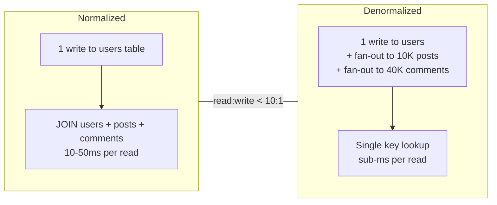
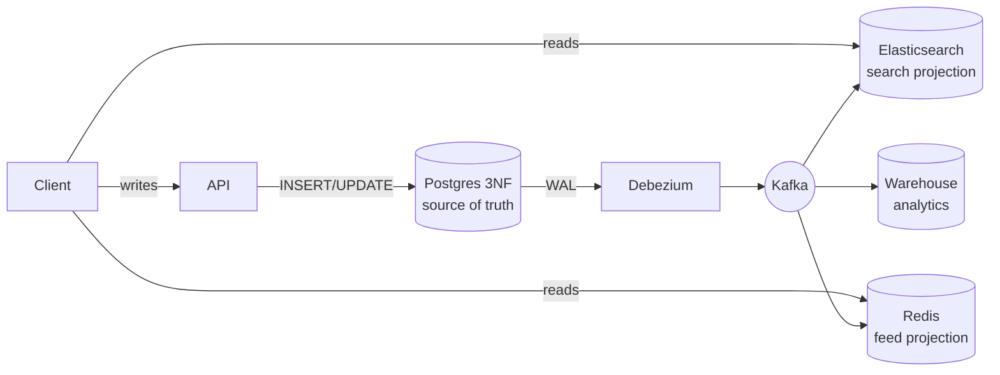
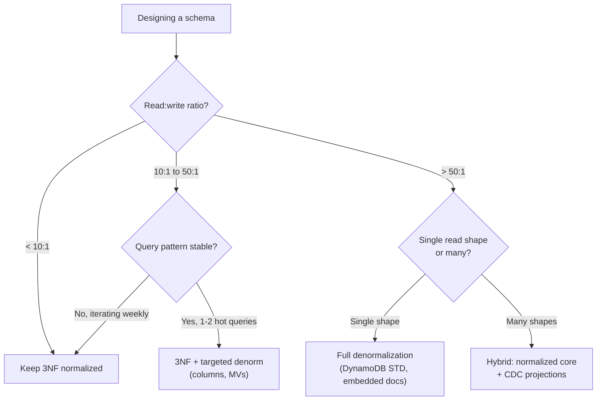

# Normalization vs Denormalization

> **TL;DR.** Normalization (3NF) stores each fact once, eliminating update anomalies but requiring joins at read time. Denormalization duplicates data so reads avoid joins, at the cost of write amplification and consistency risk. The deciding dimension is the read-to-write ratio combined with query-pattern stability. Default to 3NF for OLTP; denormalize only measured hot paths. Most production systems at scale run a hybrid: normalized source of truth with CDC-fed denormalized projections for read-heavy surfaces[^1][^2].

## Learning Objectives

- Compare normalization and denormalization across write cost, read latency, consistency, and schema flexibility.
- Identify workload characteristics (read:write ratio, query stability, sharding) that favor one approach.
- Justify the hybrid pattern (normalized core + denormalized projections) as the modern default at scale.
- Evaluate real systems (Facebook TAO, DynamoDB single-table design, Airbnb Riverbed) and explain their schema choices.

## The Core Trade-off

Every schema sits on a single axis: how much redundancy you tolerate in exchange for query speed. Normalization, formalized by Codd in 1970-1971[^3][^4], decomposes relations so each non-key fact lives in exactly one row. The payoff: update an author's name in one place and every query sees the new value immediately. The cost: reads traverse multiple tables via joins.

Denormalization pushes the other direction. You duplicate columns, pre-compute aggregates, snapshot related data at write time, or collapse joins into a single document[^5]. Reads become single-key lookups. But every write now touches multiple locations, and if any write path misses a copy, the data diverges silently.

The metric that moves in opposite directions is per-operation cost: normalization makes writes cheap and reads expensive; denormalization makes reads cheap and writes expensive. The crossover point is the read-to-write ratio. When reads dominate by 10:1 or more and the query shape is stable, denormalization pays off because you amortize extra write work across many cheap reads[^6].

*Normalization concentrates cost at read time; denormalization shifts it to write time. The read:write ratio determines which side wins.*

## Side-by-Side Comparison

| Dimension | Normalization (3NF) | Denormalization |
|---|---|---|
| Read latency | Multi-table joins, 10-50 ms typical | Single-key fetch, sub-ms[^7] |
| Write latency | Single-row update, fast | Fan-out to N copies, slower |
| Write amplification | 1x (one row) | 3-4x typical in Postgres with indexes[^8]; unbounded with projections |
| Consistency | Immediate, single source of truth | Staleness window until sync completes[^9] |
| Storage footprint | Minimal, no duplication | Bloated; duplicating 500-byte records across millions of rows adds real cost[^5] |
| Schema flexibility | Any new query is a plan change, not a migration | New access pattern may require full data rebuild[^10] |
| Shard friendliness | Cross-shard joins are expensive or impossible[^11] | Pre-joined data stays on one shard |
| Failure mode | Slow reads under load | Diverged copies, silent data corruption |

The table misleads on one dimension: storage. In 2026, storage is cheap; network round trips are expensive. The real cost of normalization is not disk but latency under fan-out reads. Conversely, the real cost of denormalization is not disk but the operational burden of keeping copies in sync.

The "schema flexibility" row dominates for early-stage products. If the product iterates on query shape weekly, denormalization locks you into yesterday's access patterns. Normalization absorbs new queries without a migration.

## When to Pick Normalization

**Write-heavy OLTP with unpredictable query mix.** Payment ledgers, ERP systems, SaaS platforms in rapid iteration. A single source of truth per fact means one-place updates and zero sync liabilities[^3][^5].

**ACID-critical operations.** When a partial update is a correctness bug (double-charge, oversold inventory), normalization keeps invariants in one transaction. Denormalized copies introduce windows where the system disagrees with itself.

**Early-stage products.** You do not know your access patterns yet. 3NF lets you add any query via a new index or plan change. Denormalization bets on stability you have not earned.

**Small-to-medium scale on a single RDBMS.** A well-indexed join over a few thousand rows runs in microseconds. The actual bottleneck is usually N+1 ORM queries or missing indexes, not the join itself[^12].

## When to Pick Denormalization

**Reads dominate 50:1+ and query pattern is frozen.** Social feeds, product listing pages, search results. Facebook TAO serves billions of reads per second against a denormalized graph cache[^13]. The query shape (point lookup, range on association type, count) has not changed in a decade.

**Joins are impossible.** DynamoDB, Cassandra, and sharded Postgres have no server-side join operator. Denormalization is not an optimization; it is the only option[^11][^14]. DynamoDB single-table design collocates related entities under one partition key so a single `Query` returns a materialized join in single-digit milliseconds[^7][^15].

**Historical accuracy requires snapshotting.** The price a customer paid belongs on the order line, not looked up from today's product catalog. This looks like denormalization but is actually the correct normalized design for point-in-time facts[^5].

**Elasticsearch and search indexes.** Parent-child (join field) queries in Elasticsearch are significantly slower than equivalent flat-document queries due to global ordinals overhead[^16]. The official guidance: denormalize documents for speed.

## The Hybrid Path

Most production systems at scale run neither pure 3NF nor full denormalization. They run a normalized OLTP source of truth with CDC-fed denormalized projections for hot read paths[^1][^17].

Writes hit the normalized store (Postgres in 3NF). A CDC pipeline (Debezium, DynamoDB Streams, Kafka Connect) propagates changes to downstream projections: a search index, a pre-joined Redis hash, a materialized feed, an analytics warehouse. Each projection is purpose-built for one screen. If a projection corrupts, rebuild it from the event log[^18].

Airbnb's Riverbed framework is a concrete instance: a Lambda-architecture system that maintains denormalized read-optimized stores from system-of-record databases, "optimizing how data is consumed from system-of-record data stores and updates secondary read-optimized stores"[^2].

*The hybrid pattern: writes stay correct in normalized storage; reads stay fast in disposable denormalized projections. Each projection can be rebuilt independently.*

The trade: you now operate a streaming infrastructure (Kafka, Flink, or equivalent) and every projection introduces a consistency window the product must document.

## Real-World Examples

**Facebook TAO** replaced ad-hoc memcache denormalization with a structured graph cache. It serves billions of reads/sec and tens of millions of writes/sec across hundreds of thousands of MySQL shards[^13][^19]. The underlying MySQL is normalized; TAO is a two-tier write-through denormalized cache exposing typed objects and associations. Meta cites approximately 99.99999999% cache consistency through version numbers and millisecond-scale invalidation[^9]. The RAMP-TAO paper (2021) reports that 1 in 1,500 batched reads reflected partial transactional updates in legacy TAO, motivating atomic-visibility transactions[^20].

**DynamoDB single-table design** bakes denormalization into primary keys. A customer profile and all their orders share partition key `CUST#123`; one `Query` returns the full item collection in sub-ms[^15][^10]. A single Query returning items totaling 4 KB or less costs 0.5 RCU (eventually consistent) versus 1 RCU for two separate GetItem calls on items that each round up to 4 KB[^21]. The cost: access patterns must be designed up front, and schema changes require full scan-and-rewrite.

**Uber Schemaless** stores data across MySQL clusters, serving millions of requests per second[^22]. Each "cell" is an immutable append-only tuple referenced by (row key, column name, ref key). Cross-shard joins are forbidden; all denormalization needed for a read is inlined at write time[^22].

## Common Mistakes

> [!WARNING]
> **Premature denormalization.** Teams denormalize before measuring, then discover the joins were never the bottleneck. A well-indexed 3NF join over a few thousand rows runs in microseconds. Run `EXPLAIN ANALYZE` first[^12].

> [!WARNING]
> **Denormalizing without a sync mechanism.** The redundant column ships but the trigger, CDC consumer, or reconciler does not. Copies drift silently. Meta explicitly called out that ad-hoc memcache denormalization led to "bugs, user-visible inconsistencies, and site performance issues" before TAO replaced it[^19].

> [!WARNING]
> **Unbounded embedded arrays.** A MongoDB document with an embedded `comments` array grows until it hits the 16 MB BSON cap and all writes fail[^23]. Documents over 1-2 MB already degrade performance[^24]. Reference out any unbounded child collection.

> [!WARNING]
> **GSI write amplification in single-table designs.** Five Global Secondary Indexes means 5x write capacity on every update. The monthly bill balloons, offsetting read savings[^21]. Only add a GSI when a concrete access pattern demands it.

## Decision Checklist

- [ ] What is the read:write ratio? Under 10:1, stay normalized. Over 50:1, denormalize the hot path.
- [ ] Is the query pattern stable (months between changes) or volatile (weekly iteration)?
- [ ] Can the product tolerate a staleness window on denormalized fields? How many seconds?
- [ ] Do you have a sync mechanism (trigger, CDC, reconciler) for every denormalized field?
- [ ] Does your datastore support server-side joins? If not, denormalization is mandatory.
- [ ] How expensive is a fan-out update when the source field changes (10 rows or 10 million)?

*Decision flowchart: the read:write ratio is the first branch; query-pattern stability is the second. Most systems at scale land in the hybrid quadrant.*

## Key Takeaways

- Default to 3NF for OLTP. Denormalize only after measurement proves a specific query is hot and join-bound.
- The read:write ratio is the single most useful screening tool. Under 10:1, normalization wins. Over 50:1, denormalize the hot path.
- Denormalization without a sync mechanism is a data corruption bug waiting to happen. Ship the trigger, CDC consumer, and reconciler together.
- The hybrid pattern (normalized core + CDC-fed projections) is the modern default at scale. Writes stay correct; reads stay fast; projections are disposable.
- Snapshotting point-in-time facts (`unit_price_paid` on order lines) is not denormalization; it is the correct normalized design for historical data.

## Further Reading

- [TAO: Facebook's Distributed Data Store for the Social Graph (Bronson et al., USENIX ATC 2013)](https://www.usenix.org/conference/atc13/technical-sessions/presentation/bronson): the canonical paper on denormalized graph caching at billion-read scale; explains the two-tier write-through architecture.
- [Single-table vs multi-table design in Amazon DynamoDB (Alex DeBrie, AWS 2022)](https://aws.amazon.com/blogs/database/single-table-vs-multi-table-design-in-amazon-dynamodb/): the single best balanced treatment of single-table design benefits and hidden costs.
- [CQRS (Martin Fowler, 2011)](https://www.martinfowler.com/bliki/CQRS.html): the definitive short overview of command-query separation and the explicit "use with caution" warning.
- [When to Denormalize: Performance vs Integrity Trade-offs](https://www.kindatechnical.com/postgresql/when-to-denormalize-performance-vs-integrity-trade-offs.html): concrete Postgres techniques, precomputed aggregates, snapshotting, materialized views, redundant columns.
- [Riverbed: Optimizing Data Access at Airbnb's Scale (Airbnb Engineering, 2024)](https://medium.com/airbnb-engineering/riverbed-optimizing-data-access-at-airbnbs-scale-c37ecf6456d9): a production Lambda-architecture framework for maintaining denormalized read stores from normalized sources.
- [Further Normalization of the Data Base Relational Model (Codd, 1971)](https://thaumatorium.com/articles/the-papers-of-ef-the-coddfather-codd/1971b-further-normalization-of-the-data-base-relational-model/): the primary source defining 2NF and 3NF; read for historical context on why redundancy elimination mattered.

## Flashcards

<strong>Q: What is the single most useful screening tool for the normalization vs denormalization decision?</strong>

A: The read-to-write ratio. Under 10:1, normalization wins (writes are cheap, joins are tolerable). Over 50:1 with stable query patterns, denormalize the hot read path.

<strong>Q: Why is denormalization effectively mandatory on DynamoDB and Cassandra?</strong>

A: These stores have no server-side join operator. Related data must be pre-joined at write time (same partition key, embedded documents) so reads are single-key lookups.

<strong>Q: What three things must ship alongside every denormalized field?</strong>

A: (1) The write path that updates it (trigger, application code), (2) a background reconciler that rebuilds it if drift occurs, and (3) a monitoring query that verifies freshness. Without all three, copies diverge silently.

<strong>Q: How does Facebook TAO achieve sub-millisecond reads on a normalized MySQL backend?</strong>

A: TAO is a two-tier write-through denormalized cache. Reads hit the cache (objects and associations); writes propagate through the cache to sharded MySQL. The cache is the denormalized projection; MySQL is the normalized source of truth.

<strong>Q: What is the DynamoDB RCU cost difference between single-table and multi-table reads?</strong>

A: A single Query returning items totaling 4 KB or less costs 0.5 RCU (eventually consistent). Two separate GetItem calls for items that each round up to 4 KB cost 1 RCU total, a 2x difference.

<strong>Q: Why is storing unit_price_paid on order_items NOT denormalization?</strong>

A: The price charged is a fact about the order, not about the current product. It is the correct normalized design for point-in-time facts. Joining to today's product table would return the wrong value.

<strong>Q: What is the hybrid pattern most production systems run at scale?</strong>

A: A normalized OLTP database as the source of truth, with CDC (Debezium, Kafka Connect) streaming changes to purpose-built denormalized read stores (search index, feed cache, analytics warehouse). Projections are disposable and rebuildable.

## References

[^1]: Martin Fowler, "CQRS", 14 July 2011. https://www.martinfowler.com/bliki/CQRS.html
[^2]: "Riverbed: Optimizing Data Access at Airbnb's Scale", Airbnb Engineering, 2024. https://medium.com/airbnb-engineering/riverbed-optimizing-data-access-at-airbnbs-scale-c37ecf6456d9
[^3]: E. F. Codd, "A Relational Model of Data for Large Shared Data Banks", Communications of the ACM, June 1970. https://dl.acm.org/doi/10.1145/362384.362685
[^4]: E. F. Codd, "Further Normalization of the Data Base Relational Model", 1971. https://thaumatorium.com/articles/the-papers-of-ef-the-coddfather-codd/1971b-further-normalization-of-the-data-base-relational-model/
[^5]: "When to Denormalize: Performance vs Integrity Trade-offs", kindatechnical.com. https://www.kindatechnical.com/postgresql/when-to-denormalize-performance-vs-integrity-trade-offs.html
[^6]: "Denormalization in Databases: When and How to Use It", DataCamp, 2024. https://www.datacamp.com/tutorial/denormalization
[^7]: Sandip Gangdhar, "Understanding Amazon DynamoDB latency", AWS Database Blog, April 2023. https://aws.amazon.com/blogs/database/understanding-amazon-dynamodb-latency/
[^8]: "Write Amplification in Postgres: The 3-4x Tax on Every Insert", Tigerdata. https://www.tigerdata.com/blog/write-amplification-in-postgres-the-3-4x-tax-on-every-insert
[^9]: "Cache made consistent", Meta Engineering, June 2022. https://engineering.fb.com/2022/06/08/core-infra/cache-made-consistent/
[^10]: "Amazon DynamoDB Single Table Design Complete Guide", hidekazu-konishi.com. https://hidekazu-konishi.com/entry/amazon_dynamodb_single_table_design_guide.html
[^11]: "Data Modeling for Scale: Denormalization and Materialized Views", kindatechnical.com. https://kindatechnical.com/system-design-interview/data-modeling-scale.html
[^12]: "Denormalization in Databases", GeeksforGeeks DBMS. https://www.geeksforgeeks.org/dbms/denormalization-in-databases/
[^13]: Bronson et al., "TAO: Facebook's Distributed Data Store for the Social Graph", USENIX ATC 2013. https://www.usenix.org/conference/atc13/technical-sessions/presentation/bronson
[^14]: "DynamoDB Access Patterns for High-Performance Applications", tampadynamics.com. https://tampadynamics.com/blog/dynamodb-patterns
[^15]: Alex DeBrie, "Single-table vs. multi-table design in Amazon DynamoDB", AWS Database Blog, August 2022. https://aws.amazon.com/blogs/database/single-table-vs-multi-table-design-in-amazon-dynamodb/
[^16]: "Join field type: Parent-join and performance", Elasticsearch Reference. https://www.elastic.co/guide/en/elasticsearch/reference/current/parent-join.html
[^17]: "Materialized Views and Read Models in CQRS with Kafka", softwarepatternslexicon.com. https://softwarepatternslexicon.com/kafka/microservices-and-event-driven-architectures/command-query-responsibility-segregation-cqrs/materialized-views-and-read-models/
[^18]: "Projections and Materialized Views", softwarepatternslexicon.com event-sourcing reference. https://softwarepatternslexicon.com/event-driven-architecture-patterns/event-sourcing-and-cqrs/projections-materialized-views/
[^19]: Mark Marchukov, "TAO: The power of the graph", Meta Engineering, June 2013. https://engineering.fb.com/2013/06/25/core-infra/tao-the-power-of-the-graph/
[^20]: Cheng et al., "RAMP-TAO: Layering Atomic Transactions on Facebook's Online TAO Data Store", VLDB 2021. https://engineering.fb.com/2021/08/18/core-data/ramp-tao/
[^21]: "DynamoDB Single-Table Design: Cost Saver or Overhyped Myth?", usage.ai, 2026. https://www.usage.ai/blogs/aws/reserved-instances/dynamodb/single-table-design-cost/
[^22]: "Designing Schemaless, Uber Engineering's Scalable Datastore Using MySQL". https://www.uber.com/us/en/blog/schemaless-part-one-mysql-datastore/
[^23]: "Data Modeling in MongoDB", MongoDB Manual 8.3. https://www.mongodb.com/docs/manual/data-modeling/
[^24]: "Bloated Documents", MongoDB Schema Design Anti-Patterns. https://www.mongodb.com/docs/manual/data-modeling/design-antipatterns/bloated-documents/
