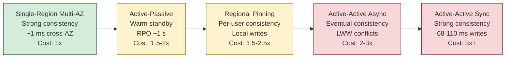
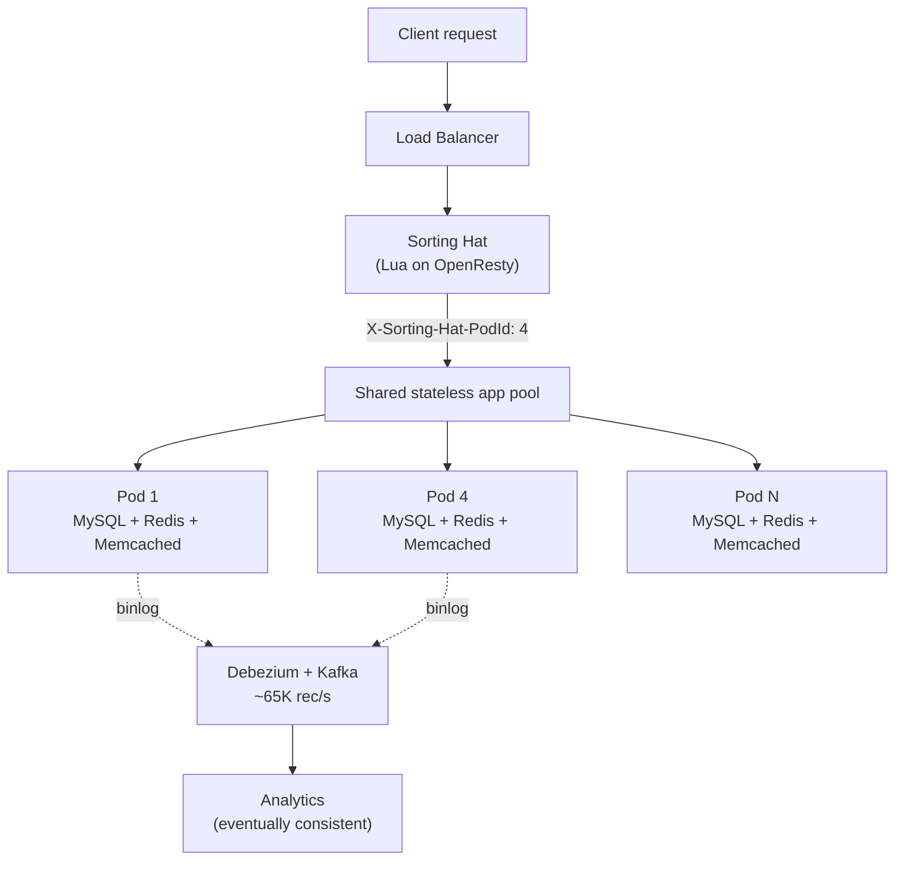
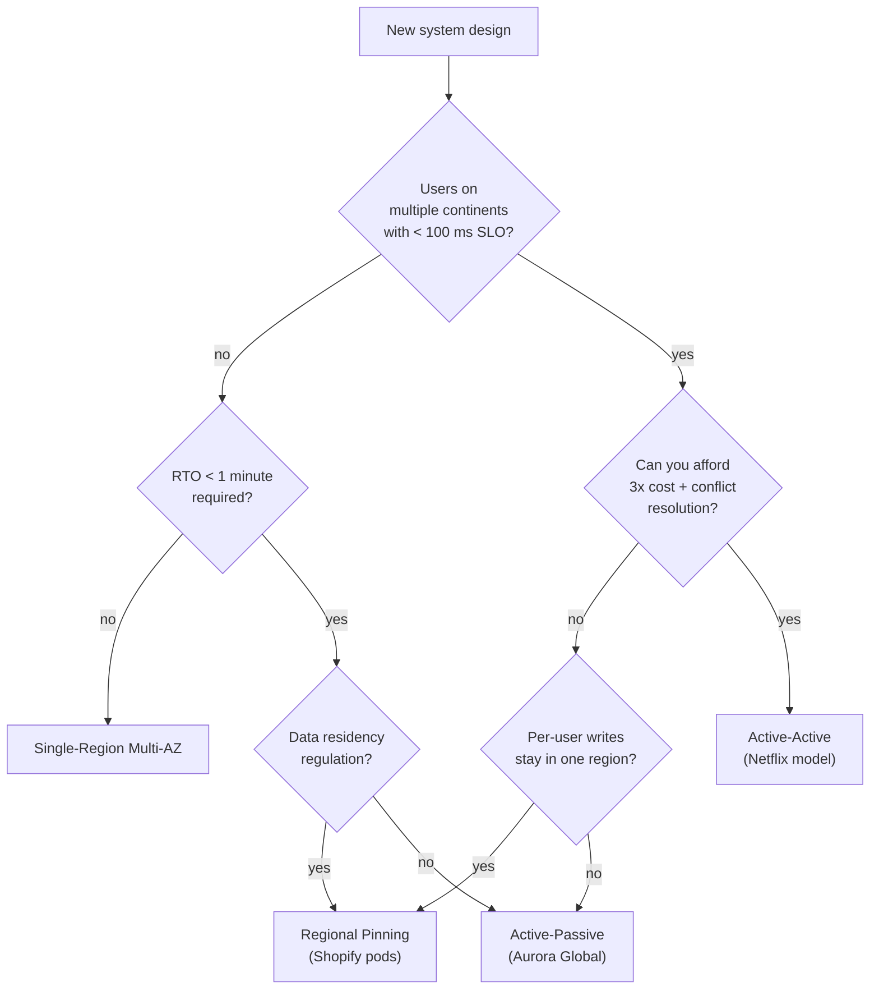

# Single-Region vs Multi-Region Deployment

> **TL;DR.** Single-region multi-AZ is the correct default. It gives you strong consistency, sub-millisecond cross-AZ replication, and one deployment pipeline. Multi-region is the single most expensive architectural choice available: 2-3x infrastructure cost, 10-20% of your AWS bill in cross-region transfer alone[^1], and mandatory conflict resolution or cross-region consensus latency (68-110 ms per RTT[^2]). Go multi-region only when RTO requirements, global latency SLOs, or data-residency regulations force it. When you do, prefer regional pinning over true active-active.

## Learning Objectives

- Compare single-region multi-AZ, active-passive, active-active, and regional pinning across RTO, RPO, cost, and consistency dimensions.
- Identify the workload characteristics that justify the cost and complexity of multi-region deployment.
- Justify regional pinning as the hybrid path that delivers multi-region availability without conflict resolution.
- Evaluate Netflix, Shopify, and the 2021 us-east-1 outage to explain when each approach succeeds or fails.

## The Core Trade-off

The fundamental tension is physics. A round trip between us-east-1 and eu-west-1 is 68 ms; to eu-central-1, 91 ms; to eu-north-1, 110 ms[^2]. Any protocol requiring cross-region acknowledgment on the write path adds that latency to every commit. You choose one of three responses:

1. **Keep writes local, accept eventual consistency** (DynamoDB Global Tables MREC, Cassandra LOCAL_QUORUM). Writes are fast; conflicts are your problem.
2. **Pay the cross-region round trip for strong consistency** (Spanner, CockroachDB REGION survival, DynamoDB MRSC). Writes are slow; correctness is guaranteed.
3. **Pin each user to one region so cross-region writes never happen** (Shopify pods, Stripe regional pinning). Writes are fast and consistent; cross-user analytics are eventually consistent.

The metric that moves in opposite directions: as you widen your deployment geography, write latency rises or consistency weakens. You cannot have both low latency and strong consistency across regions. [CAP and PACELC](../part-3-distributed-systems-theory/03-cap-and-pacelc.md) formalized this; deployment geography is where you live with the consequences.

*The deployment geography spectrum: each step right trades more money and complexity for a smaller blast radius or lower global latency.*

## Side-by-Side Comparison

| Dimension | Single-Region Multi-AZ | Multi-Region (Active-Active) |
|---|---|---|
| Write latency | 1-5 ms (synchronous cross-AZ)[^3] | 68-110 ms (sync consensus) or 1-5 ms (async, eventual)[^2] |
| Read freshness | Always latest (single leader) | Stale by 0.5-2.5 s (async) or latest (sync at cost)[^4] |
| RTO | Hours to days (rebuild in new region)[^5] | Near zero (geo-DNS reroutes)[^6] |
| RPO | Hours (last backup) to ~1 s (Aurora Global)[^7] | Zero (sync) or seconds (async)[^4] |
| Cost | 1x baseline | 2-3x compute + $0.02/GB cross-region transfer[^1] |
| Consistency model | Strong for free | Requires conflict resolution or consensus penalty[^8] |
| Failure mode | Region outage = total downtime[^9] | Region outage = capacity event, not downtime[^6] |
| Operational complexity | One pipeline, one set of secrets, one monitoring stack | Per-region pipelines, cross-region observability, failover drills |

The table misleads on RTO. "Hours to days" for single-region assumes you have no DR at all. Adding Aurora Global Database (active-passive warm standby) drops RTO to a few minutes[^7] without the full complexity of active-active. Most teams should evaluate the middle tiers before jumping to the rightmost column.

The cost row understates the real expense. Cross-region data transfer alone can account for 10-20% of a replicating architecture's total AWS bill per industry analysis[^1]. A 5 TB database replicating at 10 MB/s change rate costs roughly $520/month in transfer fees before you count duplicated compute, storage, or managed-service charges.

## When to Pick Single-Region

**Your users are geographically concentrated.** A B2B SaaS serving North American enterprises does not need eu-west-1. A user in New York hitting us-east-1 pays 5 ms; the same user hitting eu-west-1 pays 68 ms[^2]. Do not add latency to solve a problem you do not have.

**RTO > 1 hour is contractually acceptable.** Internal tools, staging environments, analytics platforms, and early-stage products can tolerate a regional outage followed by a restore-from-backup recovery. Most startups fall here.

**Strong consistency is a hard requirement and cross-region latency is unacceptable.** Spanner regional configurations deliver 99.99% availability across three zones with single-digit-millisecond commits[^3]. If you need linearizability and low latency, stay in one region and accept the regional blast radius.

**Operational capacity is limited.** Multi-region doubles your deployment surface. If your team cannot rehearse failover quarterly, the DR region will be stale when you need it[^6].

## When to Pick Multi-Region

**Contractual availability demands exceed what one region can deliver.** Spanner multi-region publishes 99.999% SLA, 10x the four-nines of regional[^3]. Financial services, healthcare, and global e-commerce with SLAs measured in minutes of annual downtime need multi-region.

**Global user latency is a product requirement.** Sub-100 ms p99 for users on multiple continents is physically impossible from a single region. Netflix serves three regions (us-east-1, us-west-2, eu-west-1) so every user hits a nearby endpoint[^6].

**Data-residency regulations force it.** GDPR, PDPA, and sovereignty laws require personal data to stay inside a jurisdiction. A single EU region plus a single US region, each serving only its own users, satisfies the requirement without active-active complexity[^10].

**The December 2021 us-east-1 outage is your threat model.** Eight hours of control-plane failure knocked out Netflix (which survived via active-active[^6]), Disney+, Venmo, Ring, and Amazon's own Connect service[^9]. If your product cannot tolerate that scenario, you need at least active-passive DR.

## The Hybrid Path

Regional pinning is the architecture most production systems actually run. Each user (or tenant) is deterministically assigned to a home region. All writes for that user happen locally. Cross-region traffic on the hot path is zero.

Shopify's pod architecture is the canonical example. The Sorting Hat (Lua on OpenResty) maps each shop to a pod via `X-Sorting-Hat-PodId`. Each pod has its own MySQL shard, Redis, and Memcached. Pod Mover fails over a pod between datacenters in approximately one minute. At BFCM 2025, this architecture handled 489 million edge requests per minute with 99.99%+ uptime[^11].

*Regional pinning gives single-leader consistency per user with pod-scoped blast radius; cross-pod reads flow through an eventually-consistent CDC pipeline.*

The key insight: regional pinning gives you multi-region availability (a pod failure affects only that pod's tenants) without conflict resolution (each user has exactly one writer). Cross-user operations (global search, analytics) accept eventual consistency through a CDC pipeline running at ~65K records/s with P99 < 10 s[^11].

## Real-World Examples

**Netflix (active-active, 3 regions).** Three AWS regions serve live traffic behind geo-DNS. Cassandra replicates asynchronously with LOCAL_QUORUM reads. EVCache invalidates cross-region via SQS. Each region is provisioned to absorb the full load of a failed peer. Chaos Kong drills validate this assumption regularly. During the December 2021 us-east-1 outage, Netflix remained functional by evacuating traffic to the surviving regions[^6].

**Shopify (regional pinning, 100+ pods).** 489M edge RPM at BFCM 2025. Per-pod failover in ~1 minute. Ghostferry migrates shops between pods with seconds of downtime. No cross-pod writes, ever. The architecture was born from a pattern where a single shared Redis could crash and take down every shop, catalyzing full per-pod isolation[^11].

**AWS us-east-1 (December 7, 2021).** An automated scale-up triggered a surge that overwhelmed internal-to-main networking devices. The regional control plane (EC2 launch, STS, Route 53 API, monitoring) was impaired for 8 hours. Running EC2 instances and DynamoDB data plane stayed up, but any team that needed to launch capacity, rotate credentials, or read monitoring was blind[^9]. The lesson: multi-AZ protects against zone failures, not regional control-plane failures.

## Common Mistakes

> [!WARNING]
> **Confusing multi-AZ with multi-region.** Multi-AZ survives a data-center power failure. It does not survive a regional control-plane outage. The 2021 us-east-1 event proved this: EC2 instances ran fine, but teams could not launch new ones, rotate credentials, or see their dashboards for 8 hours[^9].

> [!WARNING]
> **Control-plane dependency on the failing region.** Your failover plan calls Route 53 API to cut DNS. Route 53 API lives in the failing region. You are stuck. Pre-provision capacity in DR, use data-plane failover primitives (Route 53 ARC), and store runbooks out-of-region[^5].

> [!WARNING]
> **Treating "active-passive" as done after setup.** If you have not failed over in the last quarter, your DR region is stale. Netflix runs Chaos Kong drills on a schedule because latent bugs in rarely-exercised paths bite exactly when you need them[^6].

> [!WARNING]
> **Cross-region transfer cost surprise.** AWS charges $0.02/GB for cross-region transfer. Replicating a 5 TB database at 10 MB/s change rate costs ~$520/month in transfer alone. Budget 10-20% of total spend for inter-region traffic in a replicating architecture[^1].

## Decision Checklist

- [ ] What is your contractual RTO and RPO, not the aspirational one?
- [ ] Where are your users geographically, and what is the p99 latency SLO?
- [ ] Do data-residency regulations (GDPR, PDPA) force multi-region, or does a single in-jurisdiction region suffice?
- [ ] Can you afford 2-3x infrastructure cost plus 10-20% of spend in cross-region transfer?
- [ ] Can regional pinning give you multi-region availability without conflict-resolution complexity?
- [ ] When did you last actually fail over to your DR region? If the answer is "never," you are not ready.

*Decision flowchart: start from single-region as the default and justify each step up. Most teams land on active-passive or regional pinning, not full active-active.*

## Key Takeaways

- Single-region multi-AZ is the correct default. It gives strong consistency, low latency, and one deployment pipeline. Justify every step beyond it.
- Multi-region is the most expensive architectural choice: 2-3x compute, $0.02/GB cross-region transfer, and mandatory conflict resolution or consensus latency.
- Regional pinning (Shopify pods, Cloudflare Durable Objects) is the dominant real-world middle ground: multi-region availability with single-leader consistency per user.
- The December 2021 us-east-1 outage is the canonical threat model. Multi-AZ did not help; regional control-plane failure took down services for 8 hours.
- If you have not failed over to your DR region in the last quarter, it will not work when you need it. Rehearse or accept the risk.

## Further Reading

- [AWS Disaster Recovery Whitepaper](https://docs.aws.amazon.com/whitepapers/latest/disaster-recovery-workloads-on-aws/disaster-recovery-workloads-on-aws.html): canonical definition of the four DR tiers (backup/restore, pilot light, warm standby, multi-site active/active) with RTO/RPO ranges.
- [AWS us-east-1 Post-Incident Report, December 2021](https://aws.amazon.com/message/12721/): the single best document for understanding why regional control planes matter and what "multi-AZ" does not protect against.
- [Netflix: Active-Active for Multi-Regional Resiliency](https://netflixtechblog.com/active-active-for-multi-regional-resiliency-c47719f6685b): how Netflix went multi-region, Zuul routing, Cassandra replication, EVCache SQS invalidation, and Chaos Kong drills.
- [Shopify: A Pods Architecture To Allow Shopify To Scale](https://shopify.engineering/a-pods-architecture-to-allow-shopify-to-scale): regional pinning at scale, Sorting Hat, Pod Mover, Ghostferry, and per-pod isolation.
- [CockroachDB Multi-Region Overview](https://www.cockroachlabs.com/docs/stable/multiregion-overview): practical docs on SURVIVE ZONE vs SURVIVE REGION and regional-by-row table locality.
- [DynamoDB Global Tables MRSC](https://aws.amazon.com/blogs/aws/build-the-highest-resilience-apps-with-multi-region-strong-consistency-in-amazon-dynamodb-global-tables/): the managed zero-RPO primitive with witness replicas, GA June 2025.

## Flashcards

<strong>Q: What is the inter-region round-trip latency between us-east-1 and eu-west-1?</strong>

A: Approximately 68 ms on the AWS backbone. This is the minimum additional latency for any cross-region synchronous write.

<strong>Q: What percentage of AWS spend does cross-region transfer typically consume in a replicating architecture?</strong>

A: 10-20% of total AWS spend per industry analysis. At $0.02/GB, replicating even moderate databases adds hundreds of dollars monthly in transfer alone.

<strong>Q: Why did multi-AZ not help during the December 2021 us-east-1 outage?</strong>

A: The failure was in the regional control plane (EC2 launch API, STS, Route 53 API, monitoring), which is shared across all AZs in a region. Running instances stayed up, but teams could not launch, authenticate, or observe.

<strong>Q: What is regional pinning and why is it the dominant production pattern?</strong>

A: Each user is deterministically assigned to a home region; all their writes happen locally. It gives multi-region availability with single-leader consistency per user, avoiding conflict resolution entirely. Shopify and Stripe use variants of this.

<strong>Q: What is the RPO difference between DynamoDB MREC and MRSC?</strong>

A: MREC (async, default) has RPO of seconds to minutes because replication is asynchronous with last-writer-wins conflict resolution. MRSC (sync, GA June 2025) has RPO of zero because it uses three-region consensus.

<strong>Q: What availability SLA does Spanner multi-region publish vs regional?</strong>

A: Multi-region: 99.999% (five nines). Regional: 99.99% (four nines). The extra nine costs 3x in node pricing and cross-region write latency.

<strong>Q: What is Netflix's Chaos Kong and why does it matter?</strong>

A: Chaos Kong is a production drill that evacuates all traffic from one of Netflix's three active regions. It validates that the remaining two regions can absorb the full load. Without regular drills, failover paths accumulate latent bugs that surface only during real incidents.

## References

[^1]: AWS, "Amazon EC2 On-Demand Pricing: Data Transfer" and Vantage research on AWS cross-region transfer cost. https://aws.amazon.com/ec2/pricing/on-demand/
[^2]: CloudPing, AWS inter-region latency monitoring. https://www.cloudping.co
[^3]: Google Cloud, "Instance configurations" (Spanner) and "Spanner Availability SLA". https://cloud.google.com/spanner/docs/instance-configurations
[^4]: Donnie Prakoso (AWS), "Build the highest resilience apps with multi-Region strong consistency in Amazon DynamoDB global tables", AWS News Blog, June 30 2025. https://aws.amazon.com/blogs/aws/build-the-highest-resilience-apps-with-multi-region-strong-consistency-in-amazon-dynamodb-global-tables/
[^5]: AWS, "Disaster Recovery of Workloads on AWS: Recovery in the Cloud" whitepaper. https://docs.aws.amazon.com/whitepapers/latest/disaster-recovery-workloads-on-aws/disaster-recovery-workloads-on-aws.html
[^6]: Netflix Technology Blog, "Active-Active for Multi-Regional Resiliency", November 4 2013. https://netflixtechblog.com/active-active-for-multi-regional-resiliency-c47719f6685b
[^7]: AWS, "Using Amazon Aurora global databases", Aurora User Guide. https://docs.aws.amazon.com/AmazonRDS/latest/AuroraUserGuide/aurora-global-database.html
[^8]: AWS, "Amazon DynamoDB global tables", Developer Guide. https://docs.aws.amazon.com/amazondynamodb/latest/developerguide/GlobalTables.html
[^9]: AWS, "Summary of the AWS Service Event in the Northern Virginia (US-EAST-1) Region", December 10 2021. https://aws.amazon.com/message/12721/
[^10]: Greg McKeon (Cloudflare), "Supporting jurisdictional restrictions for Durable Objects", Cloudflare Blog, December 12 2020. https://blog.cloudflare.com/supporting-jurisdictional-restrictions-for-durable-objects/
[^11]: Shopify Engineering, "A Pods Architecture To Allow Shopify To Scale" and BFCM 2025 recap. https://shopify.engineering/a-pods-architecture-to-allow-shopify-to-scale
