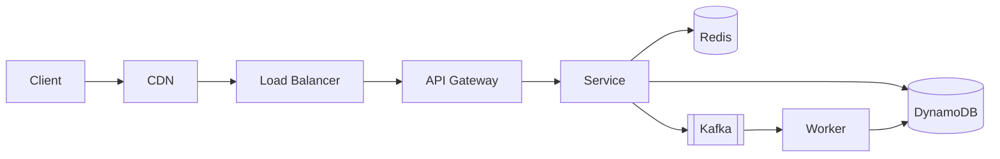

# Case Study Template (Option C+)

**Canonical template for all Part 8 case studies.** Combines the Hello Interview 10-step walkthrough with teaching scaffolding and follow-up interview prep. Every Part 8 chapter MUST follow this structure exactly.

**Target audience:** Staff-level system design interviews (FAANG, top startups) + long-term reference for practicing engineers.

---

## Hard constraints

| Constraint | Value |
|---|---|
| H2 count | **exactly 17** (outside code fences) |
| Total words | **4,500-6,000** (precise, dense, no fluff) |
| Mermaid diagrams | **minimum 4** (ideally 5) with italic captions |
| Footnotes | **20-28** `[^N]` markers, every one with matching `[^N]:` definition |
| Frontmatter status | `complete` (NOT `published`; valid values: outline, draft, review, complete) |
| Anti-patterns banned | `You covered/learned/saw X in [Chapter]`, `Part N Chapter M`, `Chapter N.M` |
| Cross-references | Full chapter title as link text with relative path: `[Caching](../part-2-building-blocks/03-caching.md)` |

---

## Exact document structure

```
---
title: "Design a [System Name]"
description: "One-sentence elevator pitch for the case study."
part: 8
module: "8.N"
difficulty: intermediate | advanced
prerequisites:
  - 1.5-back-of-envelope-estimation
  - 1.6-how-to-approach-design-questions
  - (2-4 more specific to this chapter)
tags: [case-study, interview, ...]
date_created: YYYY-MM-DD
date_updated: YYYY-MM-DD
status: complete
technologies:
  - (named products/libraries the chapter uses, per scripts/technologies.json)
---

# Design a [System Name]

> **TL;DR.** One-paragraph summary: the system, the scale, the 2-3 key architectural decisions, and the verdict. 80-120 words max. Must include at least one concrete scale number and name the pivotal trade-off.

## Learning Objectives

4-6 bullets. Each starts with an action verb (Design, Identify, Justify, Compare, Estimate, Trade off). Each bullet is a concrete, checkable outcome. No vague "understand" bullets.

- Design X that handles Y scale with Z guarantee.
- Identify when to use A vs B and justify the choice.
- Estimate capacity for N users using the back-of-envelope method.
- Justify the choice of [datastore] over alternatives for this workload.
- Trade off consistency and availability in the context of [specific decision].

**Word budget: 80-150 words.**

## Intuition

Why is this problem hard? The "aha" hook that motivates every architectural decision that follows. 200-400 words.

Explain:
1. The naive approach (one database, one server) and why it fails
2. The specific scale or concurrency or consistency pressure that changes the architecture
3. The one insight that unlocks the design

Good opening: "Looks like a trivial CRUD app. Handles 10 users fine. At 10 million it collapses, and the reason is [specific bottleneck]."

Avoid: "X is a system that..." encyclopedia voice.

**Word budget: 200-400 words.**

## Requirements

### Clarifying Questions

5-7 question/assumption pairs. Each question a strong Staff candidate should ask in the first 3 minutes of an interview. Format as bold `Q:` with `Assume:` response. Each Q should lock in a meaningful design decision.

- **Q: Authenticated users only, or anonymous?**
  Assume: Both. Anonymous creates with rate limits; registered get quotas.
- **Q: What is the SLA target?**
  Assume: 99.99% read, 99.9% write, p99 < 200 ms globally.
- **Q: Multi-region required?**
  Assume: Yes, active-active across 3 regions.
- (more)

### Functional Requirements

3-6 capability bullets. Each 1-2 sentences. Include what the user sees and any implied system obligations.

- Create X and return Y.
- Read X with pagination.
- Subscribe to live updates of X.
- Admin deletes X with soft-delete for 30 days.

### Non-Functional Requirements

Scale targets as a compact list or mini-table:

- **Load:** 10M writes/day, 1B reads/day, peak 100K RPS on read.
- **Latency:** p50 < 50 ms, p99 < 200 ms on read; p99 < 500 ms on write.
- **Availability:** 99.99% read path, 99.9% write path.
- **Consistency:** eventual for X, strong for Y.
- **Durability:** 11 nines; no data loss on single-region failure.

**Word budget: 300-500 words across all 3 subsections.**

## Capacity Estimation

Back-of-envelope math with every number justified. One table plus 3-5 bullets of derivation.

| Metric | Value | Derivation |
|--------|------:|------------|
| Total records (5 yr) | 18B | 10M/day × 365 × 5 |
| Storage/record | 500 B | key(16) + value(~400) + metadata(84) |
| Total storage | 9 TB | 18B × 500 B |
| Peak read QPS | 100K | 1B/day × 10x viral multiplier / 86,400 |
| Hot cache memory | 90 GB | 180M keys × 500 B (top 1%) |

Follow with 3-5 bullets explaining key ratios (read:write, cache hit rate, bandwidth, etc.) and any non-obvious derivations.

**Word budget: 200-350 words.**

## API and Data Model

### API Design

3-6 endpoint signatures. Include HTTP method, path, query params, request body, response body, status codes, and idempotency handling where relevant.

```
POST /v1/resources
  Idempotency-Key: <uuid>
  Body: { "field1": "...", "field2": "..." }
  Returns: 201 { "id": "abc123", "created_at": "..." }
  Errors: 409 conflict, 429 rate limited, 500 server error

GET /v1/resources/{id}
  Returns: 200 { "id": "...", "field1": "...", "created_at": "..." }
           404 not found

GET /v1/resources?cursor=...&limit=100
  Returns: 200 { "items": [...], "next_cursor": "..." }
```

Call out: pagination scheme, idempotency keys, rate-limit headers, cursor format.

### Data Model

Schema for each primary store. Prefer compact pseudo-SQL or a small ER diagram. State partition/sharding key explicitly.

```
-- Primary store (DynamoDB / Cassandra / PostgreSQL)
table resources (
  id              uuid primary key,
  owner_id        uuid,
  payload         bytes,
  created_at      timestamp,
  expires_at      timestamp,
  partition_key:  id  // hash-distributed across N shards
)

-- Secondary index (if applicable)
gsi: owner_id -> [id, created_at]  (for owner's list view)
```

Include a small Mermaid ER diagram if there are 3+ related tables.

**Word budget: 400-600 words across both subsections.**

## High-Level Architecture

One big Mermaid diagram showing every component: clients, edge (CDN / WAF), load balancer, API gateway, services, data stores, async pipelines, caches. Label data flow arrows.



*Italic one-line caption explaining what the diagram shows.*

Then 3-5 paragraphs of walkthrough. Explain the write path, the read path, and the async path separately. Call out which edges cross region boundaries, which are hot, and where caching happens.

**Word budget: 400-700 words.**

## Deep Dives

**3 to 4 H3 subsections.** This is the heart of the chapter. Each deep dive is the kind of answer the candidate gives when the interviewer says "tell me more about X." 600-1000 words each.

### Deep Dive 1: [The hardest problem]

Problem statement (2-3 sentences). Why naive approaches fail. The canonical solution. Alternatives and their trade-offs. Real numbers (latency, throughput, memory).

Include a Mermaid diagram if it clarifies.

### Deep Dive 2: [The second-hardest problem]

Same structure.

### Deep Dive 3: [The third-hardest problem]

Same structure.

### Deep Dive 4 (optional): [Cross-cutting concern]

Only include if the chapter has a natural fourth deep dive (e.g., security, cost, multi-region, or a subsystem that cannot be folded into the first three).

**Word budget: 1,800-2,800 words across all deep dives.**

## Real-World Example

400-700 words on how a real company implements this at scale. Use specific names of internal systems (Haystack, H3, Open Connect, Magic Pocket, Michelangelo), concrete numbers (throughput, cluster size, latency percentiles), and named engineers or papers where available.

Preferred pattern: a narrative arc from "what they built initially" to "what forced the rewrite" to "what they run now." Close with the one insight the team had that non-experts miss.

Include one Mermaid diagram if it adds clarity beyond the High-Level Architecture section.

**Word budget: 400-700 words.**

## Trade-offs

A comparison matrix plus 2-3 paragraphs of prose on the biggest meta-decision.

| Approach | Pros | Cons | When to use |
|----------|------|------|-------------|
| Option A | ... | ... | ... |
| Option B | ... | ... | ... |
| Option C | ... | ... | ... |
| Option D | ... | ... | ... |
| Option E | ... | ... | ... |

5-7 rows minimum.

Follow with prose: what is the single biggest trade-off in this system, and how do real companies resolve it differently? (Example: "strong vs eventual consistency for the write path.")

**Word budget: 300-500 words.**

## Scaling and Failure Modes

How this architecture breaks as load grows 10x, 100x, 1000x. What you change at each tier.

- **At 10x load:** the specific bottleneck (e.g., single-region Redis saturates) and the mitigation (e.g., add regional replicas + edge cache).
- **At 100x load:** the next bottleneck (e.g., DynamoDB hot partitions on viral records) and the mitigation.
- **At 1000x load:** the architectural rewrite (e.g., shift to CDN-first read path; DynamoDB becomes origin only).

Then 2-3 failure modes with response:
- **[Failure mode, e.g., regional outage]:** response. Degraded mode. Recovery steps.
- **[Failure mode, e.g., downstream provider throttled]:** response.

**Word budget: 300-500 words.**

## Common Pitfalls

5-7 interview anti-patterns and real-world deployment mistakes. Each as a `> [!WARNING]` block with 1-2 sentences.

> [!WARNING]
> **[Pitfall headline].** Explanation in 1-2 sentences. Why candidates fall into this. What to say instead.

> [!WARNING]
> **[Another pitfall].** ...

**Word budget: 300-500 words.**

## Follow-up Questions

5-8 Staff-level interview extensions. These are the questions an interviewer drills into after the initial design is laid out. Each as a bold question with a 2-4 sentence approach hint (not a full solution; the reader should synthesize).

**1. How would you handle multi-region active-active writes?**
Approach: per-region write ownership with conflict resolution via vector clocks; use CRDTs for eventually-consistent counters; cross-region replication via Kafka MirrorMaker.

**2. What changes for enterprise / paid-tier customers?**
Approach: dedicated tenant shards; per-tenant rate limits; stricter SLA with dedicated on-call; data residency enforcement per region.

**3. How would you audit this for GDPR right-to-erasure?**
Approach: tombstone all records tied to user_id; background reconciler removes from all replicas within 30 days; hard-delete derived data (indexes, caches, search).

**4. [Question]**
Approach: ...

**5. [Question]**
Approach: ...

**6. [Question]** (optional)
**7. [Question]** (optional)
**8. [Question]** (optional)

**Word budget: 500-800 words.**

## Exercise

1-2 concrete scenarios the reader works through. Use collapsible `<details>` blocks for hint and solution.

### Exercise 1: [Name]

[Scenario in 2-4 sentences. Pose a specific question the reader must answer.]

<details>
<summary>Hint</summary>

2-4 sentences nudging without giving the answer.

</details>

<details>
<summary>Solution</summary>

4-8 sentences walking through the reasoning and arriving at the answer. Call out trade-offs.

</details>

### Exercise 2 (optional): [Name]

[Same structure.]

**Word budget: 300-500 words.**

## Key Takeaways

4-6 bullets. Each is a defensible, memorable position the reader can cite in an interview. Not a recap; a distilled insight.

- **[Principle-level insight]:** explanation in one sentence.
- **[Architectural verdict]:** explanation in one sentence.
- **[Scale rule of thumb]:** explanation in one sentence.
- **[Failure-mode wisdom]:** explanation in one sentence.
- **[Design philosophy]:** explanation in one sentence.

**Word budget: 120-200 words.**

## Further Reading

5-8 curated external links. Engineering blogs, papers, conference talks, canonical documentation. Each with a one-sentence "why this link matters" annotation.

- [AWS S3 Lifecycle configuration](https://docs.aws.amazon.com/AmazonS3/latest/userguide/object-lifecycle-mgmt.html). The canonical reference for TTL-based object expiration.
- [DeCandia et al. "Dynamo: Amazon's Highly Available Key-value Store" (SOSP 2007)](https://www.allthingsdistributed.com/files/amazon-dynamo-sosp2007.pdf). The paper that launched a generation of eventually-consistent datastores.
- [More...]

**Word budget: 150-250 words.**

## Flashcards

8-12 question/answer pairs for spaced-repetition study. Each uses the `<details>`/`<summary>` pattern.

<details>
<summary><strong>Q: What is the 3-step process for [specific concept]?</strong></summary>

A: Step 1. Step 2. Step 3. (2-4 sentences total.)

</details>

<details>
<summary><strong>Q: Why does [naive approach] fail at [scale milestone]?</strong></summary>

A: Specific reason in 1-3 sentences, tied to a concrete bottleneck.

</details>

(10 more questions covering: capacity math, canonical algorithms named in the chapter, trade-off triggers, failure modes, real-world examples.)

**Word budget: 300-500 words.**

## References

Footnote definitions. Every `[^N]` marker in the body must have a matching `[^N]:` definition here. 20-28 references typical.

[^1]: Author or Org. "Title". Publication/Year. URL.

[^2]: Author or Org. "Title". Publication/Year. URL.

[^3]: ...

Order by `N` ascending. Prefer primary sources (papers, official docs, engineering blogs) over Medium fluff.

**Word budget: not counted toward prose budget (references are not prose).**

---

## Total word budget reconciliation

| Section | Budget |
|---------|-------:|
| TL;DR | 100 |
| Learning Objectives | 120 |
| Intuition | 300 |
| Requirements | 400 |
| Capacity Estimation | 275 |
| API and Data Model | 500 |
| High-Level Architecture | 550 |
| Deep Dives (3-4) | 2,300 |
| Real-World Example | 550 |
| Trade-offs | 400 |
| Scaling and Failure Modes | 400 |
| Common Pitfalls | 400 |
| Follow-up Questions | 650 |
| Exercise | 400 |
| Key Takeaways | 160 |
| Further Reading | 200 |
| Flashcards | 400 |
| **Total** | **~8,105** |

The budget above is loose; **aim for 4,500-6,000 words total**. If the draft exceeds 6,000, tighten Deep Dives first, then Requirements, then prose in the middle sections. If below 4,500, expand Deep Dives (more concrete numbers, one more alternative compared) and Follow-up Questions.

---

## Voice and style

- **Dense, precise, technical.** Every sentence earns its placement.
- **No marketing voice.** No "amazing", "powerful", "cutting-edge", "seamless", "robust".
- **No encyclopedia voice.** No "Foo is a distributed system that..."
- **Name real things.** Specific products (Redis, Cassandra, Cloudflare), specific techniques (H3 hexagonal cells, BOLA ABR, contraction hierarchies), specific numbers (1.5M concurrent connections, 500 hours uploaded/min).
- **Use second person sparingly.** "You would" is fine when walking through a design decision; not as a lecture tic.
- **No filler.** "In this chapter we will explore..." is banned. Start with content.

---

## Diagram guidelines

- Minimum 4 Mermaid diagrams. Ideally: 1 architecture + 1 per deep dive + 1 for real-world example or state machine.
- Every diagram has a one-line italic caption immediately below the closing fence, preceded by a blank line.
- Prefer `flowchart LR` for request flow, `sequenceDiagram` for protocols, `stateDiagram-v2` for lifecycles, `erDiagram` for data models.
- No ASCII box diagrams. No external image links (no `.png`/`.svg` URLs for diagrams).

---

## Validation checklist (writer runs before returning)

- [ ] H2 count is exactly 17 outside code fences
- [ ] Word count is 4,500-6,000
- [ ] Minimum 4 Mermaid diagrams, each with italic caption
- [ ] 20-28 `[^N]` footnotes, every marker has matching definition
- [ ] Frontmatter has `status: complete` (not `published`)
- [ ] No "You covered/learned/saw X in [Chapter]" phrasing
- [ ] No "Part N Chapter M" or "Chapter N.M" references
- [ ] Cross-refs use full chapter title as link text with relative path
- [ ] No "Status: Outline" banner, no "How to Contribute" section
