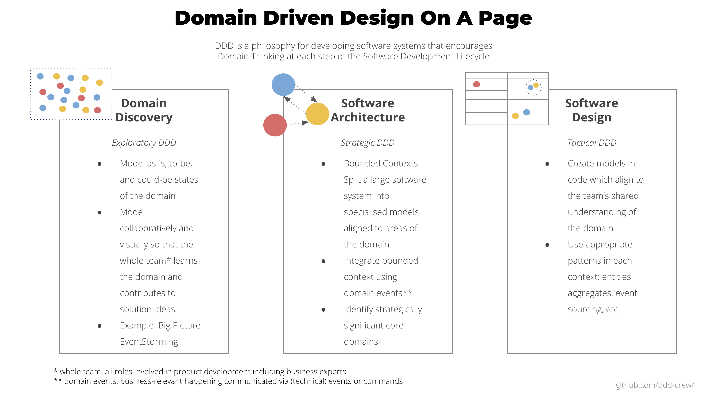
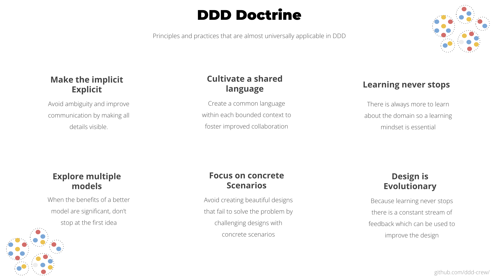
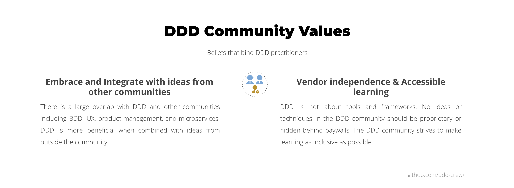

# Bem-vindo ao Domain-Driven Design (DDD)

Este projeto reúne definições de DDD e conceitos fundamentais para reduzir a curva de aprendizagem e evitar confusões.

## Primeiros passos com DDD

DDD não é uma abordagem do tipo tudo ou nada. Você pode aplicar suas ideias apenas onde e na medida em que elas trouxerem benefícios ao projeto em que está trabalhando.

Em alguns projetos, talvez você aplique DDD somente ao trabalho de descoberta do domínio. Em outros, pode optar por não aplicar o DDD estratégico e começar diretamente pela modelagem em código, apoiada por visualizações leves. Não se sinta pressionado a aplicar DDD além do necessário.

A seguir estão algumas maneiras de começar a aprender DDD ou aplicá-lo imediatamente ao seu projeto atual.

- Consulte o [DDD Starter Modelling Process em português brasileiro](https://github.com/ddd-crew/ddd-starter-modelling-process/blob/main/translations/pt-br/README.md) para entender como o DDD pode ser aplicado de maneira coesa aos diferentes aspectos do desenvolvimento de software, desde a descoberta do domínio até o design estratégico e o design tático.

- Comece com técnicas práticas usando [Visual Collaboration Tools](https://leanpub.com/visualcollaborationtools), um e-book gratuito com roteiros de workshops para diversas técnicas colaborativas de DDD, incluindo EventStorming, Domain Storytelling, Domain Quiz e Context Mapping.

- Leia o [Guia de Referência de DDD, de Eric Evans](https://www.domainlanguage.com/wp-content/uploads/2016/05/DDD_Reference_2015-03.pdf), que apresenta definições dos padrões clássicos de DDD.

- Confira também o artigo de Mathias Verraes [What is Domain-Driven Design?](https://verraes.net/2021/09/what-is-domain-driven-design-ddd/)
